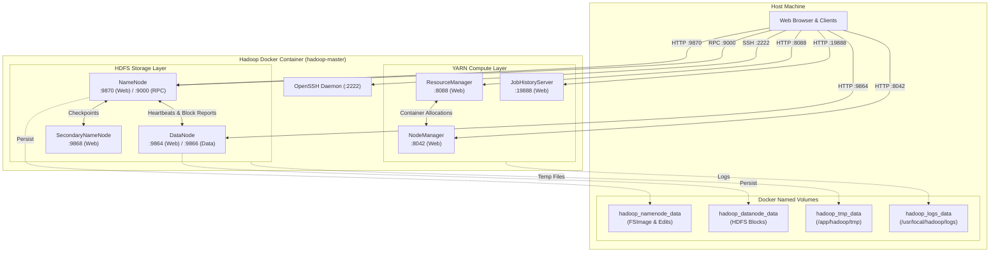

<div align="center">

# 🐘 Apache Hadoop 3.1.2 Single-Node Cluster on Docker

### *Production-grade, fully configured Big Data environment for local development, education, and distributed processing.*

[](https://github.com/Sohila-Khaled-Abbas/docker-hadoop/actions/workflows/ci.yml)
[](https://hadoop.apache.org/)
[](https://openjdk.org/)
[](https://ubuntu.com/)
[](https://docs.docker.com/compose/)
[](LICENSE)
[](CONTRIBUTING.md)

[Quick Start](#-quick-start) • [Architecture](#-system-architecture) • [Web Interfaces](#-web-interfaces--port-mappings) • [MapReduce Tutorials](#-mapreduce-tutorials) • [Documentation](#-in-depth-documentation) • [Troubleshooting](#-troubleshooting--faq)

</div>

---

## 📖 Overview

This repository provides a containerized, single-node **Apache Hadoop 3.1.2** cluster running on **Ubuntu 20.04** with **OpenJDK 8**. It includes the complete distributed daemon stack (HDFS, YARN, MapReduce JobHistory), non-root execution (`hduser`), automated health checks, persistent volume management, and hands-on examples for Java and Python Hadoop Streaming.

Ideal for:

- 🎓 **Big Data Education & Academic Courses**: Learn HDFS, YARN, and MapReduce internals without multi-machine cluster overhead.
- 🧪 **Local ETL & Algorithm Prototyping**: Test MapReduce jobs and HDFS storage pipelines locally before deploying to AWS EMR, GCP Dataproc, or on-premise clusters.
- 🔌 **Ecosystem Integration**: Seamlessly connect **Apache Spark**, **PySpark**, **Apache Hive**, **Presto / Trino**, and **Jupyter Notebooks** to HDFS.

---

## 🚀 Key Features

- **Complete Hadoop 3.1.2 Daemon Stack**:
  - **HDFS**: NameNode, DataNode, SecondaryNameNode.
  - **YARN**: ResourceManager, NodeManager.
  - **MapReduce**: JobHistory Server.
- **Enterprise Best Practices & Hardening**:
  - Secure non-root daemon execution under dedicated `hduser:hadoop` (UID/GID 1000).
  - Centralized `/etc/profile.d/hadoop.sh` and multi-shell profile exports (`.bashrc`, `.profile`) for seamless environment and PATH resolution.
  - Pre-configured passwordless SSH loopback keys with strict permission masks (`0600`/`0700`).
- **Optimized Multi-Stage Build**:
  - Automated pruning of ~60,000 redundant Javadoc/API HTML files to bypass WSL2/ext4 inode journal bottlenecks and accelerate build times.
- **Data Persistence**:
  - 4 named Docker volumes isolating NameNode metadata, DataNode blocks, temporary workspaces, and logs.
- **Automated Health Monitoring**:
  - Docker Compose container health checks querying Web UI endpoints and HDFS status.
  - GitHub Actions automated CI workflow validating builds, daemons, and MapReduce execution.
- **Developer Experience**:
  - Ready-to-run Java and Python Streaming MapReduce examples with one-click test runners.
  - Extensive `Makefile` shortcuts for all common lifecycle tasks.

---

## 🏛️ System Architecture



> [!NOTE]
> For detailed architectural specifications, HDFS read/write pipelines, and YARN scheduling lifecycles, see the [Architecture Documentation](docs/architecture.md).

---

## 🌐 Web Interfaces & Port Mappings

All standard Apache Hadoop web consoles and service endpoints are mapped to host ports:

| Service | Container Port | Host Port | Web Console URL | Description |
| :--- | :---: | :---: | :--- | :--- |
| **HDFS NameNode** | `9870` | `9870` | [http://localhost:9870](http://localhost:9870) | Browse HDFS filesystem, inspect cluster capacity, and view active DataNodes. |
| **HDFS DataNode** | `9864` | `9864` | [http://localhost:9864](http://localhost:9864) | DataNode status, block storage details, and volume metrics. |
| **YARN ResourceManager** | `8088` | `8088` | [http://localhost:8088](http://localhost:8088) | View running applications, memory/vcore metrics, and node queues. |
| **YARN NodeManager** | `8042` | `8042` | [http://localhost:8042](http://localhost:8042) | NodeManager status and container allocations. |
| **MapReduce JobHistory** | `19888` | `19888` | [http://localhost:19888](http://localhost:19888) | Historical MapReduce job logs, execution counters, and analytics. |
| **HDFS RPC Endpoint** | `9000` | `9000` | `hdfs://localhost:9000` | Client IPC protocol endpoint for external tools (Spark, Flink, PySpark). |
| **SSH Daemon** | `22` | `2222` | `ssh -p 2222 hduser@localhost` | Direct SSH access (`password: ubuntu`). |

> [!TIP]
> You can customize all external port numbers by editing `.env` or setting environment variables (e.g. `HADOOP_NAMENODE_PORT=19870`).

---

## ⚡ Quick Start

### Prerequisites

- [Docker Engine](https://docs.docker.com/get-docker/) (v20.10+)
- [Docker Compose](https://docs.docker.com/compose/) (v2.0+)

### 1. Clone the Repository

```bash
git clone https://github.com/your-username/docker-hadoop.git
cd docker-hadoop
```

### 2. Start the Cluster

<details open>
<summary><b>Option A: Using Docker Compose</b></summary>

```bash
# Build and start container in background
docker compose up -d

# Check startup status
docker compose ps
```

</details>

<details>
<summary><b>Option B: Using Make</b></summary>

```bash
# Build and start container in background
make up

# Check status
make ps
```

</details>

### 3. Verify Daemon Status

Verify that all 6 Java daemons are running:

```bash
docker compose exec hadoop jps
```

Expected output:

```text
NameNode
DataNode
SecondaryNameNode
ResourceManager
NodeManager
JobHistoryServer
Jps
```

---

## 🧪 Testing & Verification

Run the automated integration suite:

```bash
make test
# or
docker compose exec hadoop /test-cluster.sh
```

### Calculate Pi with MapReduce (Monte Carlo Estimation)

```bash
docker compose exec hadoop yarn jar /usr/local/hadoop/share/hadoop/mapreduce/hadoop-mapreduce-examples-3.1.2.jar pi 4 1000
```

---

## 💻 HDFS CLI Cheat Sheet

Open an interactive shell inside the container:

```bash
docker compose exec -it hadoop bash
```

| Operation | Command |
| :--- | :--- |
| **List Root Directory** | `hdfs dfs -ls /` |
| **Create Directory** | `hdfs dfs -mkdir -p /user/mydata` |
| **Upload Local File** | `hdfs dfs -put /path/to/local/file.txt /user/mydata/` |
| **Download File** | `hdfs dfs -get /user/mydata/file.txt /tmp/` |
| **Display File Content** | `hdfs dfs -cat /user/mydata/file.txt \| head -n 20` |
| **Check Storage Disk Usage** | `hdfs dfs -du -h /user` |
| **Delete File** | `hdfs dfs -rm /user/mydata/file.txt` |
| **Delete Directory (Recursive)** | `hdfs dfs -rm -r /user/mydata` |
| **HDFS Health Report** | `hdfs dfsadmin -report` |
| **Exit SafeMode** | `hdfs dfsadmin -safemode leave` |

---

## 🔬 MapReduce Tutorials

### 1. Python Hadoop Streaming WordCount

Run the Python streaming example using the pre-configured runner:

```bash
make test-mr-python
# or
bash examples/mapreduce-python/run.sh
```

*Read the full [Python Streaming Guide](examples/mapreduce-python/README.md).*

### 2. Java Native MapReduce WordCount

Compile and execute the standalone Java WordCount application:

```bash
make test-mr-java
# or
bash examples/mapreduce-java/compile-and-run.sh
```

*Read the full [Java MapReduce Guide](examples/mapreduce-java/README.md).*

---

## 🔌 Big Data Ecosystem Integration

Connect external data processing frameworks directly to this cluster:

```python
# PySpark HDFS Connection Example
from pyspark.sql import SparkSession

spark = SparkSession.builder \
    .appName("HadoopDockerDemo") \
    .config("spark.hadoop.fs.defaultFS", "hdfs://localhost:9000") \
    .getOrCreate()

df = spark.read.parquet("hdfs://localhost:9000/data/spark_employees.parquet")
df.show()
```

*See [Ecosystem Integration Guide](docs/ecosystem-integration.md) for Apache Spark, Apache Hive, Presto/Trino, and Jupyter Notebook setup instructions.*

---

## 💾 Storage & Persistent Volumes

Cluster state is preserved across container lifecycles via named Docker volumes:

| Docker Volume Name | Container Mount Path | Description |
| :--- | :--- | :--- |
| `hadoop_namenode_data` | `/usr/local/hadoop/yarn_data/hdfs/namenode` | NameNode metadata, `fsimage`, and transaction edit logs. |
| `hadoop_datanode_data` | `/usr/local/hadoop/yarn_data/hdfs/datanode` | DataNode HDFS block storage. |
| `hadoop_tmp_data` | `/app/hadoop/tmp` | Hadoop intermediate temporary files. |
| `hadoop_logs_data` | `/usr/local/hadoop/logs` | Daemon log files and historical application logs. |

> [!WARNING]
> To perform a clean cluster reset and reformat the NameNode from scratch, run `make clean` or `docker compose down -v`.

---

## 📚 In-Depth Documentation

| Guide | Description |
| :--- | :--- |
| 📖 [Getting Started Guide](docs/getting-started.md) | Step-by-step installation, verification, and first steps. |
| 🏛️ [Architecture Blueprint](docs/architecture.md) | Complete internal architecture, HDFS pipelines, and Mermaid diagrams. |
| ⚙️ [MapReduce Developer Guide](docs/mapreduce-guide.md) | Java & Python MapReduce development, Combiners, and memory tuning. |
| 🔌 [Ecosystem Integration Guide](docs/ecosystem-integration.md) | Connecting Apache Spark, Hive, Presto/Trino, and Jupyter to HDFS. |
| 🛠️ [Troubleshooting Runbook](docs/troubleshooting.md) | Solutions for SafeMode, ClusterID mismatch, memory limits, and port conflicts. |
| 🚀 [Configuration & Performance Tuning](docs/configuration-tuning.md) | XML configuration parameters, JVM heap sizing, and optimization. |

---

## 🛠️ Troubleshooting & FAQ

<details>
<summary><b>Q: NameNode is stuck in SafeMode (<code>Cannot create file... Name node is in safe mode</code>)</b></summary>

**Fix**: Execute the following command to manually exit SafeMode:

```bash
make safemode-leave
# or
docker compose exec hadoop hdfs dfsadmin -safemode leave
```

</details>

<details>
<summary><b>Q: DataNode is missing or <code>clusterID</code> mismatch occurs</b></summary>

**Fix**: When NameNode is formatted without wiping DataNode storage, the IDs diverge. Perform a full volume reset:

```bash
make clean
make up
```

</details>

<details>
<summary><b>Q: Host port conflict (e.g. port 9870 or 8088 already in use)</b></summary>

**Fix**: Create a `.env` file and change the conflicting port mappings:

```bash
cp .env.example .env
# Edit .env and change HADOOP_NAMENODE_PORT=19870
docker compose up -d
```

</details>

*For more solutions, see the [Troubleshooting Runbook](docs/troubleshooting.md).*

---

## 📁 Repository Structure

```text
docker-hadoop/
├── .github/
│   ├── workflows/
│   │   └── ci.yml               # Automated GitHub Actions CI workflow
│   ├── ISSUE_TEMPLATE/
│   │   ├── bug_report.md        # Structured Bug Report template
│   │   ├── feature_request.md   # Structured Feature Proposal template
│   │   └── config.yml           # Issue template settings
│   └── pull_request_template.md # Standard PR checklist & description template
├── config/
│   ├── core-site.xml            # Default filesystem & temp storage parameters
│   ├── hdfs-site.xml            # HDFS NameNode / DataNode parameters
│   ├── mapred-site.xml          # MapReduce on YARN & JobHistory server config
│   ├── yarn-site.xml            # YARN ResourceManager & NodeManager config
│   └── hadoop-env.sh            # Java & Hadoop runtime environment variables
├── docs/
│   ├── architecture.md          # In-depth architectural blueprint & Mermaid diagrams
│   ├── configuration-tuning.md  # XML parameter reference & JVM tuning guide
│   ├── ecosystem-integration.md # Spark, Hive, Presto, and Jupyter integration
│   ├── getting-started.md       # Developer onboarding & operational guide
│   ├── mapreduce-guide.md       # Comprehensive MapReduce programming guide
│   └── troubleshooting.md       # Diagnostics & troubleshooting runbook
├── examples/
│   ├── mapreduce-java/          # Standalone Java WordCount with compile script
│   │   ├── WordCount.java
│   │   ├── compile-and-run.sh
│   │   └── README.md
│   ├── mapreduce-python/        # Python Hadoop Streaming WordCount example
│   │   ├── mapper.py
│   │   ├── reducer.py
│   │   ├── run.sh
│   │   ├── sample.txt
│   │   └── README.md
│   └── spark-pyspark/           # PySpark HDFS read/write integration example
│       ├── pyspark_hdfs_read_write.py
│       └── README.md
├── scripts/
│   ├── entrypoint.sh            # Container bootstrap & daemon orchestration
│   ├── healthcheck.sh           # Container health check script
│   └── test-cluster.sh          # MapReduce & HDFS integration tests
├── .dockerignore                # Docker build exclusions
├── .env.example                 # Configuration template
├── .gitignore                   # Git exclusions
├── CHANGELOG.md                 # Semantic version changelog
├── CODE_OF_CONDUCT.md           # Contributor Covenant Code of Conduct
├── CONTRIBUTING.md              # Development & contribution guidelines
├── Dockerfile                   # Multi-stage Ubuntu 20.04 Hadoop 3 image
├── docker-compose.yml           # Container orchestration with volumes & ports
├── LICENSE                      # Apache 2.0 License
├── Makefile                     # Developer CLI commands
├── README.md                    # Project documentation
└── SECURITY.md                  # Vulnerability reporting & container security
```

---

## 🛠️ Management & Automation Commands

| Command | Description |
| :--- | :--- |
| `make help` | Display list of available developer commands |
| `make build` | Build the Hadoop Docker image |
| `make up` | Start the cluster in detached mode |
| `make down` | Stop and remove the cluster container |
| `make restart` | Restart the cluster services |
| `make logs` | Stream container logs in real time |
| `make ps` | Check container health and running services |
| `make jps` | List running Hadoop Java daemons (`NameNode`, `DataNode`, etc.) |
| `make test` | Run built-in integration tests & Pi MapReduce |
| `make test-mr-python` | Run Python Hadoop Streaming WordCount job |
| `make test-mr-java` | Compile and run Java Native MapReduce WordCount job |
| `make safemode-leave` | Force HDFS NameNode to exit SafeMode |
| `make hdfs-report` | Display HDFS storage and DataNode health report |
| `make bash` | Open interactive shell inside the container |
| `make clean` | Stop and remove containers, images, and persistent volumes |

---

## 🤝 Contributing & Community

Contributions are welcome! Please review our [Contributing Guidelines](CONTRIBUTING.md) and [Code of Conduct](CODE_OF_CONDUCT.md) before submitting pull requests.

---

## 📄 License

This project is licensed under the Apache License 2.0 - see the [LICENSE](LICENSE) file for details.
