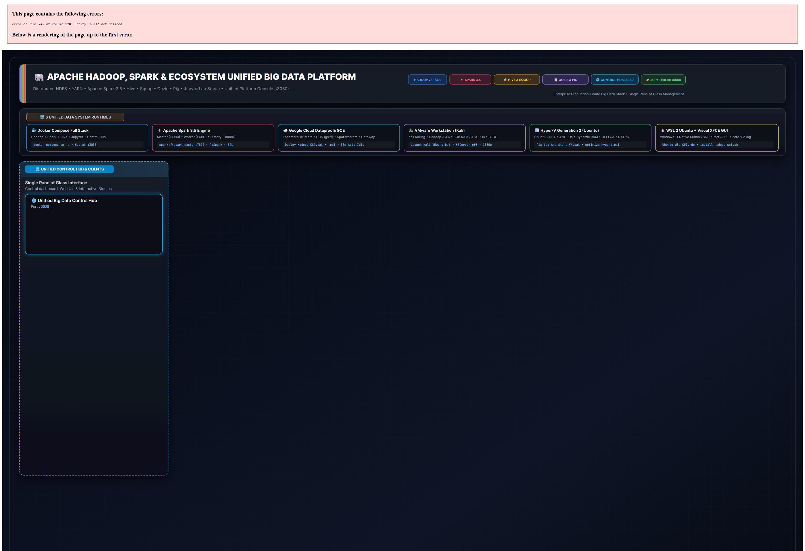
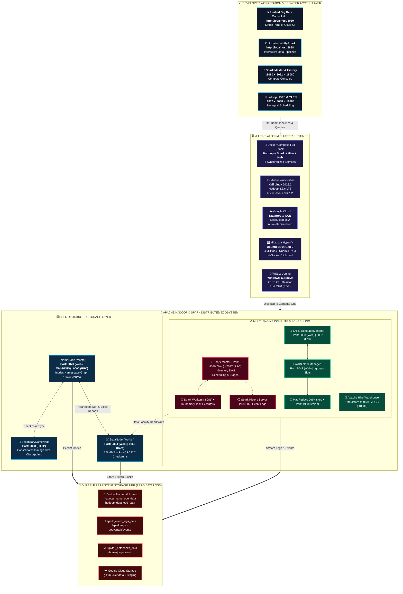

<div align="center">

# 🐘 Apache Hadoop Enterprise Multi-Platform Lab

### *Unified Big Data Engineering Ecosystem for Docker, Google Cloud (Dataproc & GCE), VMware (Kali Linux), Hyper-V, WSL 2, Oracle VirtualBox & Bare-Metal Linux*

<p align="center">
  <a href="https://github.com/Sohila-Khaled-Abbas/docker-hadoop/actions/workflows/ci.yml">
    
  </a>
  <a href="https://github.com/Sohila-Khaled-Abbas/docker-hadoop/actions/workflows/security-scan.yml">
    
  </a>
  <a href="https://spark.apache.org/">
    
  </a>
  <a href="https://hive.apache.org/">
    
  </a>
  <a href="https://jupyter.org/">
    
  </a>
  <a href="http://localhost:3030">
    
  </a>
  <a href="https://hadoop.apache.org/">
    
  </a>
  <a href="https://openjdk.org/">
    
  </a>
  <a href="https://www.python.org/">
    
  </a>
  <a href="LICENSE">
    
  </a>
</p>

<p align="center">
  <a href="https://www.docker.com/">
    
  </a>
  <a href="https://cloud.google.com/dataproc/">
    
  </a>
  <a href="https://www.vmware.com/">
    
  </a>
  <a href="https://learn.microsoft.com/virtualization/hyper-v-on-windows/">
    
  </a>
  <a href="https://learn.microsoft.com/windows/wsl/">
    
  </a>
  <a href="https://www.kali.org/">
    
  </a>
  <a href="https://ubuntu.com/">
    
  </a>
</p>

<p align="center">
  <a href="#-overview">Overview</a> •
  <a href="#-supported-environments">Environments</a> •
  <a href="#-1-click-quick-start">Quick Start</a> •
  <a href="#-system-architecture">Architecture</a> •
  <a href="#-web-interfaces--port-mappings">Web Consoles</a> •
  <a href="#-data-engineering-tutorials">Tutorials</a> •
  <a href="#-sample-datasets">Datasets</a> •
  <a href="#-repository-structure">Structure</a> •
  <a href="#-documentation">Docs</a>
</p>

</div>

---

## 📖 Overview

Welcome to the **Apache Hadoop Enterprise Multi-Platform Lab** — a unified, production-grade Big Data engineering workspace designed for distributed computing research, university courses, ETL prototyping, and performance benchmarking.

Unlike conventional single-purpose repositories, this project delivers a **cross-platform deployment suite** supporting:
1. **Containerized Cluster (Docker & Docker Compose)**: Single-node Hadoop 3.1.2 with automated daemon supervisors, named persistent storage, and built-in health probes.
2. **Google Cloud Platform (Dataproc & Compute Engine)**: Managed Apache Hadoop 3 + Spark clusters with decoupled Cloud Storage (`gs://`), Component Gateway web consoles, Spot workers, and 1-click Compute Engine VM deployment.
3. **Virtual Machine Workstations (VMware Workstation Pro & Kali Linux)**: Automated VMX hardware tuning (6GB RAM, 4 vCPUs, G1GC optimization, swappiness tuning, full-screen 1080p, programmatic mouse fix, and Hadoop 3.3.6 installer).
4. **Enterprise Type-1 Hypervisor (Microsoft Hyper-V Generation 2)**: 4 vCPUs, dynamic memory allocation, enhanced session mode (`HvSocket` bidirectional clipboard), and automated NAT virtual switch recovery.
5. **Near-Bare-Metal Windows Subsystem (WSL 2 Ubuntu)**: Ultra-fast I/O with XFCE4 visual desktop over RDP (port 3390) and zero-friction cluster startup.
6. **Open Source Virtualization (Oracle VirtualBox)**: Automated PowerShell VM orchestrator (`virtualbox-setup.ps1`) with NAT port forwarding rules.
7. **Native Linux & Bare Metal**: Non-root systemd service unit configurations and user-space zero-sudo installers.

---

## 🚀 Key Features

- **Multi-Environment Orchestration**: Launch Hadoop across Docker, VMware, Hyper-V, WSL 2, or VirtualBox with platform-tailored scripts.
- **Complete Hadoop Daemon Stack**:
  - **HDFS**: NameNode, DataNode, SecondaryNameNode.
  - **YARN**: ResourceManager, NodeManager.
  - **MapReduce**: JobHistory Server.
- **1-Click Windows Launchers ([`launchers/windows/`](launchers/windows/))**:
  - [`Start-Hadoop-Docker.bat`](launchers/windows/Start-Hadoop-Docker.bat) & [`Stop-Hadoop-Docker.bat`](launchers/windows/Stop-Hadoop-Docker.bat) for instant Docker cluster control.
  - [`Deploy-Hadoop-GCP.bat`](launchers/windows/Deploy-Hadoop-GCP.bat) & [`Deploy-Hadoop-GCP.ps1`](launchers/windows/Deploy-Hadoop-GCP.ps1) for Google Cloud Dataproc & GCE orchestration.
  - [`Launch-Kali-VMware.bat`](launchers/windows/Launch-Kali-VMware.bat) for automated VMX tuning & Kali boot.
  - [`Fix-Lag-And-Start-VM.bat`](launchers/windows/Fix-Lag-And-Start-VM.bat) & [`Fix-VM-Internet.bat`](launchers/windows/Fix-VM-Internet.bat) for Hyper-V management.
  - [`Ubuntu-WSL-GUI.rdp`](launchers/windows/Ubuntu-WSL-GUI.rdp) for instant Remote Desktop GUI access.
- **Hands-On Big Data Tutorials (`examples/`)**:
  - **HDFS CLI**: Comprehensive operations walkthrough (`demo-hdfs-operations.sh`) covering block inspection, quotas, and SafeMode.
  - **Python Hadoop Streaming**: Automated mapper/reducer WordCount pipeline.
  - **Java Native MapReduce**: Standalone WordCount application with automated compiler and runner.
  - **Apache Spark & PySpark**: Direct HDFS Parquet & CSV DataFrame ingestion and aggregation.
  - **Apache Sqoop Ingestion (`examples/sqoop/`)**: MySQL RDBMS <-> HDFS & Hive bulk import/export scripts and code generation.
  - **Apache Oozie Workflows (`examples/oozie/`)**: Production multi-action DAG pipeline (`workflow.xml`) and daily scheduler (`coordinator.xml`).
  - **Apache Pig Latin (`examples/pig/`)**: High-level data transformation, filtering, and country aggregation scripts (`analytics.pig`).
  - **Apache Hive Warehouse (`examples/hive/`)**: External table DDL (`create-tables.hql`) and window rank queries (`analytics.hql`).
  - **Apache Flume & HBase (`examples/flume/`, `examples/hbase/`)**: Spooling directory streaming agent and columnar NoSQL table scripts.
- **Pre-Packaged Datasets (`datasets/`)**:
  - Real-world unstructured text (`wordcount-sample.txt`) and tabular records (`employees.csv`) for zero-setup experimentation.
- **Enterprise Hardening & DevOps CI/CD**:
  - Dedicated non-root `hduser:hadoop` (UID/GID 1000) execution.
  - Multi-stage Docker build pruning ~60,000 redundant Javadoc HTML files to bypass filesystem journal overhead.
  - GitHub Actions CI matrix validating builds, container health checks, JPS daemons, and MapReduce jobs on every push.

---

## 🏛️ System Architecture

<p align="center">
  <a href="docs/images/hadoop-data-engineering-system-architecture.svg">
    
  </a>
  <br/>
  <em>🔍 Click the diagram above to view the scalable, high-definition vector SVG version.</em>
</p>



---

## 🌐 Web Interfaces & Port Mappings

All Big Data web consoles, interactive developer studios, and service endpoints are mapped to localhost:

| Service | Container Port | Host Port | Web Console URL | Description |
| :--- | :---: | :---: | :--- | :--- |
| 🌐 **Unified Control Hub** | `3000` | `3030` | [http://localhost:3030](http://localhost:3030) | **Single pane of glass dashboard**: live health monitor, HDFS browser, Hive SQL studio, Sqoop builder, Oozie orchestrator, Pig sandbox & diagrams. |
| ⚡ **Apache Spark Master** | `8080` | `8080` | [http://localhost:8080](http://localhost:8080) | Standalone cluster coordinator, CPU cores, active workers, and running applications. |
| 🔨 **Apache Spark Worker** | `8081` | `8081` | [http://localhost:8081](http://localhost:8081) | Worker node execution slots, thread pools, and executor memory metrics. |
| ⏱️ **Spark History Server** | `18080` | `18080` | [http://localhost:18080](http://localhost:18080) | Post-mortem Spark job diagnostics, DAG execution stages, and timeline metrics. |
| 🪐 **JupyterLab PySpark Studio** | `8888` | `8888` | [http://localhost:8888](http://localhost:8888) | Interactive Data Engineering notebooks pre-loaded with PySpark, Pandas, and Delta Lake. |
| 🐘 **HDFS NameNode** | `9870` | `9870` | [http://localhost:9870](http://localhost:9870) | Browse HDFS filesystem, inspect cluster capacity, and WebHDFS REST API. |
| ⚙️ **YARN ResourceManager** | `8088` | `8088` | [http://localhost:8088](http://localhost:8088) | Monitor running YARN applications, cluster memory/vcore metrics, and queues. |
| 📦 **HDFS DataNode** | `9864` | `9864` | [http://localhost:9864](http://localhost:9864) | Inspect DataNode volume status, block pools, and raw chunk metrics. |
| 👷 **YARN NodeManager** | `8042` | `8042` | [http://localhost:8042](http://localhost:8042) | Container allocation and per-node execution details. |
| 📜 **MapReduce JobHistory** | `19888` | `19888` | [http://localhost:19888](http://localhost:19888) | Historical MapReduce task counters, logs, and execution timelines. |
| 🐝 **Apache Hive Warehouse** | `10002` | `10002` | [http://localhost:10002](http://localhost:10002) | Schema Metastore (:9083) and HiveServer2 JDBC interface. |
| 📋 **Apache Oozie Engine** | `11000` | `11000` | `http://localhost:11000/oozie` | Workflow DAG scheduler and coordinator pipeline engine. |
| 🔄 **Apache Sqoop Ingestion** | -- | `3030` | [Sqoop Studio](http://localhost:3030) | Bulk RDBMS <-> HDFS/Hive data transfer generator & simulator. |
| 🐷 **Apache Pig Latin** | -- | `3030` | [Pig Studio](http://localhost:3030) | High-level dataflow Pig Latin compilation and execution sandbox. |
| 🔌 **Spark Master RPC** | `7077` | `7077` | `spark://localhost:7077` | Cluster manager endpoint for PySpark & `spark-submit`. |
| 🔌 **HDFS RPC Endpoint** | `9000` | `9000` | `hdfs://localhost:9000` | IPC protocol endpoint for external tools (Spark, Flink, PySpark). |
| 🔑 **SSH Bastion** | `22` | `22222` | `ssh -p 22222 hduser@localhost` | Direct SSH shell access (`password: ubuntu`). |
| 🖥️ **WSL 2 GUI Desktop** | `3390` | `3390` | `localhost:3390` (RDP) | XFCE4 graphical desktop session for WSL 2 (`Ubuntu-WSL-GUI.rdp`). |

> [!TIP]
> **Recommended Workflow**: Open the **[Unified Big Data Control Hub](http://localhost:3030)** in your browser. It automatically monitors and links to every service listed above with one-click access!

> [!NOTE]
> Web consoles operate over plain HTTP (`http://`). If your browser auto-redirects to HTTPS, open an **Incognito / Private Window** using [http://127.0.0.1:3030](http://127.0.0.1:3030) or refer to [Troubleshooting Runbook: Issue 9](docs/troubleshooting.md#issue-9-browser-err_empty_response-localhost-didnt-send-any-data-on-web-uis).

---

## ⚡ 1-Click Quick Start

Choose your preferred deployment platform below:

<details open>
<summary><b>Option 1: Docker Compose (1-Click or CLI) - Recommended</b></summary>

### Via 1-Click Windows Launcher:
Double-click **[`launchers/windows/Start-Hadoop-Docker.bat`](launchers/windows/Start-Hadoop-Docker.bat)** — it boots all Hadoop & Spark containers and automatically launches the **Unified Big Data Control Hub** at `http://localhost:3030` in your default browser.

### Via Terminal:
```bash
# Clone the repository
git clone https://github.com/Sohila-Khaled-Abbas/docker-hadoop.git
cd docker-hadoop

# Start all Big Data containers (Hadoop, Spark, JupyterLab, Control Hub)
docker compose up -d

# Open the Unified Control Hub in your browser
# http://localhost:3030

# Inspect cluster health and active daemons
docker compose ps
docker compose exec hadoop jps
```

To stop the cluster:
```bash
docker compose down
# or double-click launchers/windows/Stop-Hadoop-Docker.bat
```


</details>

<details>
<summary><b>Option 2: Kali Linux on VMware Workstation Pro</b></summary>

1. From Windows host, double-click **[`launchers/windows/Launch-Kali-VMware.bat`](launchers/windows/Launch-Kali-VMware.bat)** (tunes VMX for 6GB RAM, 4 vCPUs, disables WHPX popups, and launches VMware).
2. Inside Kali Linux terminal (`user: kali`, `pass: kali`):
   ```bash
   bash scripts/vmware/install-hadoop-kali.sh
   ```
3. Read the complete [Kali Linux & VMware Guide](docs/kali-vmware-hadoop-guide.md).

</details>

<details>
<summary><b>Option 3: Microsoft Hyper-V Generation 2 (Ubuntu)</b></summary>

1. Double-click **[`launchers/windows/Fix-Lag-And-Start-VM.bat`](launchers/windows/Fix-Lag-And-Start-VM.bat)** to allocate 4 vCPUs and launch the VM.
2. If internet connection is lost, double-click **[`launchers/windows/Fix-VM-Internet.bat`](launchers/windows/Fix-VM-Internet.bat)**.
3. To enable clipboard & full-screen resizing, run **[`launchers/windows/Eject-ISO-And-Enable-Clipboard.bat`](launchers/windows/Eject-ISO-And-Enable-Clipboard.bat)**.
4. Read the complete [Hyper-V Ubuntu Guide](docs/hyperv-ubuntu-guide.md).

</details>

<details>
<summary><b>Option 4: WSL 2 Ubuntu with Visual XFCE4 GUI</b></summary>

1. Inside WSL 2 Ubuntu terminal:
   ```bash
   bash scripts/wsl/install-hadoop-wsl.sh
   ```
2. Double-click **[`launchers/windows/Ubuntu-WSL-GUI.rdp`](launchers/windows/Ubuntu-WSL-GUI.rdp)** to connect to the desktop interface on `localhost:3390`.
3. Start the Hadoop cluster with `bash scripts/wsl/start-hadoop-cluster.sh`.
4. Read the complete [WSL 2 Ubuntu GUI Guide](docs/wsl2-ubuntu-hadoop-guide.md).

</details>

<details>
<summary><b>Option 5: Oracle VirtualBox Automated Setup</b></summary>

1. Run the automated PowerShell VM creator:
   ```powershell
   powershell -ExecutionPolicy Bypass -File .\scripts\virtualbox\virtualbox-setup.ps1
   ```
2. SSH into the VM: `ssh -p 2222 hadoopuser@localhost` (password: `hadoopuser`).
3. Read the complete [VirtualBox Ubuntu Guide](docs/virtualbox-ubuntu-guide.md).

</details>

<details>
<summary><b>Option 6: Google Cloud Platform (Dataproc & Compute Engine)</b></summary>

1. **Via 1-Click Windows Launcher**: Double-click **[`launchers/windows/Deploy-Hadoop-GCP.bat`](launchers/windows/Deploy-Hadoop-GCP.bat)** to interactively create Dataproc clusters, submit jobs to `gs://`, deploy to Compute Engine, or teardown clusters.
2. **Via Terminal CLI**:
   - Create an auto-terminating Dataproc cluster with Component Gateway:
     ```bash
     bash scripts/gcp/create-dataproc-cluster.sh
     ```
   - Submit a Python Hadoop Streaming WordCount job reading/writing from Cloud Storage:
     ```bash
     bash scripts/gcp/submit-mapreduce-job.sh streaming
     ```
   - Or deploy the Docker containerized Hadoop stack to a Google Compute Engine VM:
     ```bash
     bash scripts/gcp/deploy-hadoop-gce.sh
     ```
   - Teardown Dataproc cluster to prevent cloud charges:
     ```bash
     bash scripts/gcp/teardown-dataproc-cluster.sh
     ```
3. Read the complete [Google Cloud Dataproc & GCE Guide](docs/google-cloud-dataproc-hadoop-guide.md).

</details>

---

## 🔬 Data Engineering Tutorials

### 1. Interactive HDFS CLI Operations
Run the comprehensive HDFS operations walkthrough inside the container:
```bash
docker compose exec hadoop bash < examples/hdfs-cli/demo-hdfs-operations.sh
```
*Read the [HDFS CLI Tutorial](examples/hdfs-cli/README.md) for complete command examples.*

### 2. Python Hadoop Streaming WordCount
Execute mapper/reducer streaming pipeline on sample text:
```bash
make test-mr-python
# or
bash examples/mapreduce-python/run.sh
```
*Read the [Python Streaming Guide](examples/mapreduce-python/README.md).*

### 3. Native Java MapReduce WordCount
Compile and execute standalone Java MapReduce job:
```bash
make test-mr-java
# or
bash examples/mapreduce-java/compile-and-run.sh
```
*Read the [Java MapReduce Guide](examples/mapreduce-java/README.md).*

### 4. Apache Spark & PySpark HDFS Integration
Run standalone Python script connecting to HDFS:
```bash
python examples/spark-pyspark/pyspark_hdfs_read_write.py
```
*Read the [PySpark Integration Guide](examples/spark-pyspark/README.md).*

### 5. Interactive JupyterLab PySpark Studio & Notebooks
Open **[http://localhost:8888](http://localhost:8888)** or browse the [`notebooks/`](notebooks/) directory:
- **`01-pyspark-hdfs-pipeline.ipynb`**: End-to-end ingestion, schema transformation, and partitioned Snappy Parquet write to HDFS.
- **`02-spark-sql-hive-analytics.ipynb`**: Window functions, revenue ranking, and Spark SQL queries over HDFS tables.
- **`03-realtime-streaming-simulation.ipynb`**: Structured Streaming micro-batch windowed aggregations.

### 6. Unified Big Data Control Hub (Port 3030)
Open **[http://localhost:3030](http://localhost:3030)** to view live cluster health, browse HDFS directories via WebHDFS, submit Spark and MapReduce jobs with live terminal output, and inspect architecture diagrams.

---

## 📊 Sample Datasets

The repository includes pre-built test datasets in [`datasets/`](datasets/):

| Dataset | Format | Path | Purpose |
| :--- | :---: | :--- | :--- |
| **Text Corpus** | `.txt` | [`datasets/wordcount-sample.txt`](datasets/wordcount-sample.txt) | WordCount benchmarking, tokenization, grep |
| **Employees Data** | `.csv` | [`datasets/employees.csv`](datasets/employees.csv) | PySpark DataFrames, aggregations, SQL queries |

To load them directly into HDFS:
```bash
docker cp datasets/employees.csv hadoop-master:/tmp/
docker compose exec hadoop hdfs dfs -mkdir -p /datasets
docker compose exec hadoop hdfs dfs -put -f /tmp/employees.csv /datasets/
docker compose exec hadoop hdfs dfs -cat /datasets/employees.csv
```
*See [Datasets Documentation](datasets/README.md) for advanced ingestion recipes.*

---

## 📁 Repository Structure

```text
docker-hadoop/
├── .github/                     # GitHub Actions CI/CD & Issue Templates
├── config/                      # XML & Configuration Files
│   ├── core-site.xml            # Filesystem & temporary storage configuration
│   ├── hadoop-env.sh            # Environment exports & JVM options
│   ├── hdfs-site.xml            # NameNode, DataNode & WebHDFS settings
│   ├── mapred-site.xml          # MapReduce framework & JobHistory configuration
│   ├── spark-defaults.conf      # Spark HDFS & History Server defaults
│   └── yarn-site.xml            # YARN ResourceManager & NodeManager settings
├── datasets/                    # Built-in sample datasets
│   ├── employees.csv            # Structured employee records for Spark/SQL
│   ├── wordcount-sample.txt     # Distributed systems text corpus
│   └── README.md                # HDFS loading instructions & recipes
├── docs/                        # Comprehensive technical documentation
│   ├── architecture.md          # Internal architecture, HDFS & Spark deep dive
│   ├── configuration-tuning.md  # XML tuning & JVM GC optimization
│   ├── data-engineering-patterns.md # Lakehouse, Medallion, & join patterns
│   ├── ecosystem-integration.md # Spark, Hive, Presto, & Jupyter guides
│   ├── getting-started.md       # Fast onboarding guide
│   ├── google-cloud-dataproc-hadoop-guide.md # GCP Dataproc & GCE deployment
│   ├── hadoop-ecosystem-guide.md# Complete ecosystem, HDFS & fault-tolerance guide
│   ├── hyperv-ubuntu-guide.md   # Microsoft Hyper-V setup & optimization
│   ├── images/                  # High-definition vector SVGs & 4K PNG diagrams
│   ├── kali-vmware-hadoop-guide.md # VMware Workstation & Kali Linux guide
│   ├── mapreduce-guide.md       # Comprehensive MapReduce manual
│   ├── software-engineering-practices.md # 12-factor Big Data & DevOps
│   ├── troubleshooting.md       # Diagnostic runbook for cluster issues
│   ├── virtualbox-ubuntu-guide.md # Oracle VirtualBox guide
│   └── wsl2-ubuntu-hadoop-guide.md# WSL 2 Ubuntu GUI & Hadoop setup
├── examples/                    # Hands-on Big Data examples
│   │   └── README.md
│   ├── mapreduce-python/        # Python Hadoop Streaming example
│   │   ├── mapper.py
│   │   ├── reducer.py
│   │   ├── run.sh
│   │   ├── sample.txt
│   │   └── README.md
│   └── spark-pyspark/           # PySpark HDFS read/write integration
│       ├── pyspark_hdfs_read_write.py
│       └── README.md
├── launchers/                   # Standalone 1-Click platform launchers
│   ├── README.md                # Launcher catalog and usage guide
│   └── windows/                 # Windows 1-click desktop batch launchers
│       ├── Start-Hadoop-Docker.bat # 1-Click Docker cluster startup
│       ├── Stop-Hadoop-Docker.bat  # 1-Click Docker cluster shutdown
│       ├── Deploy-Hadoop-GCP.bat   # Google Cloud Dataproc & GCE launcher
│       ├── Launch-Kali-VMware.bat  # VMware Workstation Kali launcher
│       ├── Fix-Lag-And-Start-VM.bat# Hyper-V 4-vCPU & performance launcher
│       ├── Fix-VM-Internet.bat     # Hyper-V virtual switch network repair
│       ├── Eject-ISO-And-Enable-Clipboard.bat # Hyper-V ISO & clipboard setup
│       └── Ubuntu-WSL-GUI.rdp      # WSL 2 Remote Desktop profile
├── scripts/                     # Modular automation scripts
│   ├── README.md                # Script catalog and runtime architecture
│   ├── docker/                  # Docker container entrypoint & probes
│   │   ├── entrypoint.sh
│   │   ├── healthcheck.sh
│   │   └── test-cluster.sh
│   ├── gcp/                     # Google Cloud Dataproc & GCE automation
│   │   ├── create-dataproc-cluster.sh
│   │   ├── submit-mapreduce-job.sh
│   │   ├── teardown-dataproc-cluster.sh
│   │   └── deploy-hadoop-gce.sh
│   ├── vmware/                  # VMware & Kali Linux automation
│   │   ├── install-hadoop-kali.sh
│   │   ├── optimize-kali-vmx.ps1
│   │   ├── apply-guest-mouse-fix.ps1
│   │   ├── fix-mouse-in-guest.sh
│   │   └── set-fullscreen-resolution.ps1
│   ├── hyperv/                  # Hyper-V host & guest automation
│   │   ├── configure-hyperv-host-enhanced-session.ps1
│   │   ├── enable-hyperv-enhanced-session.sh
│   │   ├── fix-vm-internet.ps1
│   │   └── optimize-hyperv-vm.ps1
│   ├── virtualbox/              # VirtualBox VM provisioning
│   │   └── virtualbox-setup.ps1
│   ├── wsl/                     # WSL 2 Ubuntu automation
│   │   ├── install-hadoop-wsl.sh
│   │   ├── start-hadoop-cluster.sh
│   │   ├── sync-wsl-configs.sh
│   │   └── fix-xrdp.sh
│   └── linux/                   # Bare-metal & native Linux scripts
│       ├── install-hadoop-ubuntu.sh
│       ├── install-hadoop-user.sh
│       ├── setup-hadoop-systemd.sh
│       └── start-daemons-direct.sh
├── .dockerignore                # Docker build exclusions
├── .env.example                 # Port and environment variable templates
├── .gitignore                   # Git exclusions (ISOs, 7z, and VM disks ignored)
├── CHANGELOG.md                 # Semantic version history
├── CODE_OF_CONDUCT.md           # Community code of conduct
├── CONTRIBUTING.md              # Guidelines for contributing
├── Dockerfile                   # Multi-stage Ubuntu 20.04 Hadoop 3.1.2 image
├── docker-compose.yml           # Multi-volume container orchestration
├── LICENSE                      # Apache 2.0 License
├── Makefile                     # Developer CLI shortcuts
├── README.md                    # Project documentation
└── SECURITY.md                  # Security policies & vulnerability reporting
```

---

## 🛠️ Developer Command Shortcuts (`Makefile`)

| Command | Description |
| :--- | :--- |
| `make help` | Display available developer CLI commands |
| `make build` | Build the Hadoop Docker image locally |
| `make up` | Start the Hadoop Docker cluster in background |
| `make down` | Stop and remove the Docker container |
| `make restart` | Restart the cluster services |
| `make logs` | Stream container logs in real time |
| `make ps` | Inspect container health status |
| `make jps` | List running Java daemons inside the container |
| `make test` | Run built-in integration tests & Pi MapReduce |
| `make test-mr-python` | Run Python Streaming MapReduce WordCount |
| `make test-mr-java` | Compile & run Java Native MapReduce WordCount |
| `make test-hdfs-cli` | Run HDFS CLI interactive demo script |
| `make safemode-leave` | Force HDFS NameNode to leave SafeMode |
| `make hdfs-report` | Display HDFS storage capacity report |
| `make bash` | Open root shell inside the container |
| `make hdfs-shell` | Open interactive shell as `hduser` |
| `make clean` | Full teardown (removes containers, images, and named volumes) |
| `make vm-create` | Create & configure Ubuntu VM in Oracle VirtualBox |
| `make vm-start` | Start VirtualBox VM in GUI window |
| `make vm-ssh` | Connect to VirtualBox VM via SSH (`port 2222`) |
| `make vm-kali-optimize` | Tune Kali VMX hardware specs (6GB RAM, 4 vCPUs) |
| `make vm-kali-start` | Launch Kali Linux in VMware Workstation |
| `make gcp-dataproc-create` | Provision auto-terminating Dataproc cluster |
| `make gcp-dataproc-stream` | Submit Python Streaming WordCount to Dataproc |
| `make gcp-dataproc-java` | Submit Native Java MapReduce Pi to Dataproc |
| `make gcp-dataproc-delete` | Teardown Dataproc cluster (stop charges) |
| `make gcp-gce-deploy` | Deploy Docker Hadoop to Google Compute Engine |

---

## 📚 Documentation

Explore our comprehensive technical documentation and deep-dive guides:

| Document | Topic & Focus | Key Highlights |
| :--- | :--- | :--- |
| **[Google Cloud Dataproc Guide](docs/google-cloud-dataproc-hadoop-guide.md)** | Google Cloud (Dataproc & GCE) | Managed Hadoop 3 + Spark clusters, decoupled Cloud Storage (`gs://`), Component Gateway web consoles, Spot workers, and GCE deployment. |
| **[Hadoop Ecosystem Guide](docs/hadoop-ecosystem-guide.md)** | Ecosystem & HDFS Architecture | Core Hadoop principles, component classification, HDFS block sizes, replication topology, fault tolerance, NameNode HA, and write pipelines. |
| **[System Architecture](docs/architecture.md)** | Architecture & Daemon Internals | Comprehensive system breakdown, NameNode vs DataNode table, block management, heartbeat mechanisms, Secondary vs Standby NameNode, and network topology. |
| **[Getting Started](docs/getting-started.md)** | Fast Onboarding | Prerequisites, 3-minute quickstart, cluster verification, and basic data ingest. |
| **[Configuration & Tuning](docs/configuration-tuning.md)** | Performance & GC Tuning | JVM G1GC optimizations, XML configuration recipes (`hdfs-site.xml`, `yarn-site.xml`), heap memory sizing. |
| **[MapReduce Engineering Manual](docs/mapreduce-guide.md)** | Compute Paradigms | Detailed MapReduce execution flow, combiners, partitioners, custom Writable comparators, and streaming pipelines. |
| **[Data Engineering Patterns](docs/data-engineering-patterns.md)** | Enterprise Architecture | Medallion Lakehouse architecture (Bronze/Silver/Gold), idempotent pipelines, distributed joins, compaction, and data partitioning. |
| **[Ecosystem Integration](docs/ecosystem-integration.md)** | Modern Big Data Stack | Connecting Apache Spark, Hive, Presto/Trino, Kafka, and Jupyter notebooks to the containerized HDFS storage layer. |
| **[Troubleshooting Runbook](docs/troubleshooting.md)** | Diagnostics & RCA | 10+ categorized production issue resolutions (SafeMode, RPC connection refused, Java OutOfMemory, port collisions, browser empty responses). |
| **[Software Engineering Practices](docs/software-engineering-practices.md)** | Big Data DevOps | 12-factor Big Data principles, CI/CD with GitHub Actions, container health checks, and linting. |
| **[Kali Linux & VMware Guide](docs/kali-vmware-hadoop-guide.md)** | VMware Workstation Pro | Automated VMX tuning (6GB RAM, 4 vCPUs), resolution scaling, guest mouse integration, and native Hadoop 3.3.6 installation. |
| **[Hyper-V Ubuntu Guide](docs/hyperv-ubuntu-guide.md)** | Microsoft Hyper-V Gen 2 | Dynamic memory, virtual switch recovery, enhanced session mode via `HvSocket`, and full-screen display. |
| **[WSL 2 Ubuntu GUI Guide](docs/wsl2-ubuntu-hadoop-guide.md)** | Windows Subsystem for Linux | Native I/O performance, XFCE4 desktop GUI over RDP (port 3390), and single-script cluster lifecycle. |
| **[Oracle VirtualBox Guide](docs/virtualbox-ubuntu-guide.md)** | VirtualBox Automation | PowerShell VM provisioning script, NAT port forwarding rules, and headless execution. |

---

## 🤝 Contributing & Community

Contributions are warmly welcomed! Please read our [Contributing Guidelines](CONTRIBUTING.md) and [Code of Conduct](CODE_OF_CONDUCT.md) before submitting pull requests.

---

## 📄 License

This project is licensed under the **Apache License 2.0** - see the [LICENSE](LICENSE) file for details.
