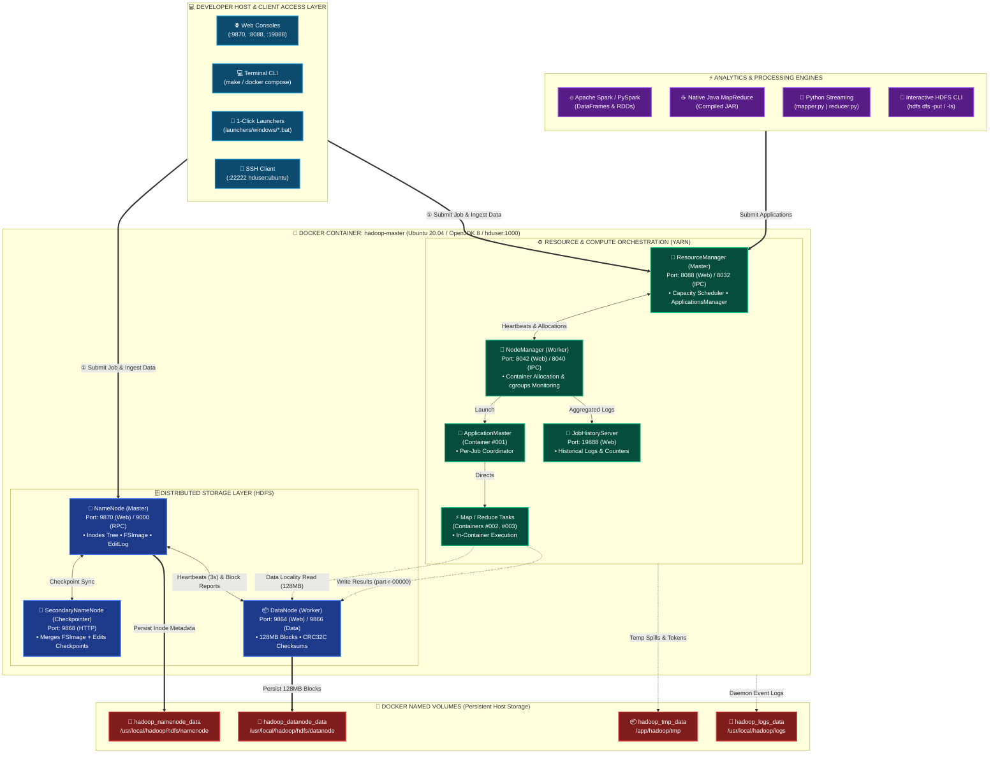
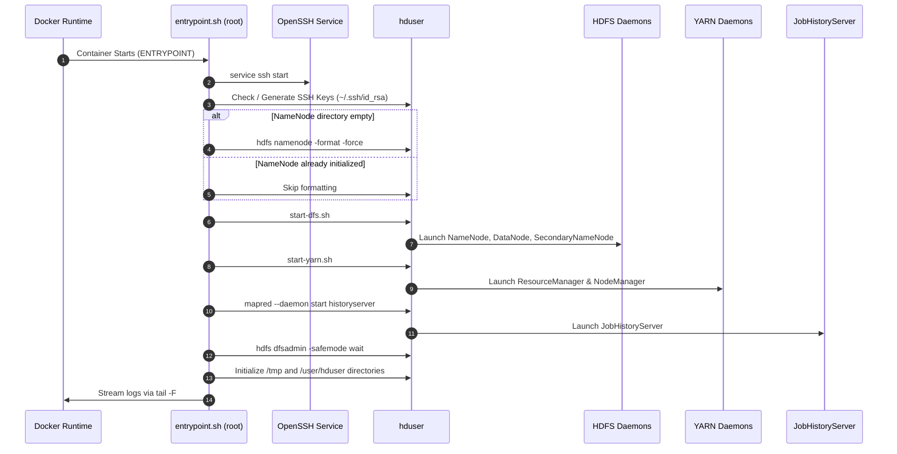
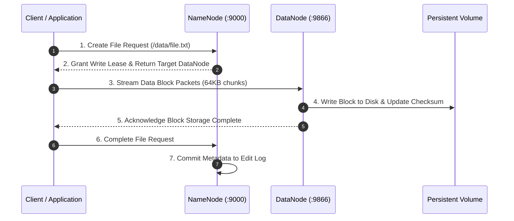
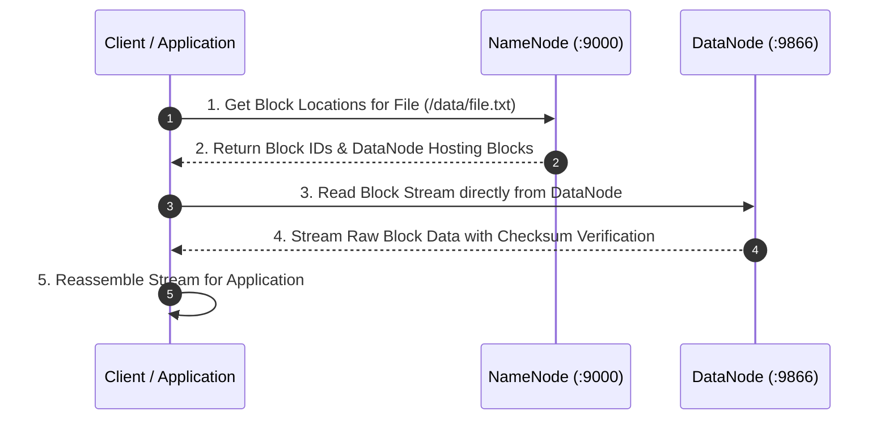
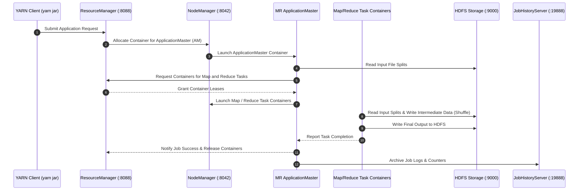

# Apache Hadoop Docker Architecture

This document provides a comprehensive architectural overview of the single-node **Apache Hadoop 3.1.2** containerized cluster, detailing component interactions, daemons, HDFS storage pipelines, YARN scheduling mechanics, container filesystem hierarchy, and network topology.

---

## 📑 Table of Contents

- [System Architecture Overview](#system-architecture-overview)
- [Daemon Responsibilities](#daemon-responsibilities)
- [Storage & Volume Persistence Layout](#storage--volume-persistence-layout)
- [Container Startup & Initialization Flow](#container-startup--initialization-flow)
- [HDFS Data Pipelines](#hdfs-data-pipelines)
  - [HDFS File Write Lifecycle](#hdfs-file-write-lifecycle)
  - [HDFS File Read Lifecycle](#hdfs-file-read-lifecycle)
- [YARN MapReduce Job Execution Flow](#yarn-mapreduce-job-execution-flow)
- [Network & Port Topology](#network--port-topology)
- [Security & Process Execution Model](#security--process-execution-model)

---

## 🏛️ System Architecture Overview

<p align="center">
  <a href="images/hadoop-data-engineering-system-architecture.svg">
    
  </a>
  <br/>
  <em>🔍 Click the diagram above to view the scalable, high-definition vector SVG version.</em>
</p>

The container orchestrates the complete Apache Hadoop 3.1.2 daemon stack inside an isolated Ubuntu 20.04 environment. It exposes all native Web UIs, RPC ports, and SSH endpoints to the host while persisting cluster state through named Docker volumes.



---

## ⚙️ Daemon Responsibilities

| Daemon | Layer | Process Class | Primary Function |
| :--- | :--- | :--- | :--- |
| **NameNode** | HDFS | `org.apache.hadoop.hdfs.server.namenode.NameNode` | Master node for HDFS metadata. Tracks file hierarchy, directory namespace, block locations, and replication factors in memory and FSImage. |
| **DataNode** | HDFS | `org.apache.hadoop.hdfs.server.datanode.DataNode` | Slave storage node. Stores raw block data on disk, validates block checksums, and serves read/write requests from clients. |
| **SecondaryNameNode** | HDFS | `org.apache.hadoop.hdfs.server.namenode.SecondaryNameNode` | Periodically merges the NameNode's `fsimage` with edit logs (`edits_inprogress`) to prevent edit log growth and expedite NameNode restarts. |
| **ResourceManager** | YARN | `org.apache.hadoop.yarn.server.resourcemanager.ResourceManager` | Master resource scheduler and arbiter. Manages cluster CPU and memory resources, arbitrates allocations across applications, and tracks NodeManagers. |
| **NodeManager** | YARN | `org.apache.hadoop.yarn.server.nodemanager.NodeManager` | Per-node compute agent. Launches and monitors compute containers, enforces memory limits, and reports node health to the ResourceManager. |
| **JobHistoryServer** | MapReduce | `org.apache.hadoop.mapreduce.v2.hs.JobHistoryServer` | Archives completed MapReduce application logs, counters, and execution histories for post-mortem analysis and debugging. |

---

## 💾 Storage & Volume Persistence Layout

Hadoop data persists across container restarts using four dedicated Docker volumes:

```text
Host Docker Volume               Container Mount Path                                Description
├── hadoop_namenode_data   --->  /usr/local/hadoop/yarn_data/hdfs/namenode           NameNode fsimage metadata & edit logs
├── hadoop_datanode_data   --->  /usr/local/hadoop/yarn_data/hdfs/datanode           DataNode raw HDFS block files
├── hadoop_tmp_data        --->  /app/hadoop/tmp                                     Hadoop intermediate temp storage
└── hadoop_logs_data       --->  /usr/local/hadoop/logs                              Daemon runtime logs & job histories
```

> [!IMPORTANT]
> Because NameNode metadata and DataNode blocks are stored in separate persistent volumes, formatting the NameNode without clearing the DataNode volume will cause a `clusterID` mismatch error. Always use `make clean` or `docker compose down -v` to perform a full reset.

---

## 🚀 Container Startup & Initialization Flow

When the container boots, `scripts/docker/entrypoint.sh` executes the bootstrap sequence:



---

## 🌊 HDFS Data Pipelines

### HDFS File Write Lifecycle



### HDFS File Read Lifecycle



---

## ⚡ YARN MapReduce Job Execution Flow

When a user submits a MapReduce job (e.g. `yarn jar hadoop-mapreduce-examples.jar pi 2 5`):



---

## 🌐 Network & Port Topology

The container maps internal daemons to host network interfaces:

```text
+-------------------------------------------------------------------------------+
| HOST MACHINE                                                                  |
|                                                                               |
|   :9870  ------------------->  NameNode Web UI                                |
|   :9864  ------------------->  DataNode Web UI                                |
|   :8088  ------------------->  YARN ResourceManager Web UI                    |
|   :8042  ------------------->  YARN NodeManager Web UI                        |
|   :19888 ------------------->  MapReduce JobHistory Web UI                    |
|   :9000  ------------------->  HDFS RPC Port (Client IPC)                     |
|   :22222 ------------------->  Container SSH Daemon (Port 22)                 |
|                                                                               |
+-------------------------------------------------------------------------------+
```

---

## 🔒 Security & Process Execution Model

1. **Non-Root Execution**:
   - Daemons run under the non-privileged `hduser` account (UID: 1000).
   - Sudo privileges (`NOPASSWD:ALL`) are granted to `hduser` for administrative operations inside the container.
2. **Passwordless SSH**:
   - Hadoop start scripts (`start-dfs.sh`, `start-yarn.sh`) require SSH loopback communication.
   - Dedicated RSA keypairs (`~/.ssh/id_rsa` and `~/.ssh/authorized_keys`) are generated with `0600` permissions.
3. **Relaxed Permission Checking**:
   - `dfs.permissions.enabled` is disabled in `hdfs-site.xml` to allow seamless local development and multi-tool experimentation.
4. **Environment & PATH Propagation**:
   - Environment variables (`JAVA_HOME`, `HADOOP_HOME`, `HADOOP_CONF_DIR`, `PATH`) are centralized in `/etc/profile.d/hadoop.sh` and backed into `.bashrc` and `.profile` for both `hduser` and `root`.
   - Automation scripts (`entrypoint.sh`, `healthcheck.sh`, `test-cluster.sh`) utilize subshell environment wrappers (`run_hduser`) ensuring uninterrupted execution across interactive and non-interactive sessions.

