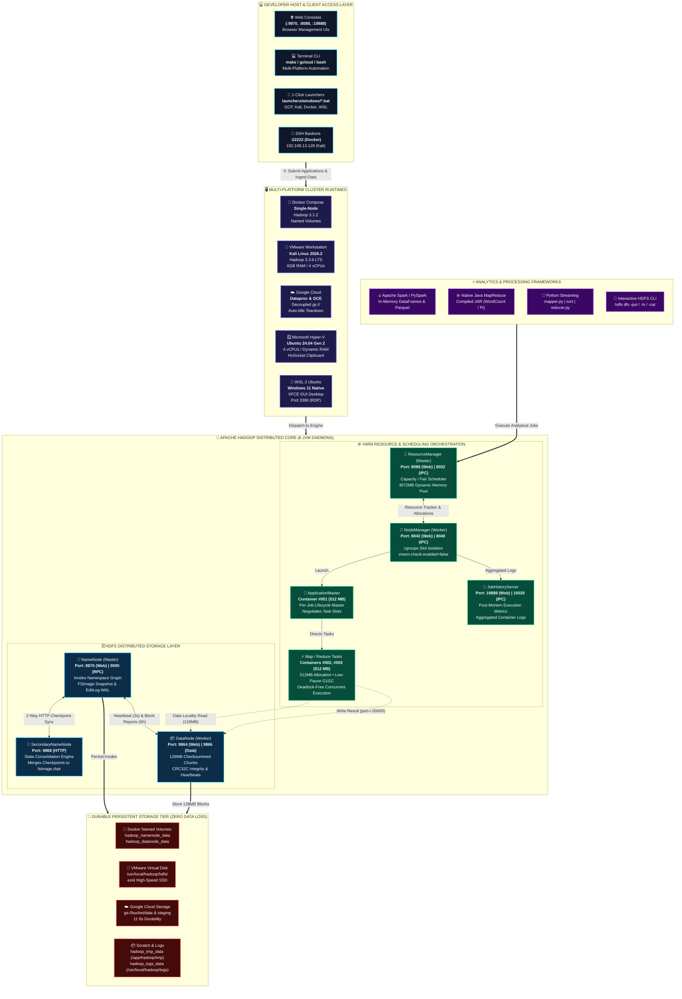
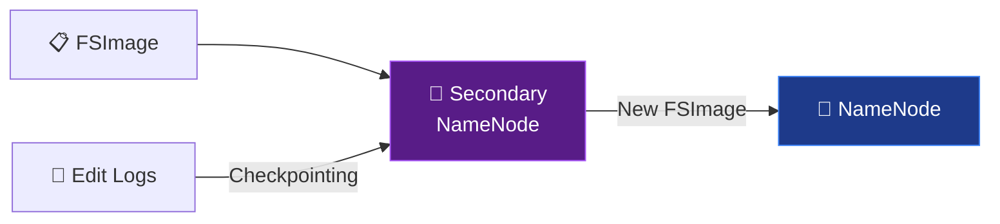
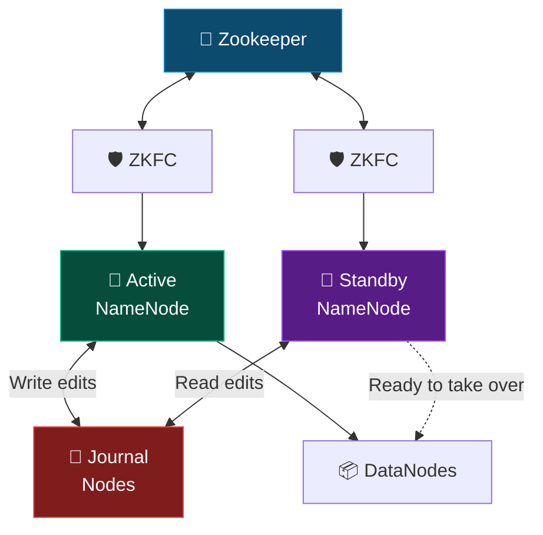
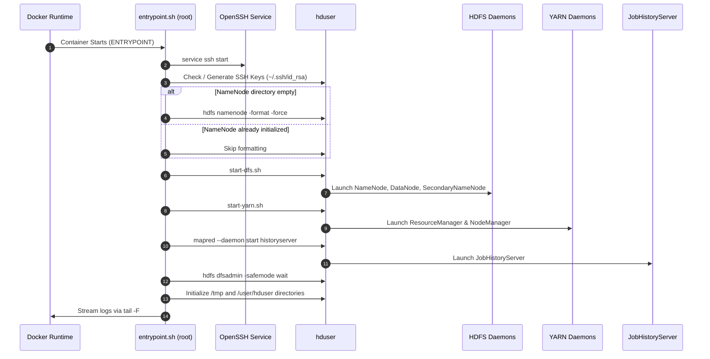
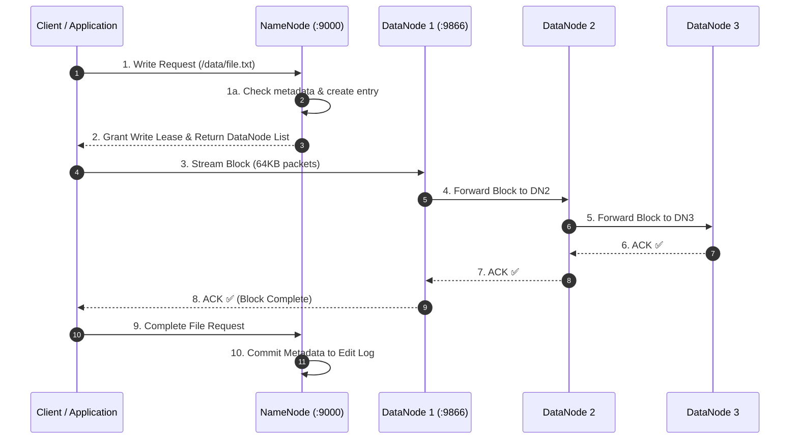
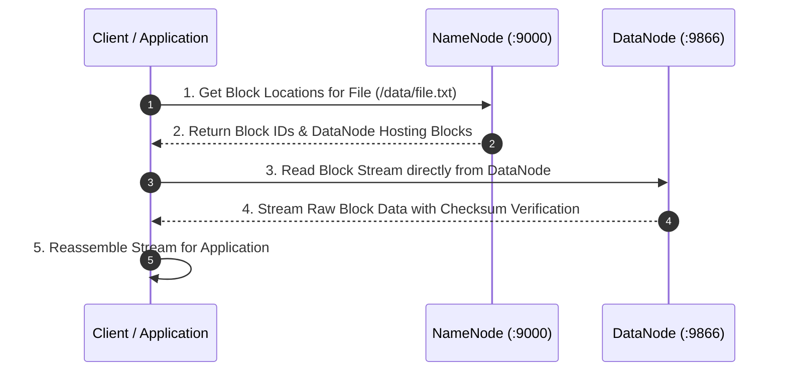
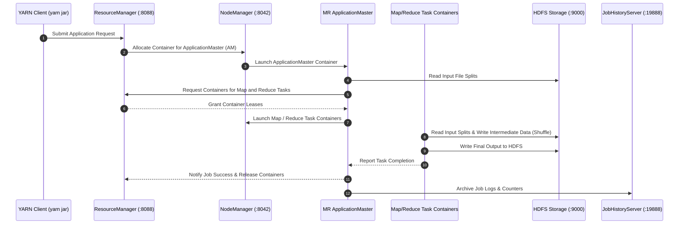

# Apache Hadoop Docker Architecture

This document provides a comprehensive architectural overview of the single-node **Apache Hadoop 3.1.2** containerized cluster, detailing component interactions, daemons, HDFS storage pipelines, YARN scheduling mechanics, container filesystem hierarchy, and network topology.

> 📚 **New to Hadoop?** Start with the [Hadoop Ecosystem Guide](hadoop-ecosystem-guide.md) for a complete theoretical foundation of Hadoop, its ecosystem components, and HDFS concepts.

---

## 📑 Table of Contents

- [System Architecture Overview](#system-architecture-overview)
- [Daemon Responsibilities](#daemon-responsibilities)
- [HDFS Deep-Dive: NameNode vs DataNode](#hdfs-deep-dive-namenode-vs-datanode)
  - [Library Analogy](#-library-analogy)
- [Block Management in HDFS](#block-management-in-hdfs)
- [Replication & Fault Tolerance](#replication--fault-tolerance)
  - [DataNode Failure Handling](#datanode-failure-handling)
  - [NameNode Failure & Secondary NameNode](#namenode-failure--secondary-namenode)
  - [Standby NameNode & HA Architecture](#standby-namenode--ha-architecture)
- [Storage & Volume Persistence Layout](#storage--volume-persistence-layout)
- [Container Startup & Initialization Flow](#container-startup--initialization-flow)
- [HDFS Data Pipelines](#hdfs-data-pipelines)
  - [HDFS File Write Lifecycle](#hdfs-file-write-lifecycle)
  - [HDFS File Read Lifecycle](#hdfs-file-read-lifecycle)
- [YARN MapReduce Job Execution Flow](#yarn-mapreduce-job-execution-flow)
- [Network & Port Topology](#network--port-topology)
- [Security & Process Execution Model](#security--process-execution-model)

---

## 🏛️ System Architecture Overview

<p align="center">
  <a href="images/hadoop-data-engineering-system-architecture.svg">
    
  </a>
  <br/>
  <em>🔍 Click the diagram above to view the scalable, high-definition vector SVG version.</em>
</p>

The container orchestrates the complete Apache Hadoop 3.1.2 daemon stack inside an isolated Ubuntu 20.04 environment. It exposes all native Web UIs, RPC ports, and SSH endpoints to the host while persisting cluster state through named Docker volumes.



---

## ⚙️ Daemon Responsibilities

| Daemon | Layer | Process Class | Primary Function |
| :--- | :--- | :--- | :--- |
| **NameNode** | HDFS | `org.apache.hadoop.hdfs.server.namenode.NameNode` | Master node for HDFS metadata. Tracks file hierarchy, directory namespace, block locations, and replication factors in memory and FSImage. |
| **DataNode** | HDFS | `org.apache.hadoop.hdfs.server.datanode.DataNode` | Slave storage node. Stores raw block data on disk, validates block checksums, and serves read/write requests from clients. |
| **SecondaryNameNode** | HDFS | `org.apache.hadoop.hdfs.server.namenode.SecondaryNameNode` | Periodically merges the NameNode's `fsimage` with edit logs (`edits_inprogress`) to prevent edit log growth and expedite NameNode restarts. |
| **ResourceManager** | YARN | `org.apache.hadoop.yarn.server.resourcemanager.ResourceManager` | Master resource scheduler and arbiter. Manages cluster CPU and memory resources, arbitrates allocations across applications, and tracks NodeManagers. |
| **NodeManager** | YARN | `org.apache.hadoop.yarn.server.nodemanager.NodeManager` | Per-node compute agent. Launches and monitors compute containers, enforces memory limits, and reports node health to the ResourceManager. |
| **JobHistoryServer** | MapReduce | `org.apache.hadoop.mapreduce.v2.hs.JobHistoryServer` | Archives completed MapReduce application logs, counters, and execution histories for post-mortem analysis and debugging. |

---

## 🔍 HDFS Deep-Dive: NameNode vs DataNode

HDFS follows a **Master-Worker architecture** where the NameNode acts as the master coordinator and DataNodes serve as the worker storage nodes.

| Aspect | NameNode | DataNode |
|:---|:---|:---|
| **Definition** | The **master node** in HDFS. Manages metadata and file system namespace | The **worker nodes** in HDFS. Store the actual file data in blocks |
| **Purpose** | Keeps track of file locations, file metadata, and directory structure (but **does not store data**) | Responsible for storing, retrieving, and replicating data blocks |
| **Role** | **Coordinator** — directs how files are stored and accessed across DataNodes | **Executor** — performs read and write operations as instructed by the NameNode |
| **Data Stored** | Metadata (file names, permissions, and locations of data blocks) | Actual data split into blocks |
| **Dependency** | HDFS **cannot function** without a NameNode. It is the **Single Point of Failure (SPOF)** in non-HA setups | HDFS can function with one or more DataNodes; their failure does not stop the system |
| **Communication** | Communicates with clients for file operations and with DataNodes to track block statuses | Communicates with the NameNode for block operations and periodically sends **heartbeat signals** |
| **Fault Tolerance** | Does not store redundant copies (replication is for data blocks only) | Handles fault tolerance through **block replication** across multiple DataNodes |
| **Processes** | Maintains and updates the file system namespace dynamically | Regularly reports to the NameNode with **block reports** and **health checks** |
| **Example Role** | Acts like a **manager in a library**, knowing the exact shelf (DataNode) where a book (block) is stored | Acts like **the shelves in the library**, holding and managing the physical books (blocks) |

### 📚 Library Analogy

A useful analogy to understand HDFS internals:

| HDFS Concept | Library Equivalent | Description |
|:---|:---|:---|
| **NameNode** | 📖 **Librarian** | Knows the exact shelf (DataNode) where every book (block) is stored |
| **DataNodes** | 📚 **Shelves** | Physically hold and manage the actual books (data blocks) |
| **Data Blocks** | 📕 **Books** | The individual units of data stored on the shelves |

---

## 📦 Block Management in HDFS

- A **block** is the smallest unit of storage in HDFS
- Each file is **divided into blocks** distributed across multiple DataNodes
- Default block size: **128 MB** (vs. 4 KB for NTFS)
- Larger blocks mean the NameNode has **less metadata to manage**

### Block Splitting Example

A **600 MB file** with default 128 MB block size produces 5 blocks:

| Block | Size |
|:---:|:---:|
| A | 128 MB |
| B | 128 MB |
| C | 128 MB |
| D | 128 MB |
| E | **88 MB** (remainder — no wasted space) |

### Block Size Trade-Offs

| Action | Parallelism | Metadata Overhead | Example |
|:---|:---|:---|:---|
| **Decrease** (128 MB → 1 MB) | ✅ More parallelism | ❌ Much more metadata | 500 MB → 500 blocks |
| **Increase** (128 MB → 512 MB) | ❌ Less parallelism | ✅ Less metadata | 1 GB → 2 blocks |

> [!TIP]
> The default 128 MB block size is optimal for most Big Data workloads. In this Docker lab, the block size is set via `dfs.blocksize` in [`config/hdfs-site.xml`](../config/hdfs-site.xml).

---

## 🛡️ Replication & Fault Tolerance

### Replication in This Lab

The **default Replication Factor (RF) = 3** in production (1 original + 2 copies), meaning **1 GB → 3 GB** of storage.

> [!NOTE]
> This Docker lab uses **RF = 1** (`dfs.replication=1` in `hdfs-site.xml`) because we run a single-node cluster. In production, always use RF ≥ 3.

### DataNode Failure Handling

DataNodes are susceptible to **temporary failures** from:
1. Network outages
2. Software crashes
3. Node reboot/maintenance

**Detection**: DataNodes send periodic **heartbeats** and **block reports** to the NameNode. If no heartbeat is received for **~10.5 minutes**, the DataNode is marked as dead.

**Recovery Process:**

| Step | Action | Details |
|:---:|:---|:---|
| 1 | **Detection** | NameNode detects missing heartbeat (~10.5 min timeout) |
| 2 | **Re-Replication** | Under-replicated blocks are copied from surviving DataNodes |
| 3 | **Recovery** | When the failed DataNode recovers, metadata is updated and excess replicas are deleted |

### NameNode Failure & Secondary NameNode

The NameNode is the **Single Point of Failure (SPOF)** — HDFS cannot function without it.

> [!CAUTION]
> **The Secondary NameNode is NOT a failover mechanism!** It only performs checkpointing.

The **SecondaryNameNode** in this Docker lab performs two tasks:
1. **Checkpointing**: Periodically merges `fsimage` + `edit logs` → new `fsimage`
2. **Size Management**: Prevents the edit log from growing indefinitely



### Standby NameNode & HA Architecture

For production environments, Hadoop 2.x+ supports **High Availability (HA)** with a Standby NameNode:

| Component | Role |
|:---|:---|
| **Active NameNode** | Serves all client requests |
| **Standby NameNode** | Hot backup — always synchronized via shared edit logs |
| **Zookeeper** | Coordination and leader election |
| **Journal Nodes** | Shared edit log storage between Active and Standby NNs |
| **ZKFC** | Monitors NN health and triggers automatic failover |



> [!NOTE]
> This Docker lab uses a **non-HA setup** with SecondaryNameNode for checkpointing. For production HA deployment, see the [Hadoop Ecosystem Guide](hadoop-ecosystem-guide.md#high-availability-ha-architecture).

---

## 💾 Storage & Volume Persistence Layout

Hadoop data persists across container restarts using four dedicated Docker volumes:

```text
Host Docker Volume               Container Mount Path                                Description
├── hadoop_namenode_data   --->  /usr/local/hadoop/yarn_data/hdfs/namenode           NameNode fsimage metadata & edit logs
├── hadoop_datanode_data   --->  /usr/local/hadoop/yarn_data/hdfs/datanode           DataNode raw HDFS block files
├── hadoop_tmp_data        --->  /app/hadoop/tmp                                     Hadoop intermediate temp storage
└── hadoop_logs_data       --->  /usr/local/hadoop/logs                              Daemon runtime logs & job histories
```

> [!IMPORTANT]
> Because NameNode metadata and DataNode blocks are stored in separate persistent volumes, formatting the NameNode without clearing the DataNode volume will cause a `clusterID` mismatch error. Always use `make clean` or `docker compose down -v` to perform a full reset.

---

## 🚀 Container Startup & Initialization Flow

When the container boots, `scripts/docker/entrypoint.sh` executes the bootstrap sequence:



---

## 🌊 HDFS Data Pipelines

### HDFS File Write Lifecycle

The HDFS write operation follows a **3-step pipeline** model:

**Step 1: Client Interacts with NameNode** — sends write request, receives DataNode list
**Step 2: Data Pipeline** — data flows through a chain of DataNodes (Client → DN1 → DN2 → DN3)
**Step 3: Acknowledgement** — ACKs flow backward through the chain (DN3 → DN2 → DN1 → Client)



**Fault tolerance during writes:**

| Failure Scenario | Handling |
|:---|:---|
| DataNode fails during write | Pipeline is rebuilt excluding the failed DN |
| Client fails | Lease expiration triggers cleanup |
| Network / Rack failure | Rack-aware placement ensures replicas survive |
| NameNode failure | HA failover if configured; otherwise write fails |

### HDFS File Read Lifecycle



---

## ⚡ YARN MapReduce Job Execution Flow

When a user submits a MapReduce job (e.g. `yarn jar hadoop-mapreduce-examples.jar pi 2 5`):



---

## 🌐 Network & Port Topology

The container maps internal daemons to host network interfaces:

```text
+-------------------------------------------------------------------------------+
| HOST MACHINE                                                                  |
|                                                                               |
|   :9870  ------------------->  NameNode Web UI                                |
|   :9864  ------------------->  DataNode Web UI                                |
|   :8088  ------------------->  YARN ResourceManager Web UI                    |
|   :8042  ------------------->  YARN NodeManager Web UI                        |
|   :19888 ------------------->  MapReduce JobHistory Web UI                    |
|   :9000  ------------------->  HDFS RPC Port (Client IPC)                     |
|   :22222 ------------------->  Container SSH Daemon (Port 22)                 |
|                                                                               |
+-------------------------------------------------------------------------------+
```

---

## 🔒 Security & Process Execution Model

1. **Non-Root Execution**:
   - Daemons run under the non-privileged `hduser` account (UID: 1000).
   - Sudo privileges (`NOPASSWD:ALL`) are granted to `hduser` for administrative operations inside the container.
2. **Passwordless SSH**:
   - Hadoop start scripts (`start-dfs.sh`, `start-yarn.sh`) require SSH loopback communication.
   - Dedicated RSA keypairs (`~/.ssh/id_rsa` and `~/.ssh/authorized_keys`) are generated with `0600` permissions.
3. **Relaxed Permission Checking**:
   - `dfs.permissions.enabled` is disabled in `hdfs-site.xml` to allow seamless local development and multi-tool experimentation.
4. **Environment & PATH Propagation**:
   - Environment variables (`JAVA_HOME`, `HADOOP_HOME`, `HADOOP_CONF_DIR`, `PATH`) are centralized in `/etc/profile.d/hadoop.sh` and backed into `.bashrc` and `.profile` for both `hduser` and `root`.
   - Automation scripts (`entrypoint.sh`, `healthcheck.sh`, `test-cluster.sh`) utilize subshell environment wrappers (`run_hduser`) ensuring uninterrupted execution across interactive and non-interactive sessions.

---

## 🐉 Virtual Machine Architecture — VMware Workstation & Kali Linux

In addition to Docker containerization and cloud deployments, this repository provides a complete bare-metal-like virtual machine architecture running **Apache Hadoop 3.3.6 LTS** on **Kali Linux Rolling**:

1. **Hardware Virtualization & Resource Calibration**:
   - Automated VMX calibration allocates **6 GB RAM** and **4 vCPUs** (`scripts/vmware/optimize-kali-vmx.ps1`), leaving 10 GB for Windows host operations.
   - Disables hardware cursor conflicts (`mks.noHostCursor = "TRUE"`) to ensure responsive mouse interaction in VMware Workstation.
   - Configures automatic display resolution to 1080p full-screen via `scripts/vmware/set-display-resolution.sh`.
2. **Hadoop 3.3.6 Daemon Topology**:
   - Runs all 6 JVM daemons actively: `NameNode`, `DataNode`, `SecondaryNameNode`, `ResourceManager`, `NodeManager`, and `JobHistoryServer`.
   - Low-pause garbage collection (`-XX:+UseG1GC`) across master and worker daemons.
   - Container allocation tuned to **512 MB** per task slot, eliminating single-node YARN deadlocks during MapReduce shuffles.
3. **Network & Host Interoperability**:
   - Bridges VM IP (`192.168.13.128`) to the Windows host through VMnet8 NAT.
   - Web consoles accessible from Windows browser: NameNode (`http://192.168.13.128:9870`), YARN (`http://192.168.13.128:8088`), and JobHistory (`http://192.168.13.128:19888`).
   - SSH direct administration via `ssh kali@192.168.13.128`.

> 📖 **Deep Dive**: Refer to [Kali Linux VMware Hadoop Guide](kali-vmware-hadoop-guide.md) for step-by-step installation, VMX tuning, and MapReduce benchmark results.

---

## ☁️ Cloud-Native Architecture — Google Cloud Platform

Beyond single-node containerization, this repository supports enterprise **Google Cloud Platform (GCP)** architectures:

1. **Decoupled Storage & Compute via Cloud Storage (`gs://`)**:
   - The Hadoop `CloudStorageFileSystem` connector substitutes local DataNode storage with Google Cloud Storage.
   - Eliminates NameNode memory limits, provides **11 9s durability**, and reduces persistent storage costs by up to 90%.
2. **Managed Lifecycle via Google Cloud Dataproc**:
   - Master and worker nodes are provisioned on-demand within 90 seconds.
   - Web consoles (YARN `:8088`, HDFS `:9870`, JobHistory `:19888`) are proxied securely through Google Cloud IAM **Component Gateway**.
   - Workers leverage **Spot / Preemptible VMs** for high-throughput, fault-tolerant batch processing.
3. **Containerized Compute Engine (GCE) Deployment**:
   - For hybrid and custom cloud requirements, this repository deploys the exact container stack onto Ubuntu Compute Engine VMs with automated VPC ingress firewall rules.

> 📖 **Deep Dive**: Refer to [Google Cloud Dataproc & GCE Guide](google-cloud-dataproc-hadoop-guide.md) for architecture diagrams, scripts, and cost management policies.


