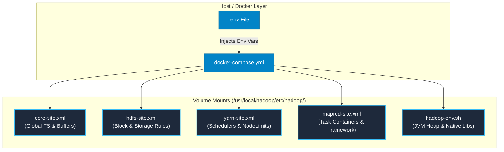
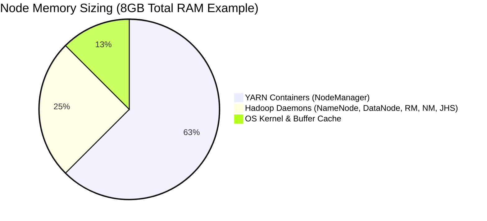

# ⚙️ Configuration & Performance Tuning Guide

This document details the configuration files within the `config/` directory and provides optimization formulas for sizing memory, vCores, I/O buffers, and JVM garbage collection on containerized Hadoop clusters.

---

## 📑 Table of Contents

- [Configuration Architecture](#-configuration-architecture)
- [Memory Allocation & Sizing Model](#-memory-allocation--sizing-model)
- [`core-site.xml` Parameters](#-core-sitexml-parameters)
- [`hdfs-site.xml` Parameters](#-hdfs-sitexml-parameters)
- [`yarn-site.xml` Parameters](#-yarn-sitexml-parameters)
- [`mapred-site.xml` Parameters](#-mapred-sitexml-parameters)
- [`hadoop-env.sh` JVM Heap Configuration](#-hadoop-envsh-jvm-heap-configuration)
- [Production Optimization Best Practices](#-production-optimization-best-practices)

---

## 📁 Configuration Architecture



---

## 🧠 Memory Allocation & Sizing Model



### Sizing Formulas

1. **YARN NodeManager Memory**:
   $$\text{yarn.nodemanager.resource.memory-mb} = \text{Total Container RAM} - \text{Daemons Heap (2GB)} - \text{OS Buffer (1GB)}$$

2. **Map/Reduce Container JVM Heap**:
   $$\text{mapreduce.map.java.opts} = 0.80 \times \text{mapreduce.map.memory.mb}$$
   *(The remaining 20% accommodates JVM Metaspace, thread stacks, and native C++ Snappy libraries).*

---

## ⚙️ `core-site.xml` Parameters

```xml
<configuration>
    <!-- Default Filesystem URI -->
    <property>
        <name>fs.defaultFS</name>
        <value>hdfs://localhost:9000</value>
        <description>Default filesystem URI scheme and authority for client RPC.</description>
    </property>

    <!-- Base temporary directory -->
    <property>
        <name>hadoop.tmp.dir</name>
        <value>/app/hadoop/tmp</value>
        <description>Parent directory for temporary files, local scratch space, and PID locks.</description>
    </property>

    <!-- Stream I/O buffer size (64KB for high-throughput reads/writes) -->
    <property>
        <name>io.file.buffer.size</name>
        <value>65536</value>
    </property>
</configuration>
```

---

## ⚙️ `hdfs-site.xml` Parameters

```xml
<configuration>
    <!-- Block Replication Factor (1 for local single-node cluster) -->
    <property>
        <name>dfs.replication</name>
        <value>1</value>
    </property>

    <!-- Default HDFS Block Size (128 MB) -->
    <property>
        <name>dfs.blocksize</name>
        <value>134217728</value>
    </property>

    <!-- NameNode metadata storage directory -->
    <property>
        <name>dfs.namenode.name.dir</name>
        <value>file:/usr/local/hadoop/yarn_data/hdfs/namenode</value>
    </property>

    <!-- DataNode block storage directory -->
    <property>
        <name>dfs.datanode.data.dir</name>
        <value>file:/usr/local/hadoop/yarn_data/hdfs/datanode</value>
    </property>

    <!-- Relaxed permission checking for local development -->
    <property>
        <name>dfs.permissions.enabled</name>
        <value>false</value>
    </property>
</configuration>
```

---

## ⚙️ `yarn-site.xml` Parameters

```xml
<configuration>
    <!-- Total physical memory (MB) allocated for YARN containers -->
    <property>
        <name>yarn.nodemanager.resource.memory-mb</name>
        <value>4096</value>
    </property>

    <!-- CPU Virtual Cores allocated to NodeManager -->
    <property>
        <name>yarn.nodemanager.resource.cpu-vcores</name>
        <value>4</value>
    </property>

    <!-- Disable strict virtual memory check on Docker containers -->
    <property>
        <name>yarn.nodemanager.vmem-check-enabled</name>
        <value>false</value>
    </property>

    <!-- Auxiliary shuffle service for MapReduce on YARN -->
    <property>
        <name>yarn.nodemanager.aux-services</name>
        <value>mapreduce_shuffle</value>
    </property>
</configuration>
```

---

## ⚙️ `mapred-site.xml` Parameters

```xml
<configuration>
    <property>
        <name>mapred.framework.name</name>
        <value>yarn</value>
    </property>

    <!-- Container RAM for Map and Reduce Tasks -->
    <property>
        <name>mapreduce.map.memory.mb</name>
        <value>1024</value>
    </property>
    <property>
        <name>mapreduce.reduce.memory.mb</name>
        <value>2048</value>
    </property>

    <!-- JVM Heap Limits (80% Rule) -->
    <property>
        <name>mapreduce.map.java.opts</name>
        <value>-Xmx819m</value>
    </property>
    <property>
        <name>mapreduce.reduce.java.opts</name>
        <value>-Xmx1638m</value>
    </property>
</configuration>
```

---

## ☕ `hadoop-env.sh` JVM Heap Configuration

```bash
# Centralized JVM Daemon Heap Allocations
export HDFS_NAMENODE_OPTS="-Xms512m -Xmx1024m -XX:+UseG1GC"
export HDFS_DATANODE_OPTS="-Xms256m -Xmx512m -XX:+UseG1GC"
export YARN_RESOURCEMANAGER_OPTS="-Xms512m -Xmx1024m -XX:+UseG1GC"
export YARN_NODEMANAGER_OPTS="-Xms256m -Xmx512m -XX:+UseG1GC"
```

---

## 🚀 Production Optimization Best Practices

1. **Enable G1GC (`-XX:+UseG1GC`)**:
   - The Garbage-First collector minimizes stop-the-world pauses for large memory heaps (>4GB) across NameNode and ResourceManager.
2. **Intermediate Map Output Compression**:
   - Always set `mapreduce.map.output.compress=true` and use **Snappy** codec to minimize disk spills and network transfer latency.
3. **Small Files Mitigations**:
   - Avoid creating files smaller than the block size (128 MB). Combine small files before ingestion or use `CombineFileInputFormat`.
