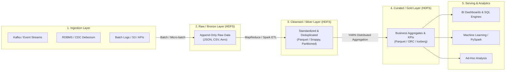
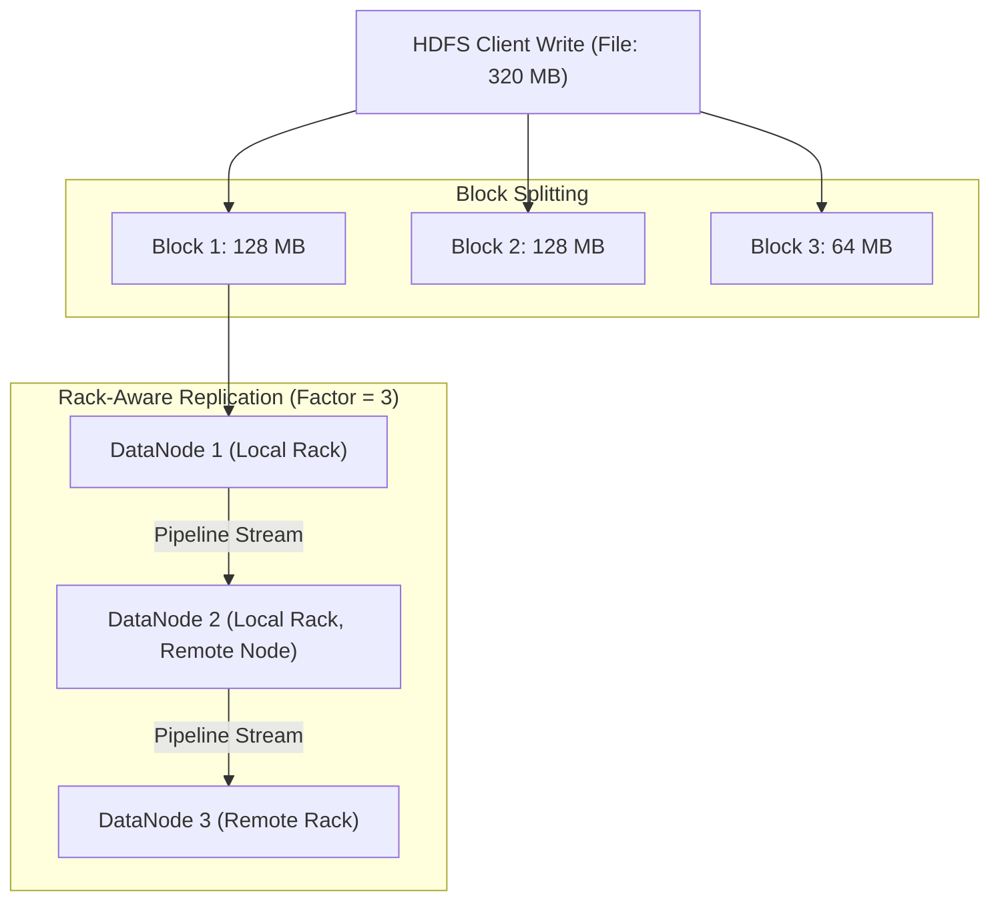
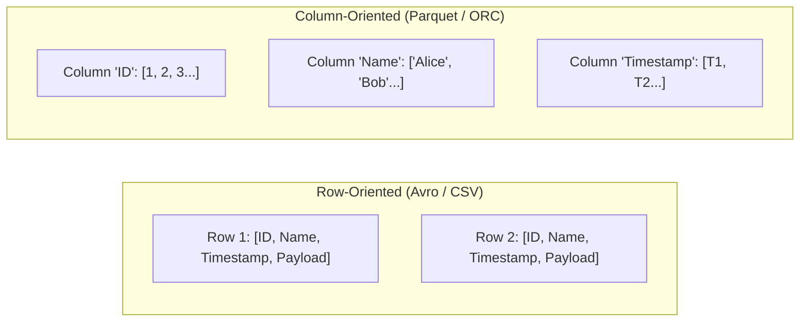
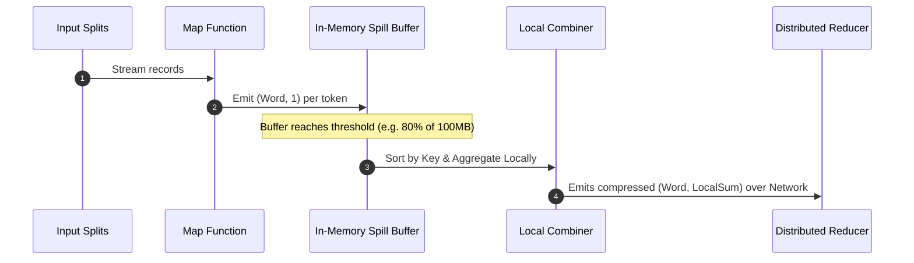
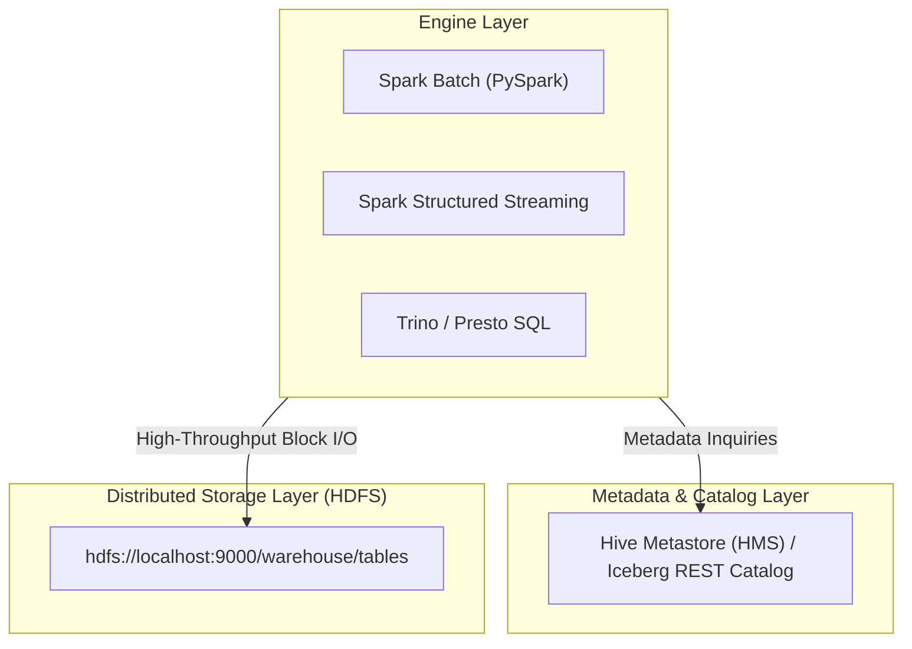

# 🏗️ Big Data Engineering Patterns & Best Practices

This guide provides deep technical architectural patterns, distributed processing methodologies, and storage strategies for building resilient, high-throughput Big Data pipelines with **Apache Hadoop (HDFS & YARN)**, **MapReduce**, and modern analytical engines like **Apache Spark / PySpark**.

---

## 📑 Table of Contents

1. [Big Data Lifecycle & Pipeline Architecture](#1-big-data-lifecycle--pipeline-architecture)
2. [HDFS Distributed Storage Patterns](#2-hdfs-distributed-storage-patterns)
   - [Block Size & Block Placement Strategy](#block-size--block-placement-strategy)
   - [The Small Files Problem & Mitigations](#the-small-files-problem--mitigations)
   - [Partitioning & Bucketing Strategies](#partitioning--bucketing-strategies)
3. [File Formats & Compression Deep Dive](#3-file-formats--compression-deep-dive)
   - [Format Comparison Matrix](#format-comparison-matrix)
   - [Compression Codec Tradeoffs](#compression-codec-tradeoffs)
4. [Distributed Compute & MapReduce Design Patterns](#4-distributed-compute--mapreduce-design-patterns)
   - [In-Mapper Combining & Combiner Functions](#in-mapper-combining--combiner-functions)
   - [Map-Side Joins with DistributedCache](#map-side-joins-with-distributedcache)
   - [Reduce-Side Joins & Secondary Sorting](#reduce-side-joins--secondary-sorting)
5. [Modern Lakehouse & Spark Interoperability](#5-modern-lakehouse--spark-interoperability)
6. [Data Quality, Idempotency & Schema Evolution](#6-data-quality-idempotency--schema-evolution)

---

## 1. Big Data Lifecycle & Pipeline Architecture

Modern data platforms follow a multi-tier data lake / medallion architecture on top of distributed storage:



### Pipeline Tiers

| Layer | Purpose | Storage Format | Schema Policy | Retention / Access |
| :--- | :--- | :--- | :--- | :--- |
| **Bronze (Raw)** | Immutable historical archive of raw source payloads. | Avro, JSON, Raw Text | Schema-on-read | Long-term cold storage; restricted access. |
| **Silver (Cleansed)** | Validated, filtered, type-cast, and deduplicated records. | Parquet / Snappy | Conformed Schema | High-concurrency internal analytics. |
| **Gold (Curated)** | Enriched, star-schema aggregated business metrics. | Parquet / ORC | Rigid / Governed | Production BI, dashboards, downstream feeds. |

---

## 2. HDFS Distributed Storage Patterns

### Block Size & Block Placement Strategy

HDFS stores files as fixed-size blocks (default **128 MB** in Hadoop 3.x).



- **Rack Awareness Policy**:
  - **Replica 1**: Placed on the local node requesting the write (or random node in cluster).
  - **Replica 2**: Placed on a different node within the **same rack** (low inter-switch latency).
  - **Replica 3**: Placed on a node in an **entirely different rack** (survives complete rack switch failures).

### The Small Files Problem & Mitigations

> [!WARNING]
> **The Small Files Problem**: Every file, directory, and block in HDFS occupies ~150 bytes of JVM Heap memory in the **NameNode**. Storing millions of small files (e.g. 1 KB - 100 KB) exhausts NameNode memory and degrades MapReduce split calculation performance.

#### Solutions for Small Files:
1. **Hadoop Archives (HAR)**:
   Pack millions of files into an indexed virtual filesystem:
   ```bash
   hadoop archive -archiveName logs_2026.har -p /raw/logs/2026 /archives/logs/
   hdfs dfs -ls har:///archives/logs/logs_2026.har/
   ```
2. **CombineFileInputFormat**:
   Group multiple small files into a single Map task split dynamically to avoid spawning thousands of short-lived mappers.
3. **Compaction Jobs**:
   Periodic Spark/MapReduce batch jobs that merge delta partitions into optimal 128 MB – 512 MB file chunks.

### Partitioning & Bucketing Strategies

- **Partitioning**: Organizes data into subdirectories (e.g., `/data/events/year=2026/month=08/day=13/`).
  - *Rule of Thumb*: Avoid high-cardinality partitioning (e.g., partitioning by `user_id` or timestamp down to the minute) which creates an explosion of directories.
- **Bucketing (Clustering)**: Hashes records into a fixed number of files within each partition (e.g. `hash(user_id) % 32`).
  - Enables efficient **Map-side bucketed joins** without costly network shuffles.

---

## 3. File Formats & Compression Deep Dive

### Format Comparison Matrix



| Dimension | **Apache Parquet** | **Apache ORC** | **Apache Avro** | **CSV / JSON** |
| :--- | :--- | :--- | :--- | :--- |
| **Storage Layout** | Columnar | Columnar | Row-based | Row-based |
| **Primary Use Case** | Analytical Queries (OLAP), Spark | Hive & Presto/Trino Queries | Streaming Ingestion (Kafka, CDC) | Human-readable Raw Data |
| **Compression Ratio** | ⭐⭐⭐⭐⭐ Very High | ⭐⭐⭐⭐⭐ Very High | ⭐⭐⭐ Medium | ⭐ Low |
| **Projection Pushdown** | ✅ Only reads queried columns | ✅ Only reads queried columns | ❌ Reads entire row | ❌ Reads entire row |
| **Predicate Pushdown** | ✅ Min/Max stats per row-group | ✅ Min/Max, bloom filters | ❌ Limited | ❌ No |
| **Schema Evolution** | ✅ Excellent (supports add/drop) | ✅ Excellent | ✅ Full Schema Registry support | ❌ Fragile |
| **Splittable** | ✅ Yes | ✅ Yes | ✅ Yes (sync markers) | ⚠️ Only with uncompressed/Bzip2 |

### Compression Codec Tradeoffs

| Codec | Splittable? | Compression Ratio | CPU Usage / Speed | Recommended Scenario |
| :--- | :---: | :---: | :---: | :--- |
| **Snappy** | ❌ (Splittable in container formats like Parquet/Avro) | Moderate (40-50%) | ⚡ Ultra-fast | **Default for Parquet & Spark intermediate shuffles**. |
| **ZSTD** | ❌ (Splittable in Parquet/ORC) | High (60-75%) | ⚡ Balanced / Configurable | **Modern cold & warm analytical data lakes**. |
| **Gzip** | ❌ No | High (60-70%) | 🐢 Medium CPU | Cold storage when single-file split is not required. |
| **Bzip2** | ✅ Yes | Very High (75%+) | 🐌 High CPU | Archival storage requiring block-level splitting. |

---

## 4. Distributed Compute & MapReduce Design Patterns

### In-Mapper Combining & Combiner Functions

Traditional MapReduce emits intermediate `(key, value)` pairs for every input record, saturating network I/O during the **Shuffle & Sort** phase.



- **Combiner Rule**: Combiners must be **associative** and **commutative** operations (e.g. `SUM`, `MIN`, `MAX`, `COUNT`). For non-commutative operations like `AVERAGE`, emit `(Count, Sum)` tuples.

### Map-Side Joins with DistributedCache

When joining a **large dataset (Fact table)** with a **small dataset (Dimension table < 100 MB)**:

1. Send the small dataset to every worker node via **Hadoop DistributedCache**.
2. Load the small dataset into an in-memory `HashMap` during the Mapper's `setup()` phase.
3. Lookup matches directly in memory inside the `map()` method without triggering any Reducers or network shuffles.

```java
// Map-Side Join Pattern in Hadoop Java
public class MapSideJoinMapper extends Mapper<LongWritable, Text, Text, Text> {
    private Map<String, String> departmentMap = new HashMap<>();

    @Override
    protected void setup(Context context) throws IOException {
        URI[] cacheFiles = context.getCacheFiles();
        if (cacheFiles != null && cacheFiles.length > 0) {
            BufferedReader reader = new BufferedReader(new FileReader("departments.csv"));
            String line;
            while ((line = reader.readLine()) != null) {
                String[] parts = line.split(",");
                departmentMap.put(parts[0].trim(), parts[1].trim()); // dept_id -> dept_name
            }
            reader.close();
        }
    }

    @Override
    protected void map(LongWritable key, Text value, Context context) 
            throws IOException, InterruptedException {
        String[] emp = value.toString().split(",");
        String deptName = departmentMap.getOrDefault(emp[2], "UNKNOWN");
        context.write(new Text(emp[0]), new Text(emp[1] + "\t" + deptName));
    }
}
```

### Reduce-Side Joins & Secondary Sorting

For joining two large datasets:
- Tag records with their source origin (`Source_A` vs `Source_B`).
- Use a **Composite Key** `(JoinKey, Tag)` and custom **Partitioner** (partitioning only on `JoinKey`).
- Custom **GroupingComparator** groups all records for `JoinKey` together so the Reducer receives records in deterministic order.

---

## 5. Modern Lakehouse & Spark Interoperability

HDFS serves as the storage foundation for Apache Spark, Apache Iceberg, and Hive Metastore:



### PySpark Integration with HDFS RPC Endpoint (`hdfs://localhost:9000`)

```python
from pyspark.sql import SparkSession
from pyspark.sql.functions import col, count, sum

spark = SparkSession.builder \
    .appName("HDFS-Data-Engineering-Pipeline") \
    .master("yarn") \
    .config("spark.hadoop.fs.defaultFS", "hdfs://localhost:9000") \
    .config("spark.sql.parquet.compression.codec", "snappy") \
    .getOrCreate()

# 1. Read Raw CSV from HDFS Bronze Zone
df_raw = spark.read.csv("hdfs://localhost:9000/bronze/events/*.csv", header=True, inferSchema=True)

# 2. Transform & Aggregate (Silver / Gold Zone)
df_clean = df_raw.filter(col("status") == "SUCCESS") \
    .groupBy("category_id", "country") \
    .agg(count("event_id").alias("total_events"), sum("amount").alias("revenue"))

# 3. Write Optimized Partitioned Parquet to Gold Zone
df_clean.write \
    .mode("overwrite") \
    .partitionBy("country") \
    .parquet("hdfs://localhost:9000/gold/aggregated_events/")
```

---

## 6. Data Quality, Idempotency & Schema Evolution

### 1. Write-Audit-Publish (WAP) Pattern
- **Write**: Write pipeline output to a temporary staging partition `/warehouse/table/.staging_batch_id/`.
- **Audit**: Run automated data quality assertions (non-null primary keys, row count bounds, schema adherence).
- **Publish**: Atomically swap/rename staging files to the target production path `/warehouse/table/date=2026-08-13/` using HDFS atomic rename (`hdfs dfs -mv`).

### 2. Idempotency & Deterministic Backfilling
- Avoid non-deterministic pipelines that append duplicate data upon retries.
- Always use **dynamic partition overwrites** or truncate-and-load partition replacement.

### 3. Schema Evolution with Parquet & Avro
- Backward compatible changes (adding optional fields with default values).
- Never rename existing columns in-place; write new columns and deprecate old ones gracefully.
