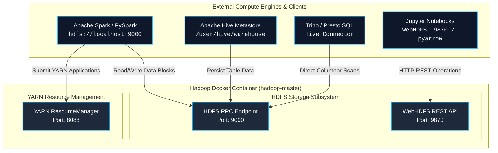

# 🔌 Big Data Ecosystem Integration Guide

This guide details how to seamlessly connect external distributed compute engines, notebooks, and query frameworks to this containerized **Apache Hadoop 3.1.2** cluster.

---

## 📑 Table of Contents

- [Ecosystem Architecture](#-ecosystem-architecture)
- [Apache Spark & PySpark Integration](#-apache-spark--pyspark-integration)
- [Apache Hive Metastore & Tables](#-apache-hive-metastore--tables)
- [Trino / Presto SQL Query Engines](#-trino--presto-sql-query-engines)
- [Jupyter Notebooks & Python Clients](#-jupyter-notebooks--python-clients)

---

## 🌐 Ecosystem Architecture



---

## ⚡ Apache Spark & PySpark Integration

PySpark applications on your host machine or within separate containers can directly interact with HDFS.

### PySpark Read & Write Script

```python
from pyspark.sql import SparkSession

# 1. Initialize Spark session pointing to HDFS DefaultFS
spark = SparkSession.builder \
    .appName("PySpark-HDFS-Integration") \
    .master("local[*]") \
    .config("spark.hadoop.fs.defaultFS", "hdfs://localhost:9000") \
    .config("spark.sql.parquet.compression.codec", "snappy") \
    .getOrCreate()

# 2. Sample Data
data = [
    ("Alice", "Engineering", 120000),
    ("Bob", "Marketing", 95000),
    ("Charlie", "Data Science", 135000),
    ("Diana", "Engineering", 125000)
]
df = spark.createDataFrame(data, ["name", "department", "salary"])

# 3. Write Partitioned Parquet to HDFS
df.write \
    .mode("overwrite") \
    .partitionBy("department") \
    .parquet("hdfs://localhost:9000/warehouse/employees.parquet")

# 4. Query Back from HDFS
result_df = spark.read.parquet("hdfs://localhost:9000/warehouse/employees.parquet")
result_df.groupBy("department").avg("salary").show()

spark.stop()
```

---

## 🐝 Apache Hive Metastore & Tables

### 1. Initialize HDFS Warehouse Directories

```bash
docker compose exec hadoop hdfs dfs -mkdir -p /tmp /user/hive/warehouse
docker compose exec hadoop hdfs dfs -chmod -R 1777 /tmp
docker compose exec hadoop hdfs dfs -chmod -R 777 /user/hive/warehouse
```

### 2. Configure `hive-site.xml`

```xml
<configuration>
    <property>
        <name>fs.defaultFS</name>
        <value>hdfs://localhost:9000</value>
    </property>
    <property>
        <name>hive.metastore.warehouse.dir</name>
        <value>/user/hive/warehouse</value>
    </property>
</configuration>
```

---

## 🚀 Trino / Presto SQL Query Engines

Configure the Hive catalog in Trino (`etc/catalog/hdfs.properties`):

```properties
connector.name=hive
hive.metastore.uri=thrift://localhost:9083
hive.config.resources=/path/to/core-site.xml,/path/to/hdfs-site.xml
```

---

## 📓 Jupyter Notebooks & Python Clients

### Option A: Using `pyarrow`

```python
import pyarrow.fs as fs

# Connect to native HDFS C++ client
hdfs = fs.HadoopFileSystem("localhost", port=9000, user="hduser")

# List files
file_info = hdfs.get_file_info(fs.FileSelector("/", recursive=False))
for f in file_info:
    print(f.path, f.type)
```

### Option B: Using WebHDFS REST Client (`hdfs` library)

```python
from hdfs import InsecureClient
import pandas as pd

client = InsecureClient('http://localhost:9870', user='hduser')

# Upload DataFrame to HDFS CSV
df = pd.DataFrame({"id": [1, 2, 3], "val": ["A", "B", "C"]})
with client.write('/user/hduser/data.csv', encoding='utf-8', overwrite=True) as writer:
    df.to_csv(writer, index=False)
```

---

## 🌐 Unified Big Data Control Hub (Port 3030)

The **Unified Big Data Engineering Control Hub** provides an all-in-one glassmorphic command center for the entire cluster:

- **URL**: [http://localhost:3030](http://localhost:3030)
- **Live Monitoring**: Probes all 10 cluster daemons (HDFS, YARN, Spark Master, Spark Worker, Spark History, JupyterLab, Hive) every 5 seconds.
- **Interactive HDFS File Explorer**: Browse blocks, directories, and preview datasets directly in the browser via WebHDFS.
- **Interactive Job & Query Studio**: One-click execution of Spark Pi, PySpark DataFrame ETL, MapReduce WordCount, and Hive SQL with streaming terminal output.
- **Architecture Blueprints**: Embedded interactive vector SVG and high-resolution PNG viewers with zoom and fullscreen capabilities.

---

## ⚡ Apache Spark Standalone Cluster & History Server

The ecosystem includes a fully containerized Apache Spark 3.5 standalone cluster:

| Component | Web UI Port | RPC Port | Description |
| :--- | :---: | :---: | :--- |
| **Spark Master** | `http://localhost:8080` | `spark://localhost:7077` | Cluster manager, executor dispatch, resource coordination |
| **Spark Worker** | `http://localhost:8081` | Dynamic | Task execution slots (2 cores, 1024MB RAM) |
| **Spark History Server** | `http://localhost:18080` | -- | Event log diagnostics reading from HDFS `/spark-logs` |

### Submitting a Job via Spark Submit:
```bash
docker compose exec spark-master spark-submit \
  --class org.apache.spark.examples.SparkPi \
  --master spark://spark-master:7077 \
  /opt/bitnami/spark/examples/jars/spark-examples_2.12-3.5.1.jar 10
```

---

## 🪐 JupyterLab PySpark Interactive Studio (Port 8888)

Access the interactive notebook environment at **[http://localhost:8888](http://localhost:8888)**:

- **Pre-Built Notebooks** (`notebooks/`):
  1. `01-pyspark-hdfs-pipeline.ipynb`: Ingest CSV, transform DataFrames, write Snappy Parquet to HDFS.
  2. `02-spark-sql-hive-analytics.ipynb`: Window functions, table joins, and Hive data warehouse queries.
  3. `03-realtime-streaming-simulation.ipynb`: Structured Streaming micro-batch aggregations.
- **Data Engineering Stack**: Pre-configured with PySpark 3.5, PyArrow, Pandas, DuckDB, and HDFS connectivity out of the box.

---

## 🔄 Apache Sqoop Data Ingestion (RDBMS <-> HDFS)

Sqoop enables bidirectional bulk data movement between relational databases (MySQL, PostgreSQL, Oracle) and the Hadoop DataLake:

```bash
# Ingest relational table into HDFS as delimited text
sqoop import \
  --connect "jdbc:mysql://mysql:3306/retail_db" \
  --username "root" --password "H@doop2022" \
  --table customers \
  --target-dir "/data/sqoop/customers" \
  --split-by customer_id --num-mappers 2 \
  --fields-terminated-by ',' --delete-target-dir
```

---

## 📋 Apache Oozie Workflow Orchestration

Oozie manages multi-stage pipeline execution DAGs:

```xml
<!-- Sample Oozie Action Node (Spark -> Pig transition) -->
<action name="spark-transformation">
    <spark xmlns="uri:oozie:spark-action:0.2">
        <job-tracker>${jobTracker}</job-tracker>
        <name-node>${nameNode}</name-node>
        <master>spark://${sparkMaster}:7077</master>
        <mode>client</mode>
        <jar>${nameNode}/apps/spark/etl.jar</jar>
    </spark>
    <ok to="pig-aggregation"/>
    <error to="fail-notification"/>
</action>
```

---

## 🐷 Apache Pig Latin Dataflow

Pig Latin provides a high-level procedural dataflow language translated into MapReduce or Tez execution DAGs:

```pig
-- Load, filter, group, and store
customers = LOAD '/data/sqoop/customers.csv' USING PigStorage(',') AS (id:int, name:chararray, country:chararray, credit:double);
high_value = FILTER customers BY credit >= 5000.0;
grouped = GROUP high_value BY country;
summary = FOREACH grouped GENERATE group AS country, COUNT(high_value) AS count, AVG(high_value.credit) AS avg_credit;
STORE summary INTO '/data/pig_output' USING PigStorage(',');
```


