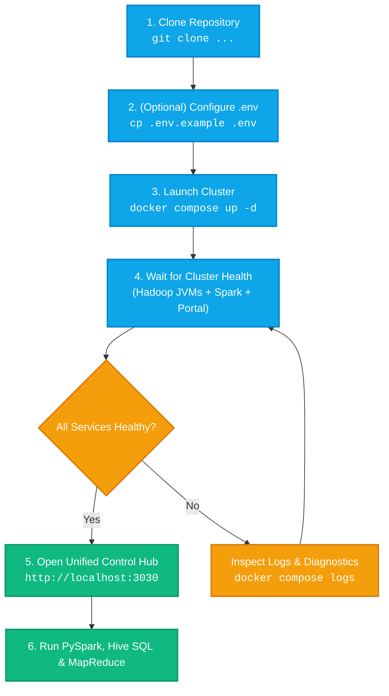

# 🚀 Getting Started with Apache Hadoop on Docker

This guide walks you through provisioning, verifying, configuring, and interacting with your containerized **Apache Hadoop 3.1.2** single-node cluster.

---

## 📑 Table of Contents

- [System Requirements](#-system-requirements)
- [Quick Start Flow](#-quick-start-flow)
- [Step-by-Step Installation](#-step-by-step-installation)
- [Verifying Cluster Health](#-verifying-cluster-health)
- [Web Interfaces & Port Access](#-web-interfaces--port-access)
- [Essential HDFS Operations](#-essential-hdfs-operations)
- [Executing MapReduce Jobs](#-executing-mapreduce-jobs)
- [Cluster Lifecycle & Teardown](#-cluster-lifecycle--teardown)

---

## 💻 System Requirements

| Resource | Minimum Spec | Recommended |
| :--- | :--- | :--- |
| **Host OS** | Linux, macOS (Intel/Apple Silicon), Windows 10/11 (WSL2) | Ubuntu 22.04 LTS / macOS 14+ / Windows 11 WSL2 |
| **Docker Engine** | `20.10.0+` | `24.0.0+` |
| **Docker Compose** | `v2.0.0+` | `v2.20.0+` |
| **Host RAM** | 4 GB | 8 GB+ |
| **Free Storage** | 5 GB | 15 GB+ (SSD recommended) |

---

## 🔄 Quick Start Flow



---

## 🛠️ Step-by-Step Installation

### Step 1: Clone the Repository

```bash
git clone https://github.com/Sohila-Khaled-Abbas/docker-hadoop.git
cd docker-hadoop
```

### Step 2: (Optional) Configure Environment Settings

To customize host port mappings, memory thresholds, or container names, inspect or copy the `.env` template:

```bash
cp .env.example .env
```

> [!TIP]
> On Windows systems, the default SSH host port is set to **`22222`** and the Control Hub port is set to **`3030`** (with automatic collision fallback if 3000 is occupied by local services like n8n or Grafana).

### Step 3: Build & Start the Cluster

Using **Docker Compose**:
```bash
docker compose up -d
```

Or using **Make**:
```bash
make up
```

Or on Windows, simply double-click:
```cmd
launchers\windows\Start-Hadoop-Docker.bat
```

---

## 🩺 Verifying Cluster Health

### 1. Check Container Health Status

```bash
docker compose ps
```

Expected output:
```text
NAME             IMAGE                  COMMAND                  SERVICE         STATUS                   PORTS
bigdata-portal   docker-hadoop-portal   "node server.js"         portal          Up 2 minutes (healthy)   0.0.0.0:3030->3000/tcp
hadoop-master    hadoop-cluster:3.1.2   "/entrypoint.sh"         hadoop          Up 2 minutes (healthy)   0.0.0.0:8042->8042/tcp, 0.0.0.0:8088->8088/tcp, 0.0.0.0:9000->9000/tcp, 0.0.0.0:9864->9864/tcp, 0.0.0.0:9870->9870/tcp, 0.0.0.0:19888->19888/tcp, 0.0.0.0:22222->22/tcp
spark-master     bitnami/spark:3.5.1    "/opt/bitnami/script…"   spark-master    Up 2 minutes             0.0.0.0:7077->7077/tcp, 0.0.0.0:8080->8080/tcp
spark-worker     bitnami/spark:3.5.1    "/opt/bitnami/script…"   spark-worker    Up 2 minutes             0.0.0.0:8081->8081/tcp
spark-history    bitnami/spark:3.5.1    "/opt/bitnami/script…"   spark-history   Up 2 minutes             0.0.0.0:18080->18080/tcp
bigdata-jupyter  jupyter/pyspark-noteb… "start-notebook.sh"      jupyter         Up 2 minutes             0.0.0.0:8888->8888/tcp
```

> [!NOTE]
> Hadoop starts 6 distinct Java daemons sequentially. The health check allows a **120-second startup period** before validating endpoints.

### 2. Verify Running Java Processes (JPS)

Execute `jps` inside the running Hadoop container:

```bash
docker compose exec hadoop jps
```

Expected daemons list:
```text
173 NameNode
261 DataNode
409 SecondaryNameNode
801 ResourceManager
886 NodeManager
1028 JobHistoryServer
1240 Jps
```

---

## 🌐 Web Interfaces & Port Access

The cluster exposes **10 integrated web dashboards and RPC endpoints**. The easiest way to access everything is via the **Unified Big Data Control Hub**:

| Dashboard | URL | Operational Function |
| :--- | :--- | :--- |
| **🚀 Unified Control Hub** | [http://localhost:3030](http://localhost:3030) | **Single-pane-of-glass portal**: Service matrix, HDFS explorer, Job/Query Studio, live logs, and architecture diagrams. |
| **HDFS NameNode** | [http://localhost:9870](http://localhost:9870) | Browse HDFS filesystem, inspect cluster capacity, and monitor DataNodes. |
| **HDFS DataNode** | [http://localhost:9864](http://localhost:9864) | Inspect physical block volumes and DataNode operational metrics. |
| **YARN ResourceManager** | [http://localhost:8088](http://localhost:8088) | Monitor active applications, scheduler queues, and memory/vcore metrics. |
| **YARN NodeManager** | [http://localhost:8042](http://localhost:8042) | Container allocations, node health status, and node-local logs. |
| **MapReduce JobHistory** | [http://localhost:19888](http://localhost:19888) | Historical MapReduce metrics, task counters, and execution timelines. |
| **⚡ Spark Master UI** | [http://localhost:8080](http://localhost:8080) | Spark Standalone cluster manager, active/completed applications, workers. |
| **⚡ Spark Worker UI** | [http://localhost:8081](http://localhost:8081) | Worker core allocations, executor logs, and memory consumption. |
| **⚡ Spark History Server** | [http://localhost:18080](http://localhost:18080) | Post-mortem Spark execution DAGs, stage execution times, and shuffle stats. |
| **🪐 JupyterLab / PySpark** | [http://localhost:8888](http://localhost:8888) | Interactive PySpark notebooks, SQL querying, and data science exploratory analysis. |
| **SSH Terminal** | `ssh -p 22222 hduser@localhost` | Direct shell access with password: `ubuntu`. |

> [!IMPORTANT]
> Web UIs operate over plain HTTP (`http://`). If Chrome/Edge auto-redirects to HTTPS, open the URL in an **Incognito Window** using `http://127.0.0.1:3030` or see [Troubleshooting: Issue 9](troubleshooting.md#issue-9-browser-err_empty_response-localhost-didnt-send-any-data-on-web-uis).

---

## 💻 Essential HDFS Operations

<details>
<summary><b>📂 Click to expand HDFS CLI cheatsheet</b></summary>

```bash
# 1. Open interactive bash session
docker compose exec -it hadoop bash

# 2. List root directory
hdfs dfs -ls /

# 3. Create user workspaces
hdfs dfs -mkdir -p /user/mydata /input

# 4. Upload local configuration files into HDFS
hdfs dfs -put /usr/local/hadoop/etc/hadoop/*.xml /input/

# 5. Display file content from HDFS
hdfs dfs -cat /input/core-site.xml | head -n 25

# 6. Inspect storage capacity and alive DataNodes
hdfs dfsadmin -report

# 7. Check directory size in human-readable units
hdfs dfs -du -h /input

# 8. Download files from HDFS to local container storage
hdfs dfs -get /input/core-site.xml /tmp/local-copy.xml

# 9. Clean up test directories
hdfs dfs -rm -r /input
```

</details>

---

## 🧪 Executing MapReduce Jobs

### 1. Calculate Pi (Monte Carlo Estimation)

```bash
docker compose exec hadoop yarn jar \
  /usr/local/hadoop/share/hadoop/mapreduce/hadoop-mapreduce-examples-3.1.2.jar \
  pi 4 1000
```

### 2. Python Hadoop Streaming WordCount

```bash
# Run one-click Python Streaming runner
bash examples/mapreduce-python/run.sh
```

### 3. Java Native MapReduce WordCount

```bash
# Compile and run Java Native MapReduce
bash examples/mapreduce-java/compile-and-run.sh
```

---

## ⚡ Executing Apache Spark & PySpark Jobs

### 1. Calculate Pi on Spark Master

```bash
# Run Spark Pi on the Standalone Cluster
docker compose exec spark-master spark-submit \
  --class org.apache.spark.examples.SparkPi \
  --master spark://spark-master:7077 \
  /opt/bitnami/spark/examples/jars/spark-examples_2.12-3.5.1.jar 10
```

### 2. Interactive PySpark Shell with HDFS Support

```bash
docker compose exec -it spark-master pyspark --master spark://spark-master:7077
```

Inside the PySpark shell:
```python
# Read and process text directly from HDFS
lines = sc.textFile("hdfs://hadoop:9000/input/core-site.xml")
print("Total lines in HDFS file:", lines.count())
```

### 3. JupyterLab Data Engineering Notebooks

Navigate to **[http://localhost:8888](http://localhost:8888)** and run the pre-built notebooks in `notebooks/`:
- `01-pyspark-hdfs-pipeline.ipynb`: End-to-end ingestion, schema transformation, and partitioned Parquet write to HDFS.
- `02-spark-sql-hive-analytics.ipynb`: Spark SQL relational aggregations, window functions, and external HDFS table queries.
- `03-realtime-streaming-simulation.ipynb`: Structured Streaming micro-batch window aggregations.

---

## 🔄 Executing Ingestion, Pipelines & Analytics (Sqoop, Oozie, Pig & Hive)

### 1. Apache Sqoop RDBMS Ingestion & Export

```bash
# 1. Populate sample MySQL seed database
mysql -u root -p retail_db < examples/sqoop/seed-data.sql

# 2. Run Sqoop import: MySQL -> HDFS & Hive
bash examples/sqoop/sqoop-import-mysql.sh

# 3. Run Sqoop export: Aggregated HDFS -> MySQL
bash examples/sqoop/sqoop-export-mysql.sh
```

### 2. Apache Pig Latin Analytics

```bash
# Run Pig Latin aggregation script over customer dataset
bash examples/pig/run-pig.sh examples/pig/analytics.pig /data/sqoop/customers.csv /data/pig_output
```

### 3. Apache Hive Data Warehouse Analytics

```bash
# 1. Create external CSV and partitioned Parquet tables in Hive
bash examples/hive/run-hive.sh examples/hive/create-tables.hql

# 2. Run analytical window rank queries
bash examples/hive/run-hive.sh examples/hive/analytics.hql
```

### 4. Apache Oozie Workflow Pipeline

```bash
# Validate and submit multi-action Oozie workflow (Sqoop -> Spark -> Pig -> Hive)
bash examples/oozie/run-oozie-pipeline.sh examples/oozie/job.properties
```

---

## 🛑 Cluster Lifecycle & Teardown

```bash
# Stop containers (Preserves all HDFS data and volumes)
docker compose down

# Restart the cluster
docker compose restart

# Full Clean Reset (Removes all images, containers, and data volumes)
make clean
# or
docker compose down -v --rmi all
```

---

## 🖥️ Alternative VM & Native Deployment Guides

Prefer running Hadoop inside a dedicated virtual machine or WSL2 instead of Docker? We provide fully automated, production-tuned deployment guides for all major virtualization platforms:

| Platform | Target OS | Sizing & Tuning | Guide Link |
| :--- | :--- | :--- | :--- |
| **VMware Workstation Pro** | **Kali Linux Rolling** | 6GB RAM, 4 vCPUs, OpenJDK 11, G1GC | [Kali VMware Setup Guide](kali-vmware-hadoop-guide.md) |
| **Oracle VirtualBox** | **Ubuntu 24.04 / 22.04 LTS** | 5GB RAM, 4 vCPUs, UEFI, FHD | [VirtualBox Ubuntu Guide](virtualbox-ubuntu-guide.md) |
| **Microsoft Hyper-V** | **Ubuntu 24.04 / 22.04 LTS** | Gen 2 UEFI, 4 vCPUs, Dynamic Memory | [Hyper-V Ubuntu Guide](hyperv-ubuntu-guide.md) |
| **Windows Subsystem for Linux (WSL2)** | **Ubuntu on WSL2** | Mirrored mode, systemd, GUI | [WSL2 Ubuntu Guide](wsl2-ubuntu-hadoop-guide.md) |

