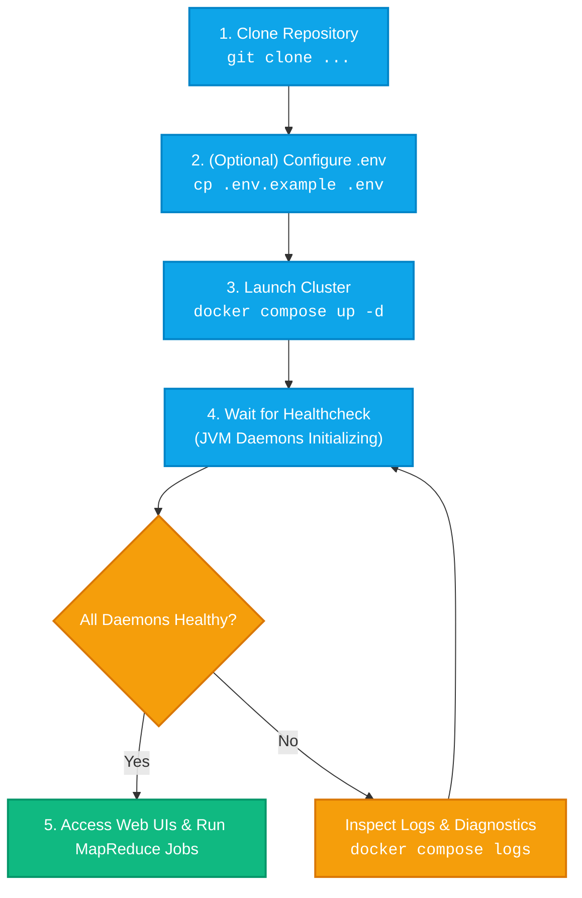

# 🚀 Getting Started with Apache Hadoop on Docker

This guide walks you through provisioning, verifying, configuring, and interacting with your containerized **Apache Hadoop 3.1.2** single-node cluster.

---

## 📑 Table of Contents

- [System Requirements](#-system-requirements)
- [Quick Start Flow](#-quick-start-flow)
- [Step-by-Step Installation](#-step-by-step-installation)
- [Verifying Cluster Health](#-verifying-cluster-health)
- [Web Interfaces & Port Access](#-web-interfaces--port-access)
- [Essential HDFS Operations](#-essential-hdfs-operations)
- [Executing MapReduce Jobs](#-executing-mapreduce-jobs)
- [Cluster Lifecycle & Teardown](#-cluster-lifecycle--teardown)

---

## 💻 System Requirements

| Resource | Minimum Spec | Recommended |
| :--- | :--- | :--- |
| **Host OS** | Linux, macOS (Intel/Apple Silicon), Windows 10/11 (WSL2) | Ubuntu 22.04 LTS / macOS 14+ / Windows 11 WSL2 |
| **Docker Engine** | `20.10.0+` | `24.0.0+` |
| **Docker Compose** | `v2.0.0+` | `v2.20.0+` |
| **Host RAM** | 4 GB | 8 GB+ |
| **Free Storage** | 5 GB | 15 GB+ (SSD recommended) |

---

## 🔄 Quick Start Flow



---

## 🛠️ Step-by-Step Installation

### Step 1: Clone the Repository

```bash
git clone https://github.com/Sohila-Khaled-Abbas/docker-hadoop.git
cd docker-hadoop
```

### Step 2: (Optional) Configure Environment Settings

To customize host port mappings, Hadoop versions, or container names, create a local `.env` file from the provided template:

```bash
cp .env.example .env
```

> [!TIP]
> On Windows systems, the default SSH host port is set to **`22222`** to avoid Hyper-V / WSL2 dynamic port reservations (`[2180-2279]`).

### Step 3: Build & Start the Cluster

Using **Docker Compose**:
```bash
docker compose up -d
```

Or using **Make**:
```bash
make up
```

---

## 🩺 Verifying Cluster Health

### 1. Check Container Health Status

```bash
docker compose ps
```

Expected output:
```text
NAME            IMAGE                  COMMAND            SERVICE   STATUS                    PORTS
hadoop-master   hadoop-cluster:3.1.2   "/entrypoint.sh"   hadoop    Up 2 minutes (healthy)    0.0.0.0:8042->8042/tcp, 0.0.0.0:8088->8088/tcp, 0.0.0.0:9000->9000/tcp, 0.0.0.0:9864->9864/tcp, 0.0.0.0:9870->9870/tcp, 0.0.0.0:19888->19888/tcp, 0.0.0.0:22222->22/tcp
```

> [!NOTE]
> Hadoop starts 6 distinct Java daemons sequentially. The health check allows a **120-second startup period** before validating endpoints.

### 2. Verify Running Java Processes (JPS)

Execute `jps` inside the running container:

```bash
docker compose exec hadoop jps
```

Expected daemons list:
```text
173 NameNode
261 DataNode
409 SecondaryNameNode
801 ResourceManager
886 NodeManager
1028 JobHistoryServer
1240 Jps
```

---

## 🌐 Web Interfaces & Port Access

| Dashboard | URL | Operational Function |
| :--- | :--- | :--- |
| **HDFS NameNode** | [http://localhost:9870](http://localhost:9870) | Browse HDFS filesystem, inspect cluster capacity, and monitor DataNodes. |
| **HDFS DataNode** | [http://localhost:9864](http://localhost:9864) | Inspect physical block volumes and DataNode operational metrics. |
| **YARN ResourceManager** | [http://localhost:8088](http://localhost:8088) | Monitor active applications, scheduler queues, and memory/vcore metrics. |
| **YARN NodeManager** | [http://localhost:8042](http://localhost:8042) | Container allocations, node health status, and node-local logs. |
| **MapReduce JobHistory** | [http://localhost:19888](http://localhost:19888) | Historical MapReduce metrics, task counters, and execution timelines. |
| **SSH Terminal** | `ssh -p 22222 hduser@localhost` | Direct shell access with password: `ubuntu`. |

> [!IMPORTANT]
> Web UIs operate over plain HTTP (`http://`). If Chrome/Edge auto-redirects to HTTPS, open the URL in an **Incognito Window** using `http://127.0.0.1:9870` or see [Troubleshooting: Issue 9](troubleshooting.md#issue-9-browser-err_empty_response-localhost-didnt-send-any-data-on-web-uis).

---

## 💻 Essential HDFS Operations

<details>
<summary><b>📂 Click to expand HDFS CLI cheatsheet</b></summary>

```bash
# 1. Open interactive bash session
docker compose exec -it hadoop bash

# 2. List root directory
hdfs dfs -ls /

# 3. Create user workspaces
hdfs dfs -mkdir -p /user/mydata /input

# 4. Upload local configuration files into HDFS
hdfs dfs -put /usr/local/hadoop/etc/hadoop/*.xml /input/

# 5. Display file content from HDFS
hdfs dfs -cat /input/core-site.xml | head -n 25

# 6. Inspect storage capacity and alive DataNodes
hdfs dfsadmin -report

# 7. Check directory size in human-readable units
hdfs dfs -du -h /input

# 8. Download files from HDFS to local container storage
hdfs dfs -get /input/core-site.xml /tmp/local-copy.xml

# 9. Clean up test directories
hdfs dfs -rm -r /input
```

</details>

---

## 🧪 Executing MapReduce Jobs

### 1. Calculate Pi (Monte Carlo Estimation)

```bash
docker compose exec hadoop yarn jar \
  /usr/local/hadoop/share/hadoop/mapreduce/hadoop-mapreduce-examples-3.1.2.jar \
  pi 4 1000
```

### 2. Python Hadoop Streaming WordCount

```bash
# Run one-click Python Streaming runner
bash examples/mapreduce-python/run.sh
```

### 3. Java Native MapReduce WordCount

```bash
# Compile and run Java Native MapReduce
bash examples/mapreduce-java/compile-and-run.sh
```

---

## 🛑 Cluster Lifecycle & Teardown

```bash
# Stop containers (Preserves all HDFS data and volumes)
docker compose down

# Restart the cluster
docker compose restart

# Full Clean Reset (Removes all images, containers, and data volumes)
make clean
# or
docker compose down -v --rmi all
```
