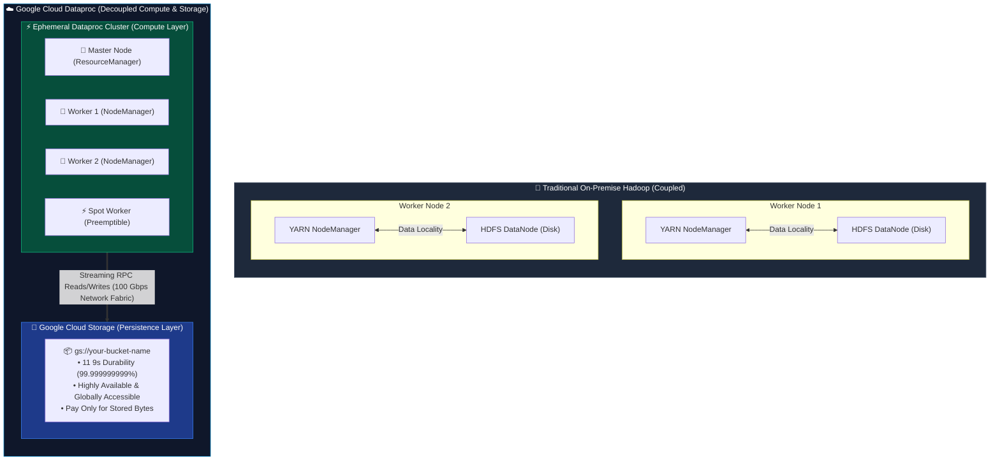
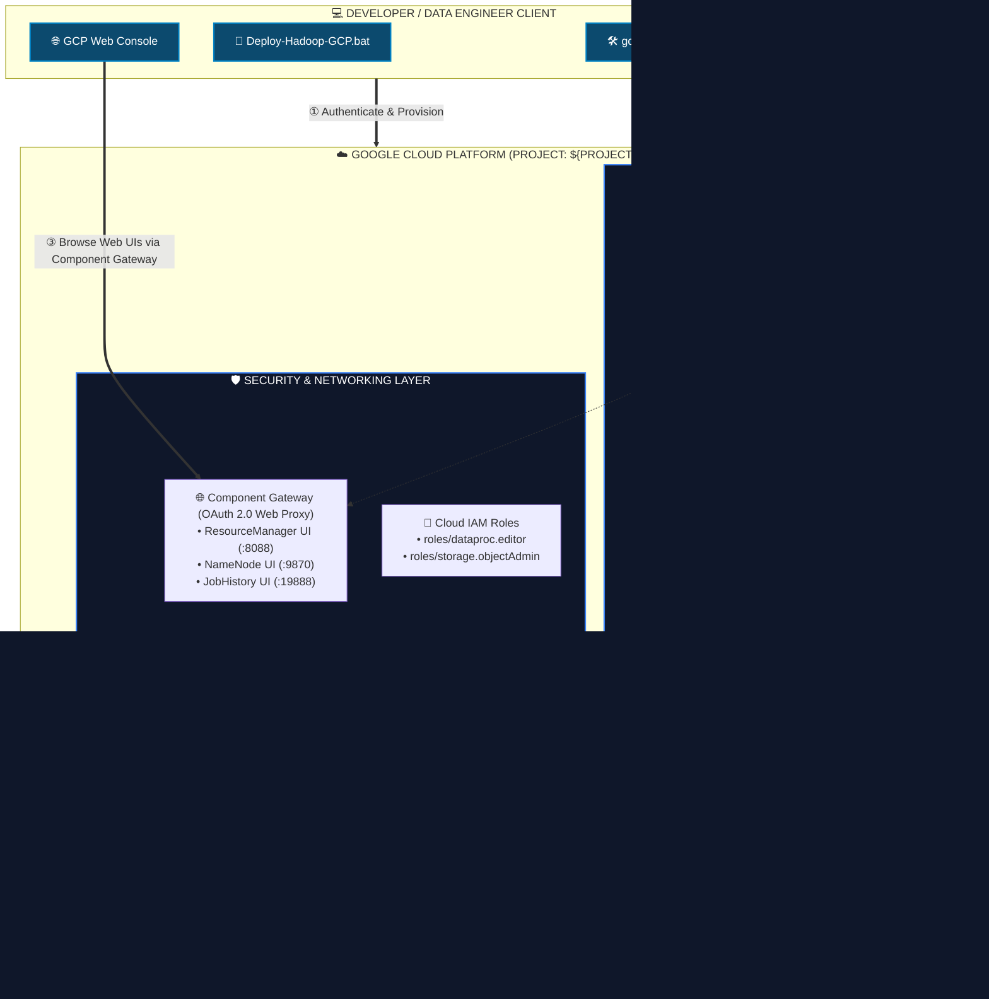
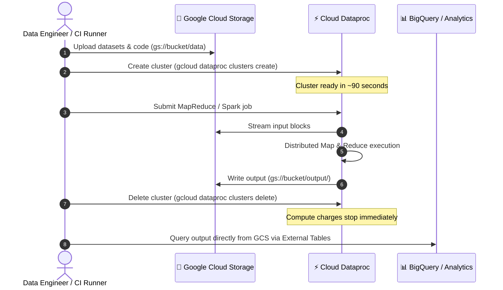

# ☁️ Apache Hadoop on Google Cloud Platform — Enterprise Guide

> **Ecosystem Focus**: Google Cloud Dataproc, Compute Engine (GCE), Google Cloud Storage (`gs://`), & BigQuery Integration  
> **Target Audience**: Data Engineers, Cloud Architects, and Distributed Systems Researchers

---

## 📑 Table of Contents

- [Overview & The Cloud Paradigm Shift](#-overview--the-cloud-paradigm-shift)
- [HDFS vs. Google Cloud Storage (GCS)](#-hdfs-vs-google-cloud-storage-gcs)
- [GCP Hadoop Architecture](#-gcp-hadoop-architecture)
- [Option 1: Managed Hadoop via Google Cloud Dataproc](#-option-1-managed-hadoop-via-google-cloud-dataproc)
  - [Prerequisites & Authentication](#prerequisites--authentication)
  - [Cluster Provisioning (1-Click & CLI)](#cluster-provisioning-1-click--cli)
  - [Component Gateway & Web UIs](#component-gateway--web-uis)
  - [Submitting MapReduce & Streaming Jobs](#submitting-mapreduce--streaming-jobs)
  - [Cost Optimization & Ephemeral Clusters](#cost-optimization--ephemeral-clusters)
- [Option 2: Containerized Docker Hadoop on Google Compute Engine (GCE)](#-option-2-containerized-docker-hadoop-on-google-compute-engine-gce)
  - [Architecture & VPC Firewalls](#architecture--vpc-firewalls)
  - [Automated Deployment](#automated-deployment)
- [Troubleshooting Runbook for GCP Hadoop](#-troubleshooting-runbook-for-gcp-hadoop)
- [Best Practices & Security Hardening](#-best-practices--security-hardening)

---

## 🌐 Overview & The Cloud Paradigm Shift

In traditional on-premises data centers, Apache Hadoop requires dedicated bare-metal servers with directly attached disks (DAS). Compute nodes (TaskTrackers/NodeManagers) and storage nodes (DataNodes) are physically co-located on the same physical machines to optimize for **Data Locality**.

### Limitations of Traditional On-Premise Hadoop:
1. **Coupled Scaling**: You cannot scale compute without buying more storage disks, and you cannot scale storage without buying more CPU/RAM.
2. **Cluster Idling**: Massive clusters must remain powered on 24/7/365 even when no MapReduce or Spark jobs are executing.
3. **Single Point of Failure / Upgrades**: Operating system patches, JVM upgrades, and Hadoop major version upgrades require complex, risky rolling restarts.
4. **Capital Expenditure (CapEx)**: Upfront hardware procurement, cooling, rack space, and network fabric costs.

### The Google Cloud Solution:
Google Cloud modernizes Apache Hadoop through two primary deployment paradigms:

| Deployment Model | Technology | Description | Best For |
|:---|:---|:---|:---|
| **Fully Managed** | **Google Cloud Dataproc** | 90-second cluster provisioning, auto-scaling, integrated `gs://` Cloud Storage connector, Component Gateway, and zero daemon maintenance. | Production ETL, ephemeral analytics, batch processing, and Spark/Hive pipelines. |
| **Self-Managed IaaS** | **Google Compute Engine (GCE)** | Running our containerized Docker Hadoop stack or native Linux daemons on scalable virtual machines with dedicated VPC networks and persistent SSD disks. | Educational labs, custom Hadoop builds, full root/configuration control, and offline experimentation. |

---

## 🗄️ HDFS vs. Google Cloud Storage (GCS)

The single most impactful architectural innovation in Google Cloud Dataproc is replacing (or augmenting) the traditional Hadoop Distributed File System (`hdfs://`) with **Google Cloud Storage** via the open-source GCS connector (`gs://`):



### Architectural Comparison:

| Metric | HDFS (`hdfs://`) | Google Cloud Storage (`gs://`) |
|:---|:---|:---|
| **Storage & Compute Coupling** | **Coupled**: Storage resides on worker disks. | **Decoupled**: Compute runs independently of storage. |
| **Data Durability** | $3\times$ replication ($200\%$ storage overhead). | **11 9s** ($99.999999999\%$) built-in geo-redundancy. |
| **Cluster Lifecycle** | **Permanent**: Cluster must stay alive to retain data. | **Ephemeral**: Delete cluster after job; data persists indefinitely in bucket. |
| **NameNode Scaling Limit** | Inodes limited by NameNode JVM heap (~1GB per 1M objects). | Virtually unlimited objects with zero metadata memory bottlenecks. |
| **Cost Profile** | Pay for running compute VMs + persistent disks 24/7. | Pay ~$0.020/GB/month at rest; $0 compute cost when no jobs run. |
| **Ecosystem Interoperability** | Accessible only within Hadoop network. | Natively accessible from BigQuery, Vertex AI, Dataflow, Cloud Functions, and local hosts. |

---

## 🏛️ GCP Hadoop Architecture



---

## 🚀 Option 1: Managed Hadoop via Google Cloud Dataproc

### Prerequisites & Authentication

1. Install the Google Cloud SDK ([`gcloud`](https://cloud.google.com/sdk/docs/install)).
2. Authenticate and initialize your project:
   ```bash
   gcloud auth login
   gcloud auth application-default login
   gcloud config set project <YOUR_PROJECT_ID>
   ```
3. Set your preferred compute region and zone:
   ```bash
   gcloud config set compute/region us-central1
   gcloud config set compute/zone us-central1-a
   ```

---

### Cluster Provisioning (1-Click & CLI)

You can spin up an enterprise Dataproc Hadoop cluster using our provided automation script or direct `gcloud` command:

#### Method A: Automated Script ([`scripts/gcp/create-dataproc-cluster.sh`](../scripts/gcp/create-dataproc-cluster.sh))
```bash
export GCP_PROJECT_ID="your-project-id"
export GCP_REGION="us-central1"
export DATAPROC_CLUSTER_NAME="hadoop-cluster-lab"

bash scripts/gcp/create-dataproc-cluster.sh
```

#### Method B: Direct CLI Command
```bash
gcloud dataproc clusters create hadoop-cluster-lab \
    --region=us-central1 \
    --zone=us-central1-a \
    --master-machine-type=e2-standard-4 \
    --master-boot-disk-size=50GB \
    --num-workers=2 \
    --worker-machine-type=e2-standard-4 \
    --worker-boot-disk-size=50GB \
    --num-secondary-workers=1 \
    --secondary-worker-type=spot \
    --image-version=2.1-debian11 \
    --enable-component-gateway \
    --optional-components=JUPYTER \
    --max-idle=30m \
    --labels="environment=lab,orchestrator=docker-hadoop-suite"
```

> [!TIP]
> `--max-idle=30m` automatically shuts down and deletes the cluster if it receives no new jobs for 30 minutes, preventing accidental billing surprises.

---

### Component Gateway & Web UIs

Traditionally, accessing Hadoop web consoles required configuring SSH SOCKS proxies (`ssh -D 9870`). With Dataproc's **Component Gateway**, all web consoles are routed through secure, Google-authenticated web endpoints:

1. Open the [Google Cloud Dataproc Console](https://console.cloud.google.com/dataproc/clusters).
2. Click on your cluster name (`hadoop-cluster-lab`).
3. Switch to the **Web Interfaces** tab.
4. Access the following interfaces directly in your browser:
   - **YARN ResourceManager**: Monitor active applications, scheduler queues, and memory allocations.
   - **HDFS NameNode**: Inspect filesystem status and capacity.
   - **MapReduce JobHistory Server**: View execution timeline, counters, and task attempts.
   - **Jupyter Notebooks**: Execute interactive PySpark analysis backed by the cluster.

---

### Submitting MapReduce & Streaming Jobs

Jobs can be submitted directly from your local terminal to the cloud cluster without SSHing into the master node:

#### 1. Python Hadoop Streaming WordCount (via [`scripts/gcp/submit-mapreduce-job.sh`](../scripts/gcp/submit-mapreduce-job.sh))
```bash
bash scripts/gcp/submit-mapreduce-job.sh streaming
```

Under the hood, this uploads your input text and mapper/reducer scripts to Cloud Storage and executes:
```bash
gcloud dataproc jobs submit hadoop \
    --region=us-central1 \
    --cluster=hadoop-cluster-lab \
    --files="gs://${BUCKET}/code/mapper.py,gs://${BUCKET}/code/reducer.py" \
    --jar="file:///usr/lib/hadoop-mapreduce/hadoop-streaming.jar" \
    -- \
    -files="gs://${BUCKET}/code/mapper.py,gs://${BUCKET}/code/reducer.py" \
    -mapper="python3 mapper.py" \
    -reducer="python3 reducer.py" \
    -input="gs://${BUCKET}/input/wordcount-sample.txt" \
    -output="gs://${BUCKET}/output/python-wc"
```

#### 2. Native Java MapReduce Pi Estimation
```bash
bash scripts/gcp/submit-mapreduce-job.sh java
```
Executes:
```bash
gcloud dataproc jobs submit hadoop \
    --region=us-central1 \
    --cluster=hadoop-cluster-lab \
    --jar="file:///usr/lib/hadoop-mapreduce/hadoop-mapreduce-examples.jar" \
    -- pi 16 1000
```

#### 3. Inspecting Results from Cloud Storage
Since output was written directly to GCS, inspect it immediately from your host:
```bash
gcloud storage cat "gs://${BUCKET}/output/python-wc/part*" | head -n 25
```

---

### Cost Optimization & Ephemeral Clusters

The single greatest cost-saving pattern on Google Cloud is the **Ephemeral Cluster Workflow**:



To delete the cluster immediately after your run:
```bash
bash scripts/gcp/teardown-dataproc-cluster.sh
```

---

## 🐳 Option 2: Containerized Docker Hadoop on Google Compute Engine (GCE)

If you require our exact Docker single-node container runtime on cloud infrastructure, you can deploy it directly onto a Compute Engine VM instance.

### Automated Deployment ([`scripts/gcp/deploy-hadoop-gce.sh`](../scripts/gcp/deploy-hadoop-gce.sh))

Run the automated GCE deployment script:
```bash
export GCP_PROJECT_ID="your-project-id"
export GCP_ZONE="us-central1-a"

bash scripts/gcp/deploy-hadoop-gce.sh
```

### What this script automates:
1. **VPC Ingress Firewall**: Creates firewall rule `allow-hadoop-web-consoles` opening ports `9870`, `9864`, `8088`, `8042`, `19888`, and `22222` for instances tagged with `hadoop-node`.
2. **VM Provisioning**: Spawns an `e2-standard-4` (4 vCPUs, 16 GB RAM, 60 GB SSD) instance running Ubuntu 22.04 LTS.
3. **Automated Docker Bootstrap**: Executes a startup script that installs Docker Engine, clones this repository into `/opt/docker-hadoop`, and launches the cluster via `docker compose up -d`.
4. **Public IP Outputs**: Displays the external IP address to connect directly to the Web Consoles.

---

## 🔧 Troubleshooting Runbook for GCP Hadoop

### Issue 1: `INSUFFICIENT_RESOURCE_QUOTA` during Cluster Creation
- **Symptoms**: `QUOTA_EXCEEDED: Quota 'CPUS' exceeded. Limit: 8.0 in region us-central1.`
- **Cause**: Free tier or new GCP accounts often have default regional CPU limits (e.g., 8-12 vCPUs).
- **Resolution**:
  1. Reduce worker count: `--num-workers=1` or use `--single-node` mode:
     ```bash
     export GCP_SINGLE_NODE=true
     bash scripts/gcp/create-dataproc-cluster.sh
     ```
  2. Request a quota increase in the Google Cloud Console under `IAM & Admin > Quotas`.

### Issue 2: `AccessDeniedException: 403 Access Denied` on GCS Bucket
- **Symptoms**: Hadoop job fails with `org.apache.hadoop.fs.FileAlreadyExistsException` or `403 Forbidden` reading/writing to `gs://`.
- **Cause**: The Compute Engine default service account (`<project-number>-compute@developer.gserviceaccount.com`) lacks read/write permissions on the bucket.
- **Resolution**:
  Grant the `Storage Object Admin` role to the Dataproc service account:
  ```bash
  PROJECT_NUMBER=$(gcloud projects describe ${GCP_PROJECT_ID} --format='value(projectNumber)')
  gcloud projects add-iam-policy-binding ${GCP_PROJECT_ID} \
      --member="serviceAccount:${PROJECT_NUMBER}-compute@developer.gserviceaccount.com" \
      --role="roles/storage.objectAdmin"
  ```

### Issue 3: Preemptible / Spot Worker Eviction
- **Symptoms**: Task failures in YARN logs with `Container killed by NodeManager` or `Node lost`.
- **Cause**: Google Cloud reclaimed a Spot VM.
- **Resolution**: YARN handles Spot VM preemption automatically through task retries (`mapreduce.map.maxattempts=4`). For mission-critical master metadata, always ensure master nodes and primary workers are standard persistent VMs, using Spot instances only for secondary workers (`--secondary-worker-type=spot`).

---

## 🛡️ Best Practices & Security Hardening

1. **Never Store Secrets in Cloud Buckets**:
   - Use Google Cloud Secret Manager for credentials or SSH private keys.
2. **Enforce Uniform Bucket-Level Access**:
   - Always create GCS buckets with `--uniform-bucket-level-access` to unify IAM policies.
3. **Private Google Access for Cluster Subnets**:
   - Deploy Dataproc clusters on internal VPC subnets with `--no-address` and enable **Private Google Access** to route traffic to `gs://` securely without external IPs.
4. **Automate Cluster Lifecycle**:
   - Always configure `--max-idle` (e.g. `30m`) and scheduled deletions for lab clusters.
