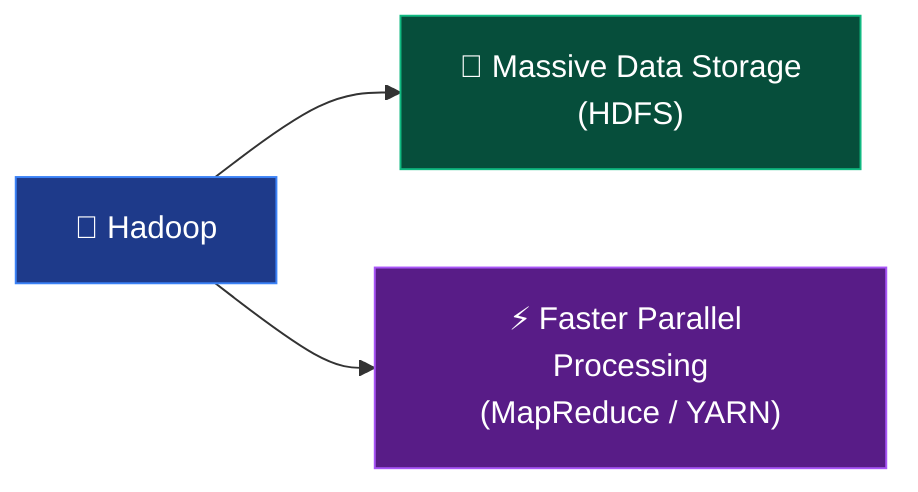
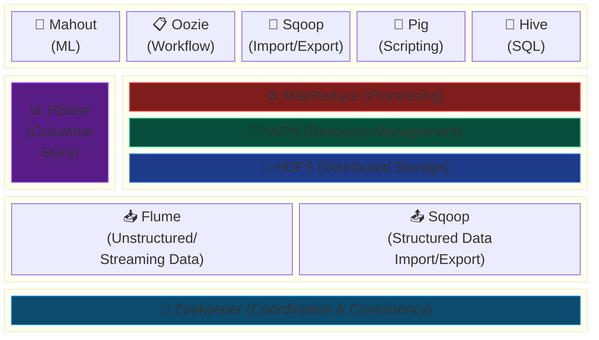
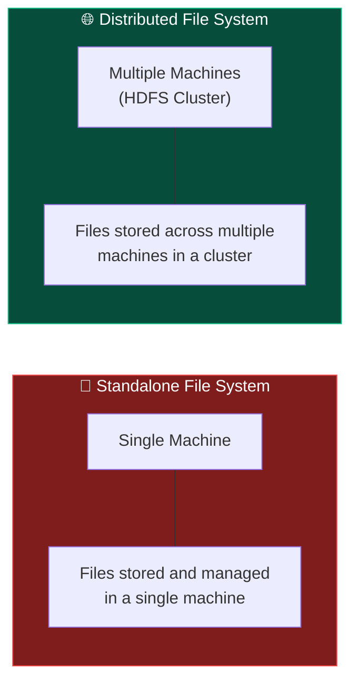
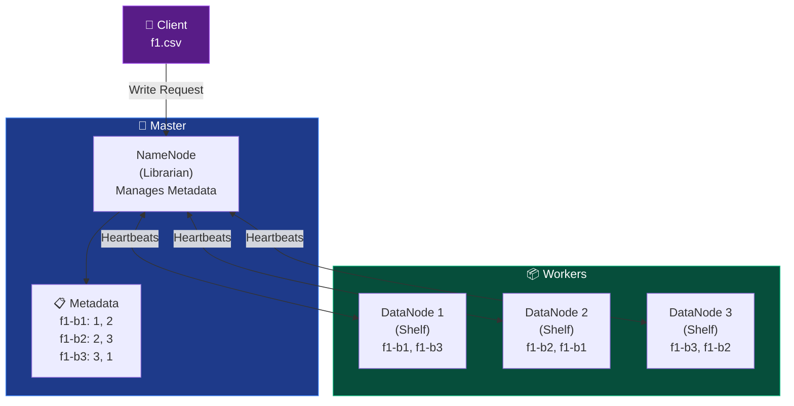
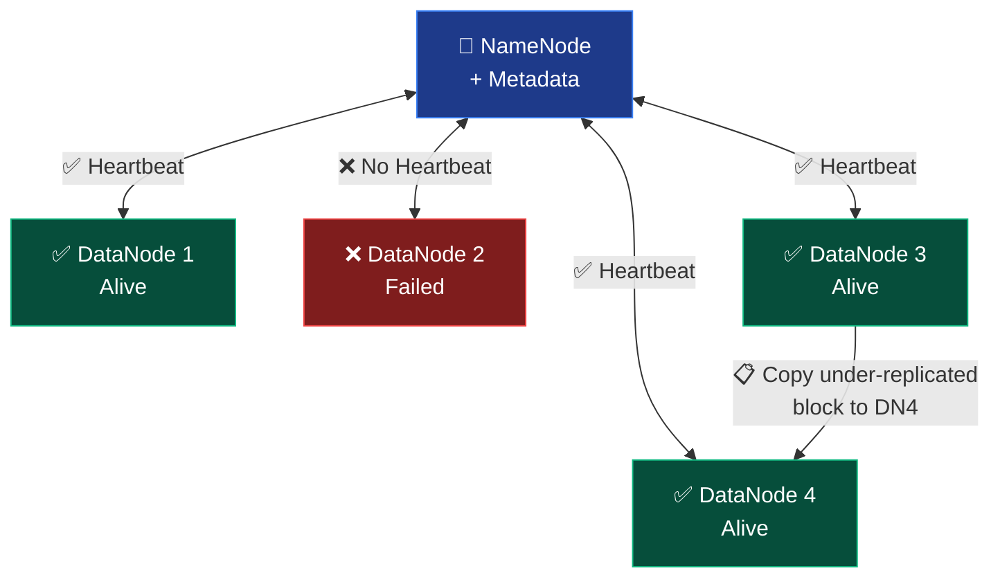
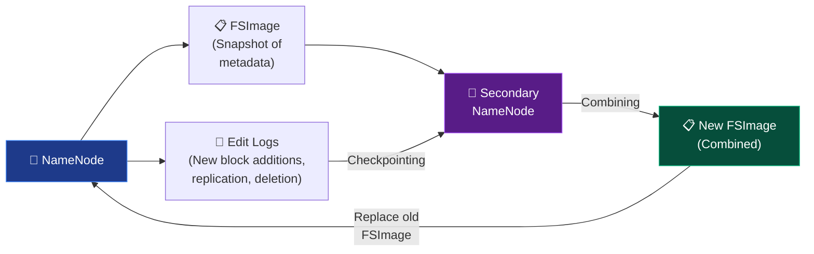
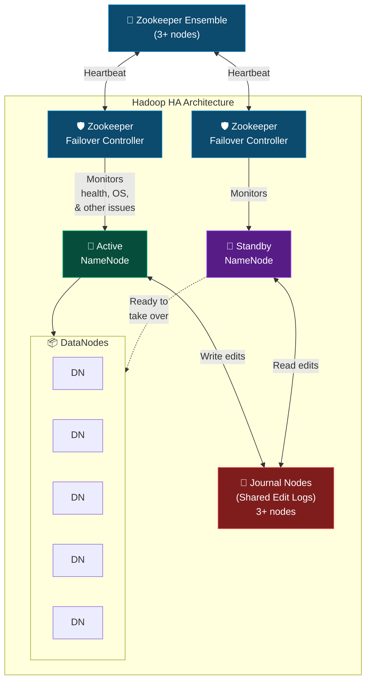
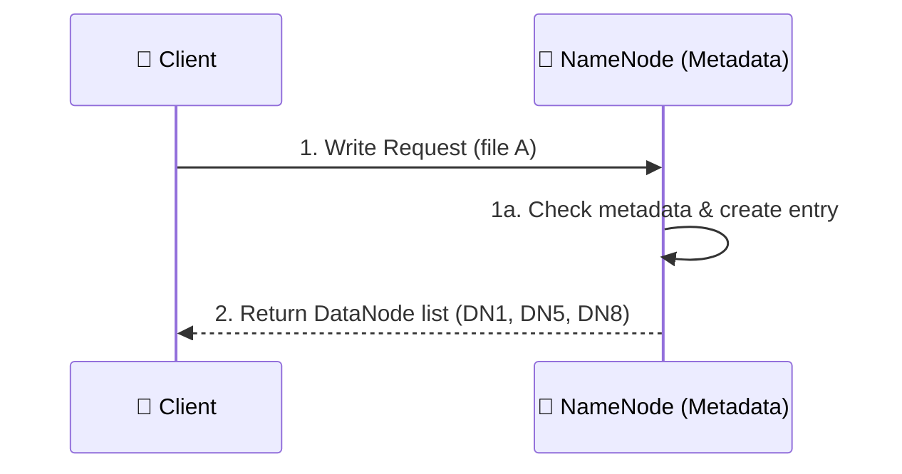
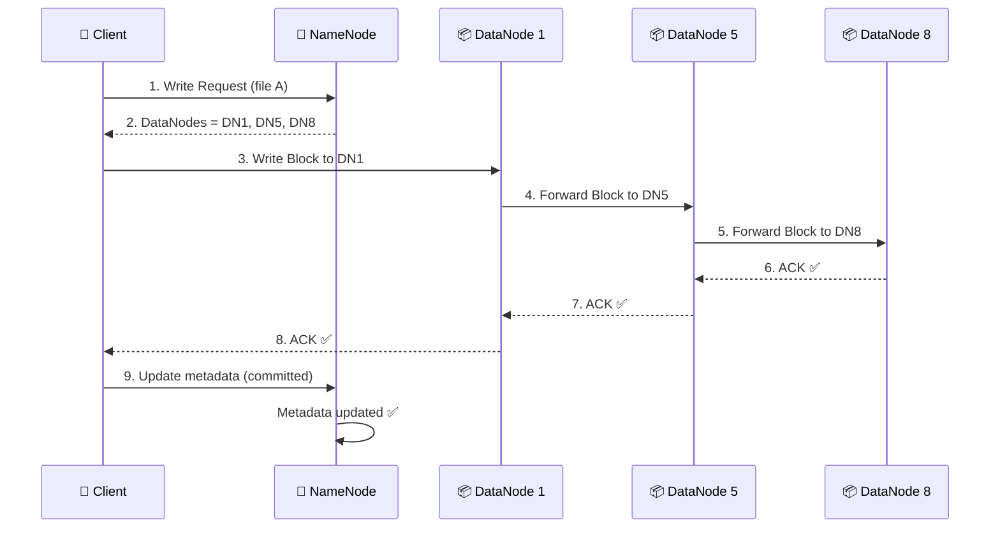

# 🐘 Hadoop Ecosystem — Complete Learning Guide

> **Course Reference**: *Hadoop & Its Components* | *HDFS Architecture*
> **AraBigData Engineering Program**

This guide provides a comprehensive theoretical reference for Apache Hadoop, its ecosystem components, HDFS internals, and distributed storage concepts. It is designed as a companion to the hands-on Docker lab environment in this repository.

---

## 📑 Table of Contents

- [What is Hadoop?](#-what-is-hadoop)
- [Properties of Hadoop](#-properties-of-hadoop)
- [The Hadoop Ecosystem](#-the-hadoop-ecosystem)
  - [Ecosystem Component Stack](#ecosystem-component-stack)
  - [Detailed Component Reference](#detailed-component-reference)
  - [Framework Properties](#framework-properties)
- [HDFS — Hadoop Distributed File System](#-hdfs--hadoop-distributed-file-system)
  - [Why HDFS?](#why-hdfs)
  - [Key Terminologies](#key-terminologies)
  - [HDFS Architecture](#hdfs-architecture)
  - [NameNode vs DataNode](#namenode-vs-datanode)
  - [Blocks in HDFS](#blocks-in-hdfs)
  - [Block Size Trade-Offs](#block-size-trade-offs)
  - [Replication in HDFS](#replication-in-hdfs)
- [Fault Tolerance & Failure Handling](#-fault-tolerance--failure-handling)
  - [DataNode Failures](#datanode-failures)
  - [NameNode Failure & Secondary NameNode](#namenode-failure--secondary-namenode)
  - [Standby NameNode (Hadoop 2.x+)](#standby-namenode-hadoop-2x)
  - [High Availability (HA) Architecture](#high-availability-ha-architecture)
- [HDFS Write Operation](#-hdfs-write-operation)
- [Linux Commands for Data Engineers](#-linux-commands-for-data-engineers)
- [External Learning Resources](#-external-learning-resources)

---

## 🐘 What is Hadoop?

**Hadoop is an open-source framework designed to handle massive amounts of data in a distributed and scalable way.**

### The Origin Story

As data started increasing exponentially in the 2000s, traditional systems couldn't keep up. Google published two landmark papers that inspired Hadoop:

| Google Paper | Hadoop Equivalent | Purpose |
|:---|:---|:---|
| **GFS** (Google File System) | **HDFS** | Distributed **storing** of massive datasets |
| **MapReduce** | **MapReduce** | Distributed parallel **processing** of data |

### Hadoop's Two Core Tasks



### Real-World Example

Consider **Amazon**: millions of users generating searches, purchases, and reviews simultaneously. Hadoop enables companies like Amazon to:
- Store petabytes of data across **low-cost commodity machines**
- Process it in parallel across a **cluster of machines**

---

## ⚡ Properties of Hadoop

| # | Property | Description |
|:---:|:---|:---|
| 1 | **Scalability** | Hadoop can **scale horizontally** — just add more nodes to the cluster to handle more data |
| 2 | **Fault Tolerance** | Hadoop maintains **copies/replicas** to avoid failure if any single machine goes down |
| 3 | **Distributed Processing** | Hadoop can **process the data where it is stored** — bringing computation to data, not data to computation |
| 4 | **Cost Effectiveness** | **Inexpensive hardware / commodity machines** can be used — no need for specialized enterprise servers |
| 5 | **Open Source** | **Free to use and modify** — backed by the Apache Software Foundation community |

---

## 🌐 The Hadoop Ecosystem

> The **Hadoop ecosystem** is a collection of open-source projects and tools that work together to **store, process, and analyze large amounts of data**.

### Ecosystem Component Stack



### Ecosystem Categories Summary

| Category | Components | Purpose |
|:---|:---|:---|
| **Storage** | HDFS, HBase | Storing massive datasets |
| **Processing** | MapReduce, Pig, Hive, Spark | Processing and analyzing data |
| **Data Ingestion** | Flume, Sqoop | Moving data in and out of Hadoop |
| **Coordination** | Zookeeper | Maintaining cluster consistency |
| **Workflow Management** | Oozie | Scheduling and automating ETL jobs |

### Detailed Component Reference

#### 1. HDFS (Hadoop Distributed File System)
- **Role**: Distributed storage for large datasets
- **Concept**: Each node in the cluster = a separate machine
- **Details**: See the [full HDFS section](#-hdfs--hadoop-distributed-file-system) below

#### 2. MapReduce
- **Role**: Helps in **processing data by dividing it into smaller tasks** which can run in parallel
- **Paradigm**: Split → Map → Shuffle → Reduce
- **Language**: Primarily Java-based

#### 3. YARN (Yet Another Resource Negotiator)
- **Role**: **Decouples resource management from application execution**
- **Components**: ResourceManager (master), NodeManager (worker), ApplicationMaster (per-job)
- **Benefit**: Enables multiple processing engines (MapReduce, Spark, Tez) on the same cluster

#### 4. Hive
- **Role**: **Query engine (not a database!)** — provides SQL-like interface over Hadoop
- **How it works**: Abstracts MapReduce by translating SQL queries into MR jobs
- **Benefits**: Avoids Java interaction; provides wanted SQL performance of MR

#### 5. Pig
- **Role**: **Abstraction of Java MapReduce** — high-level scripting language for MR
- **Benefits**: MR performance but **no Java/SQL required**
- **Language**: Pig Latin (scripting language)

#### 6. Sqoop
- **Role**: Facilitates **import/export between Hadoop and relational databases**
- **Direction**: RDBMS ↔ HDFS bidirectional data transfer
- **Use case**: Bulk loading from MySQL, PostgreSQL, Oracle into HDFS

#### 7. Oozie
- **Role**: **Abstraction of MR** — XML files for scheduling and automating batch work
- **Key value**: Essential for **scheduling complex workflows in ETL processes**
- **Workflow types**: Coordinator jobs, bundle jobs, workflow DAGs

#### 8. HBase
- **Role**: **Columnar NoSQL database** which allows **real-time read and writes on HDFS**
- **Use case**: Random, real-time read/write access to Big Data
- **Storage model**: Column-family oriented (vs. row-oriented RDBMS)

#### 9. Mahout
- **Role**: **Data science component** — provides ML libraries
- **Capabilities**: Implement algorithms for **clustering, classification**, recommendation, etc.
- **Integration**: Works on top of MapReduce / Spark

#### 10. Flume
- **Role**: Collect **logs or event data from various sources** and deliver them to Hadoop or HBase
- **Category**: Messaging Queue for **ingesting streaming data**
- **Use case**: Real-time analytics for monitoring

#### 11. Zookeeper
- **Role**: **Coordinates distributed systems to maintain consistency**
- **Key value**: Critical for ensuring **reliability** in Hadoop clusters
- **Services**: Naming, configuration management, synchronization, group services

### Framework Properties

The Hadoop framework has two important architectural properties:

| Property | Description |
|:---|:---|
| **1. Loosely Coupled** | We can remove elements/components and the system still works. Each component operates independently |
| **2. Integration** | Can be connected with **Spark** or any other big data frameworks. Also supports non-big-data sources like **MySQL, RDBMS** |

---

## 💾 HDFS — Hadoop Distributed File System

> **HDFS is a key component of the Hadoop ecosystem. It is designed to store and manage large-scale datasets across a distributed environment, making it highly scalable and fault tolerant.**
>
> Unlike traditional file systems, **HDFS is optimized for Big Data, where files are massive and need to be processed efficiently**.

### Why HDFS?

The essence of HDFS is threefold:

1. **Distributes data** across multiple nodes/machines
2. **Replicates data** to ensure fault tolerance
3. **Provides efficient access** for Big Data processing

### Key Terminologies

#### 1. File System
A **layer between our software and hardware** — the OS uses a file system to manage how data is stored on disk.

| OS | File System |
|:---|:---|
| Linux | ext (ext3, ext4) |
| Windows | NTFS, FAT32 |
| macOS | APFS |
| Hadoop | **HDFS** → distributed |

#### 2. Types of File System



#### 3. Block
The **smallest unit of data storage** in a file system.

| File System | Default Block Size |
|:---|:---|
| NTFS (Windows) | 4 KB |
| **HDFS (Hadoop)** | **128 MB** |

> A 10 KB file on NTFS with 4 KB blocks → 3 blocks needed.

#### 4. Cluster and Node
- **Node**: A single machine (physical or virtual) in the Hadoop cluster
- **Cluster**: A group of interconnected nodes working together

#### 5. Process and Daemon Process
- **Process**: A program currently in execution
- **Daemon Process**: A **background process** that runs without any user intervention (like services in Windows Task Manager)

#### 6. Metadata
**Data about data** — an "index page" describing properties of stored files:
- **Size** of the file
- **Created** date
- **Modified** date
- **Permissions** (read/write/execute)
- **Quality** information

#### 7. Replication
The **process of making copies of our data** — needed to achieve **fault tolerance**.

### HDFS Architecture

HDFS follows a **Master-Worker architecture**:



#### 📚 The Library Analogy

Understanding HDFS through the library metaphor:

| HDFS Concept | Library Equivalent | Description |
|:---|:---|:---|
| **NameNode** | 📖 **Librarian** | Knows the exact shelf (DataNode) where a book (block) is stored |
| **DataNodes** | 📚 **Shelves** | Physically hold and manage the actual books (data blocks) |
| **Data Blocks** | 📕 **Books** | The actual units of data stored on the shelves |

### NameNode vs DataNode

| Aspect | NameNode | DataNode |
|:---|:---|:---|
| **Definition** | The **master node** in HDFS. Manages metadata and file system namespace | The **worker nodes** in HDFS. Store the actual file data in blocks |
| **Purpose** | Keeps track of file locations, file metadata, and directory structure (but **does not store data**) | Responsible for storing, retrieving, and replicating data blocks |
| **Role** | **Coordinator** — directs how files are stored and accessed across DataNodes | **Executor** — performs read and write operations as instructed by the NameNode |
| **Data Stored** | Metadata (file names, permissions, and locations of data blocks) | Actual data split into blocks |
| **Dependency** | HDFS **cannot function** without a NameNode. It is the **Single Point of Failure (SPOF)** in non-HA setups | HDFS can function with one or more DataNodes; their failure does not stop the system |
| **Communication** | Communicates with clients for file operations and with DataNodes to track block statuses | Communicates with the NameNode for block operations and periodically sends **heartbeat signals** |
| **Fault Tolerance** | Does not store redundant copies (replication is for data blocks only) | Handles fault tolerance through **block replication** across multiple DataNodes |
| **Processes** | Maintains and updates the file system namespace dynamically | Regularly reports to the NameNode with **block reports** and **health checks** |
| **Example Role** | Acts like a **manager in a library**, knowing the exact shelf (DataNode) where a book (block) is stored | Acts like **the shelves in the library**, holding and managing the physical books (blocks) |

### Blocks in HDFS

- A block is the **smallest unit of storage** in HDFS
- Each file stored in HDFS is **divided into blocks**, which are then **distributed across multiple DataNodes**
- Default block size = **128 MB**
- NameNode has **less metadata to manage** with larger blocks

**Key benefits of 128 MB blocks:**
1. **Efficient for large files** — fewer blocks to track
2. **Distributed storage and computation** — blocks spread across nodes

#### Block Splitting Example

A **600 MB file** with default 128 MB block size:

| Block | Size |
|:---:|:---:|
| Block A | 128 MB |
| Block B | 128 MB |
| Block C | 128 MB |
| Block D | 128 MB |
| Block E | **88 MB** (remainder) |

> Total: 5 blocks. The last block only uses the space it needs — no wasted storage.

### Block Size Trade-Offs

| Action | Effect on Parallelism | Effect on Metadata | Example |
|:---|:---|:---|:---|
| **Decrease** block size (128MB → 1MB) | ✅ Helps in **increasing parallelism** | ❌ Metadata **will increase** significantly | 500MB file → 500 blocks |
| **Increase** block size (128MB → 512MB) | ❌ **Less parallelism** | ✅ **Less metadata** | 1GB file → 2 blocks |

> [!TIP]
> The default 128 MB block size is optimal for most Big Data workloads. Only change it when you have a specific performance requirement.

### Replication in HDFS

**Default Replication Factor (RF) = 3** → 1 original + 2 copies

This means: **1 GB of data → 3 GB of storage consumed**

#### Replication Example

A 300 MB file is split into 3 blocks (A, B, C) with RF=3 across 4 DataNodes:

```text
┌─────────────┐  ┌─────────────┐  ┌─────────────┐  ┌─────────────┐
│ DataNode 1   │  │ DataNode 2   │  │ DataNode 3   │  │ DataNode 4   │
│              │  │              │  │              │  │              │
│  ┌───┐ ┌───┐│  │  ┌───┐ ┌───┐│  │  ┌───┐ ┌───┐│  │  ┌───┐      │
│  │ B1│ │ B2││  │  │ B1│ │ B3││  │  │ B1│ │ B2││  │  │ B2│      │
│  └───┘ └───┘│  │  └───┘ └───┘│  │  └───┘ └───┘│  │  └───┘      │
│  ┌───┐      │  │              │  │  ┌───┐      │  │              │
│  │ B3│      │  │              │  │  │ B3│      │  │              │
│  └───┘      │  │              │  │  └───┘      │  │              │
└─────────────┘  └─────────────┘  └─────────────┘  └─────────────┘
```

**Metadata** stored by the NameNode:

```
B1 : DataNode 1, 2, 3
B2 : DataNode 1, 3, 4
B3 : DataNode 1, 2, 3
```

> [!NOTE]
> In this Docker lab, the replication factor is set to **1** (`dfs.replication=1` in `hdfs-site.xml`) because we run a single-node cluster. In production, always use RF ≥ 3.

---

## 🛡️ Fault Tolerance & Failure Handling

### DataNode Failures

DataNodes are susceptible to failure. Failures can be **temporary**:

1. **Network outage** — connectivity issues between nodes
2. **Software crashes** — daemon process failures
3. **Node reboot/maintenance** — planned or unplanned restarts

#### How Hadoop Handles DataNode Failure

DataNodes send periodic signals to the NameNode:
- **Heartbeats** — "I'm alive" signals
- **Block reports** — list of all blocks stored on the DataNode



The 3-step recovery process:

| Step | Action | Details |
|:---:|:---|:---|
| **1. Detection** | NameNode detects missing heartbeat | Timeout: **~10.5 minutes** (default) |
| **2. Re-Replication** | NameNode identifies under-replicated blocks | Marks blocks as "yellow" (under-replicated) and triggers copy from surviving DataNodes |
| **3. Recovery** | When failed DataNode recovers | Metadata is updated to ensure consistency; **excess replicas are deleted** to maintain RF |

### NameNode Failure & Secondary NameNode

> **The NameNode is the most critical component in HDFS** as it manages the metadata and namespace of the filesystem.
>
> **It is the Single Point of Failure (SPOF).**

#### Secondary NameNode — What It Actually Does

> [!CAUTION]
> **The Secondary NameNode is NOT a failover mechanism!** It only helps with checkpointing and size management.

The Secondary NameNode performs two tasks:

1. **Checkpointing**: Periodically merges `fsimage` + `edit logs` → new `fsimage`
2. **Size Management**: Prevents the edit log from growing indefinitely



> **Works fine if we can afford downtimes.** For production, use Standby NameNode.

### Standby NameNode (Hadoop 2.x+)

The Standby NameNode (introduced in **Hadoop 2.x**) is a **hot backup** for your NameNode:

- **High availability** — constant connection with master
- Maintains a **copy of namespace image in memory**
- All **edit logs are applied** to keep the Standby NN always up-to-date

| Feature | Description |
|:---|:---|
| **High Availability** | Can take the role of Active NN when required |
| **Failover Mechanism** | **Seamless takeover** ensuring no data loss and minimum downtime |
| **Synchronization** | All edit logs are applied; Standby NN is **always up-to-date** |

#### Secondary NameNode vs Standby NameNode

| Aspect | Secondary NameNode | Standby NameNode |
|:---|:---|:---|
| Purpose | Checkpointing & size management | Hot backup & failover |
| Failover? | ❌ **No** — NOT a failover mechanism | ✅ **Yes** — automatic failover |
| Availability | Can afford downtimes | Critical for production (zero/minimal downtime) |
| Hadoop Version | 1.x and 2.x | 2.x+ (HA mode) |

### High Availability (HA) Architecture

> **High Availability architecture ensures the continuous operation of the Hadoop cluster even if the Active NameNode fails.**



**HA Architecture Components:**

| Component | Role |
|:---|:---|
| **Active NameNode** | Serves all client requests and manages metadata |
| **Standby NameNode** | Hot standby, ready to take over instantly |
| **Zookeeper** | Coordination service for leader election |
| **Journal Nodes** | Shared edit log storage — both NNs read/write here |
| **Zookeeper Failover Controller (ZKFC)** | Monitors NN health and triggers automatic failover |

> [!IMPORTANT]
> HA Architecture is **critical for production-grade clusters** — it ensures high availability with minimal downtime.

> [!NOTE]
> This Docker lab uses a **single-node, non-HA setup** with a SecondaryNameNode for checkpointing. For production HA, you would deploy Active + Standby NameNodes with Zookeeper and Journal Nodes.

---

## ✍️ HDFS Write Operation

> Using HDFS as a distributed data storage

The write operation follows a **3-step pipeline**:

### Step 1: Interact with NameNode



### Step 2: Data Pipeline to DataNodes

The client doesn't send data to all DataNodes — it creates a **pipeline**:

```text
Client → DN1 → DN5 → DN8
```

Data flows through the pipeline: the client sends to DN1, which forwards to DN5, which forwards to DN8.

### Step 3: Acknowledgement Chain

Once the last DataNode writes the block, acknowledgements flow **backward**:

```text
DN8 → DN5 → DN1 → Client
```

After all acknowledgements are received, the client notifies the NameNode to **update metadata**.



### Fault Tolerance During Write

If a failure occurs during the write pipeline:

| Failure | Handling |
|:---|:---|
| 1. **DataNode fails during write** | Pipeline is rebuilt excluding the failed DN |
| 2. **Client fails** | Lease expiration triggers cleanup |
| 3. **Network / Rack failure** | Rack-aware placement ensures replicas survive |
| 4. **NameNode failure** | HA failover if configured; otherwise write fails |
| 5. **DataNode failure** | Re-replication triggered after heartbeat timeout |

---

## 🐧 Linux Commands for Data Engineers

> As a data engineer, proficiency in Linux commands is crucial for:
> - **Managing data pipelines**
> - **Handling files** in distributed systems
> - **Working with distributed systems** like Hadoop

### Why Linux?

- **Very lightweight** — ideal for server environments
- **Easy to install and maintain**
- Most Big Data tools (Hadoop, Spark, Kafka) run natively on Linux
- Cloud providers (GCP, AWS, Azure) use Linux for data workloads

### Terminal Access Options

| Platform | Terminal Option |
|:---|:---|
| Linux / macOS | Terminal (bash, zsh) |
| Windows | Windows Terminal / Ubuntu Subsystem (WSL 2) / Git Bash CLI |

> [!TIP]
> This Docker lab provides a full Linux terminal inside the container. Access it with:
> ```bash
> make bash        # Root shell
> make hdfs-shell  # hduser shell
> # or
> docker compose exec hadoop bash
> ```

---

## 📚 External Learning Resources

These resources are recommended in the course lectures:

| Resource | Link | Topic |
|:---|:---|:---|
| **Essential Linux Commands for Data Engineers** | [allthingdata.substack.com](https://allthingdata.substack.com/p/essential-linux-commands-for-data) | Linux CLI fundamentals |
| **Essential HDFS Commands for Data Engineers** | [allthingdata.substack.com](https://allthingdata.substack.com/p/essential-hdfs-commands-for-data) | HDFS CLI operations |
| **HDFS CLI Lab (This Repo)** | [examples/hdfs-cli/](../examples/hdfs-cli/) | Hands-on HDFS commands in Docker |
| **Architecture Deep-Dive (This Repo)** | [docs/architecture.md](architecture.md) | Docker container architecture internals |

---

<div align="center">

*Part of the [Apache Hadoop Enterprise Multi-Platform Lab](../README.md) — AraBigData Engineering Program*

</div>
