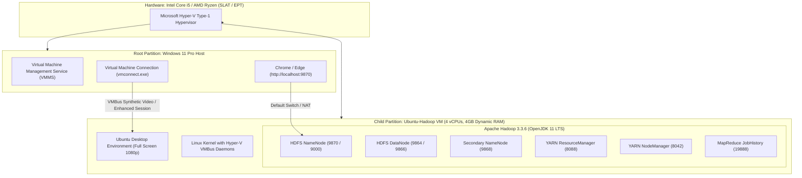

# ⚡ Hyper-V Ubuntu 24.04 / 26.04: High-Performance VM & Hadoop Guide

This comprehensive operational guide details how to deploy, optimize, and run an **Ubuntu Desktop VM** on **Microsoft Hyper-V (Windows 11 Pro)** with **Full Screen display scaling**, **4-vCPU acceleration**, and a fully configured **Apache Hadoop 3.3.6** cluster.

---

## 📑 Table of Contents
1. [Hyper-V Architecture Overview](#-hyper-v-architecture-overview)
2. [Hardware Sizing & Performance Tuning](#-hardware-sizing--performance-tuning)
3. [Full Screen & Display Scaling](#-full-screen--display-scaling)
4. [Ubuntu Installation & Navigation Shortcuts](#-ubuntu-installation--navigation-shortcuts)
5. [Automated Hadoop Cluster Deployment](#-automated-hadoop-cluster-deployment)
6. [Web UIs & Port Forwarding](#-web-uis--port-forwarding)
7. [Troubleshooting & Runbook](#-troubleshooting--runbook)

---

## 🏛️ Hyper-V Architecture Overview

Hyper-V is a **native Type-1 hypervisor** built into Windows 11 Pro/Enterprise. Unlike Type-2 hypervisors (e.g., VirtualBox), Hyper-V runs directly on bare-metal hardware beneath the Windows host OS, delivering near bare-metal performance, hardware-accelerated memory virtualization (SLAT/EPT), and direct VMBus I/O pipelines.



---

## ⚙️ Hardware Sizing & Performance Tuning

Hyper-V defaults to basic server configurations (1 vCPU, static RAM, and "Microsoft Windows" Secure Boot). Desktop Linux requires the following optimized settings:

| Parameter | Default (Laggy) | Optimized (High Performance) | Rationale |
| :--- | :--- | :--- | :--- |
| **Virtual Processors** | 1 vCPU | **4 vCPUs** | Eliminates 100% CPU lockups during GNOME software rendering. |
| **Startup Memory** | 4096 MB (Static) | **3072 MB** (Dynamic) | Prevents host OOM error `0x800705AA` on startup. |
| **Dynamic Memory** | Disabled | **Enabled (1024 - 4096 MB)** | Allows Windows and Linux to dynamically share physical RAM. |
| **Secure Boot Template** | Microsoft Windows | **Microsoft UEFI Certificate Authority** | Allows Linux GRUB bootloader to verify and boot without EFI errors. |
| **Integration Services** | Standard | **All Enabled + Guest Services** | Enables guest time sync, heartbeat, and shutdown signals. |

### 🚀 1-Click Automated Configuration
Run our automated optimization script from the project root:
```cmd
Fix-Lag-And-Start-VM.bat
```
*(Or in PowerShell as Administrator: `powershell -ExecutionPolicy Bypass -File scripts/optimize-hyperv-vm.ps1`)*.

---

## 🖥️ Full Screen & Display Scaling

To make the Ubuntu VM **fill your entire monitor** without black borders:

### Method 1: Inside Ubuntu Live Session Right Now (Instant 1080p, 5 Seconds)
If you are currently on the Ubuntu desktop or installer:
1. Click the top-right system status area (where the Battery / Volume icons are).
2. Click **Settings** (gear icon) $\rightarrow$ select **Displays** on the left navigation bar.
3. Under **Resolution**, change `1024x768` to **`1920x1080 (16:9)`**.
4. Click the green **Apply** button at the top right, then click **Keep Changes**.
5. Press **`Ctrl + Alt + Break`** (or click **View $\rightarrow$ Full Screen** in `vmconnect.exe`).
👉 Ubuntu now fills 100% of your 1080p screen edge-to-edge with zero black borders!

### Method 2: Fit to Window Scaling in vmconnect.exe (Instant Stretch)
1. In `vmconnect.exe`, click **View** $\rightarrow$ **Zoom** $\rightarrow$ **Fit to Window**.
2. Click the **Full Screen** icon in the toolbar (or press `Ctrl + Alt + Break`).
3. Hyper-V stretches the guest display dynamically to fill your entire physical monitor.

### Method 3: Hyper-V Hardware Video Resolution (PowerShell)
To permanently lock the virtual synthetic video hardware to 1920x1080:
```powershell
Set-VMVideo -VMName "Ubuntu-Hadoop" -HorizontalResolution 1920 -VerticalResolution 1080 -ResolutionType Single
```

### Method 4: Native 1080p Resolution via GRUB (Post-Installation)
Once Ubuntu is installed, configure native 1920x1080 resolution inside GRUB:
1. Open Terminal in Ubuntu (`Ctrl + Alt + T`).
2. Edit `/etc/default/grub`:
   ```bash
   sudo nano /etc/default/grub
   ```
3. Update the kernel command line to include:
   ```text
   GRUB_CMDLINE_LINUX_DEFAULT="quiet splash video=hyperv_fb:1920x1080"
   ```
4. Update GRUB and reboot:
   ```bash
   sudo update-grub
   sudo reboot
   ```
5. Ubuntu will boot natively into full **1920x1080 Full HD**!

---

## ⌨️ Ubuntu Installation & Navigation Shortcuts

The Ubuntu 24.04/26.04 installer uses Flutter running on Wayland. Under basic Hyper-V synthetic mouse emulation, mouse click releases can be misinterpreted as drag gestures.

Use keyboard navigation to complete the installation smoothly:

| Shortcut | Action |
| :--- | :--- |
| **`Alt + N`** | Activate **<u>N</u>ext** button immediately from anywhere on the screen. |
| **`Tab`** | Move focus border forward to the next button / field. |
| **`Shift + Tab`** | Move focus border backward. |
| **`Spacebar`** | Toggle check boxes and radio buttons (e.g., "Install third-party software"). |
| **`Enter`** | Click the currently highlighted button (**Next**, **Install Now**, **Continue**). |
| **`Arrow Keys`** | Navigate through Language, Keyboard layout, and Timezone lists. |

> [!TIP]
> At the initial GNU GRUB boot menu, selecting **`Ubuntu (safe graphics)`** disables Wayland hardware compositing, ensuring 100% accurate mouse clicks throughout the installation wizard.

---

## 🚀 Automated Hadoop Cluster Deployment

Once you reach the Ubuntu Desktop, install the entire Hadoop cluster with a single unattended command:

```bash
curl -sSL https://raw.githubusercontent.com/Sohila-Khaled-Abbas/docker-hadoop/master/scripts/install-hadoop-wsl.sh | bash
```

### What this automated installer configures:
1. **Java Runtime**: Installs **OpenJDK 11 LTS** (`/usr/lib/jvm/java-11-openjdk-amd64`).
2. **Hadoop Distribution**: Downloads and installs **Apache Hadoop 3.3.6** to `/home/hadoopuser/hadoop`.
3. **Environment Setup**: Exports `JAVA_HOME`, `HADOOP_HOME`, `HADOOP_CONF_DIR`, and `PATH` into `/etc/profile.d/hadoop.sh` and `~/.bashrc`.
4. **Configuration XMLs**: Configures `core-site.xml` (HDFS URI), `hdfs-site.xml` (Replication 1, Web UI `0.0.0.0:9870`), `mapred-site.xml` (YARN framework), and `yarn-site.xml` (Shuffle service).
5. **HDFS Formatting**: Safely formats the NameNode filesystem.
6. **systemd Daemon Integration**: Registers `hadoop.service` so all 6 daemons start automatically on system boot.

---

## 🌐 Web UIs & Port Forwarding

Once the cluster is running, all Web UIs are accessible directly via the VM's IP address:

| Service | Port | Description |
| :--- | :--- | :--- |
| **HDFS NameNode** | `http://<VM-IP>:9870` | Browse HDFS filesystem, active DataNodes, and capacity. |
| **YARN ResourceManager** | `http://<VM-IP>:8088` | Active cluster nodes, running applications, and YARN metrics. |
| **HDFS DataNode** | `http://<VM-IP>:9864` | Block pool metrics and volume storage details. |
| **MapReduce JobHistory** | `http://<VM-IP>:19888` | Historical logs for completed MapReduce jobs. |

To find the VM IP inside Ubuntu, run:
```bash
ip addr show eth0 | grep "inet "
```

---

## 🛠️ Troubleshooting & Runbook

### 1. `0x800705AA` / `0x8007000E` (Insufficient System Resources / RAM Allocation Failure)
* **Root Cause**: Host unreserved RAM was lower than the configured Startup RAM.
* **Fix**: Shut down background memory hogs via `wsl --shutdown` and enable Dynamic Memory (`Set-VMMemory -VMName "Ubuntu-Hadoop" -DynamicMemoryEnabled $true -StartupBytes 3072MB`).

### 2. High CPU Lag / Sluggish Mouse
* **Root Cause**: Hyper-V assigned 1 vCPU by default.
* **Fix**: Turn off VM, change Processors to **4 vCPUs** in Settings, and boot with **Safe Graphics**.

### 3. Mouse pointer locked inside VM window
* **Fix**: Press **`Ctrl + Alt + Left Arrow`** to release the mouse cursor back to Windows host.
