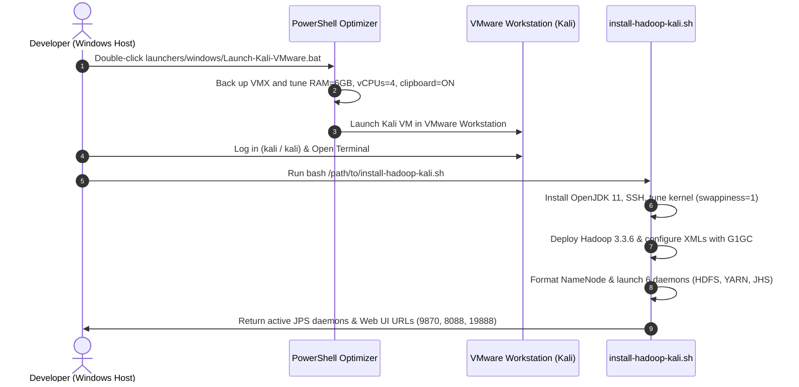

# 🐉 Kali Linux & VMware Workstation Apache Hadoop Setup Guide

This comprehensive guide walks you through importing, optimizing, configuring, and operating a **production-grade Apache Hadoop (Single-Node / Pseudo-Distributed) cluster** on **Kali Linux** inside **VMware Workstation Pro**.

---

## 📑 Table of Contents

- [1. System Hardware & Sizing Architecture](#1-system-hardware--sizing-architecture)
- [2. Quick Start Flow](#2-quick-start-flow)
- [3. Automated VM Hardware Optimization (PowerShell)](#3-automated-vm-hardware-optimization-powershell)
- [4. Launching the VM in VMware Workstation](#4-launching-the-vm-in-vmware-workstation)
- [5. Automated Hadoop Cluster Installation](#5-automated-hadoop-cluster-installation)
- [6. Manual Hadoop Installation Deep-Dive](#6-manual-hadoop-installation-deep-dive)
  - [Prerequisites & Package Setup](#prerequisites--package-setup)
  - [OS Hardening & Swappiness Tuning](#os-hardening--swappiness-tuning)
  - [Passwordless SSH Loopback](#passwordless-ssh-loopback)
  - [Hadoop Deployment & Environment Variables](#hadoop-deployment--environment-variables)
  - [Low-Pause G1GC JVM Heap Limits](#low-pause-g1gc-jvm-heap-limits)
  - [Cluster XML Configurations](#cluster-xml-configurations)
- [7. Cluster Bootstrap & Daemon Lifecycle](#7-cluster-bootstrap--daemon-lifecycle)
- [8. Verification & MapReduce Smoke Tests](#8-verification--mapreduce-smoke-tests)
- [9. Web Interfaces & Port Access](#9-web-interfaces--port-access)
- [10. Troubleshooting & Common Pitfalls](#10-troubleshooting--common-pitfalls)

---

## 1. System Hardware & Sizing Architecture

This guide is tuned for modern developer laptops/desktops (e.g., **Intel Core i5-10300H**, 4 Cores / 8 Threads, **16 GB RAM**, Windows 11 host with high-capacity secondary storage `D:\`):

```mermaid
flowchart TB
    subgraph Host["💻 Host Machine (Windows 11 - 16 GB RAM / 8 Logical Cores)"]
        WindowsOS["Windows 11 OS + Browser + VS Code<br/>Allocated: ~10 GB RAM / 4 Threads"]
        VMwareWorkstation["VMware Workstation Pro 26.x<br/>VMnet8 NAT Network Adapter"]
    end

    subgraph Guest["🐉 Guest VM: Kali Linux Rolling (6 GB RAM / 4 vCPUs)"]
        KaliDesktop["XFCE Desktop / GUI Tools (~800 MB)"]
        subgraph HadoopStack["🐘 Apache Hadoop 3.3.6 Daemon Stack (~2.5 GB)"]
            NN["NameNode<br/>1024 MB Max (G1GC)"]
            DN["DataNode<br/>512 MB Max (G1GC)"]
            SNN["SecondaryNameNode<br/>512 MB Max"]
            RM["ResourceManager<br/>1024 MB Max (G1GC)"]
            NM["NodeManager<br/>512 MB Max (G1GC)"]
            JHS["JobHistoryServer<br/>Port: 19888 (Web)"]
        end
        subgraph YARNPool["⚡ YARN Container Pool (3072 MB Pool)"]
            Container0["ApplicationMaster<br/>512 MB (G1GC)"]
            Container1["Map Task Container<br/>512 MB (Split 0)"]
            Container2["Reduce Task Container<br/>512 MB (Part 0)"]
        end
    end

    VMwareWorkstation --> Guest
    Host <-->|HTTP Web UIs (9870, 8088, 19888)| Guest

    classDef host fill:#0284c7,stroke:#0369a1,stroke-width:2px,color:#ffffff;
    classDef guest fill:#6366f1,stroke:#4f46e5,stroke-width:2px,color:#ffffff;
    classDef hadoop fill:#059669,stroke:#047857,stroke-width:2px,color:#ffffff;
    classDef yarn fill:#d97706,stroke:#b45309,stroke-width:2px,color:#ffffff;
    class Host,WindowsOS,VMwareWorkstation host;
    class Guest,KaliDesktop guest;
    class HadoopStack,NN,DN,SNN,RM,NM,JHS hadoop;
    class YARNPool,Container0,Container1,Container2 yarn;
```

### ⚖️ Resource Allocation Breakdown

| Parameter | Official Pre-built Default | **Tuned Big Data Allocation** | Purpose & Technical Justification |
| :--- | :---: | :---: | :--- |
| **RAM (Memory)** | `2048 MB` (2 GB) ⚠️ | **`6144 MB` (6 GB)** | Default 2GB causes Linux kernel OOM killer to terminate JVM daemons. 6GB provides stable room for OS + daemons + YARN containers, leaving 10GB for Windows. |
| **vCPUs** | 4 (2 sockets × 2 cores) | **4 (1 socket × 4 cores)** | 50% CPU allocation balances parallel MapReduce compute slots with host OS responsiveness. |
| **Virtualization** | Off | **`vhv.enable = "TRUE"`** | Enables Intel VT-x hardware-assisted nested virtualization. |
| **Clipboard & DnD** | Varies | **Enabled (`FALSE` to disable flags)** | Smooth copy-paste of commands, scripts, and logs between Windows and Kali. |
| **Disk Storage** | 80 GB Dynamic VMDK | **80 GB Dynamic VMDK** | Stored on high-capacity drive (`D:\`) with 250GB+ free space. |

---

## 2. Quick Start Flow



---

## 3. Automated VM Hardware Optimization (PowerShell)

Before powering on the VM for the first time, run the automated tuning script on your Windows host:

```powershell
# From the repository root in PowerShell:
powershell -ExecutionPolicy Bypass -File .\scripts\vmware\optimize-kali-vmx.ps1
```

Or simply double-click **`launchers/windows/Launch-Kali-VMware.bat`**.

This script automatically:
1. Locates `kali-linux-2026.2-vmware-amd64.vmx`.
2. Creates a safety backup: `kali-linux-2026.2-vmware-amd64.vmx.bak`.
3. Upgrades RAM from `2048 MB` to `6144 MB`.
4. Sets CPU allocation to 4 vCPUs.
5. Enables nested hardware virtualization (`vhv.enable = "TRUE"`).
6. Enables bidirectional copy/paste and drag-and-drop.
7. Enables 3D acceleration and VMware Shared Folders (HGFS).

---

## 4. Launching the VM in VMware Workstation

1. **Option A (1-Click)**: Run [Launch-Kali-VMware.bat](file:///d:/courses/AraBigData/docker-hadoop/launchers/windows/Launch-Kali-VMware.bat).
2. **Option B (GUI)**:
   - Open **VMware Workstation Pro**.
   - Navigate to **File > Open...** (`Ctrl + O`).
   - Browse to:  
     `d:\courses\AraBigData\docker-hadoop\kali-linux-2026.2-vmware-amd64.vmwarevm\kali-linux-2026.2-vmware-amd64.vmx`
   - Click **Open**, then click **Power on this virtual machine**.
3. **First Boot Prompt**:
   - When prompted: *"This virtual machine might have been moved or copied"*, select **"I copied it"** (or **"I moved it"**).
4. **Default Credentials**:
   - **Username**: `kali`
   - **Password**: `kali`
   - **Root Access**: `sudo su` (password: `kali`)

---

## 5. Automated Hadoop Cluster Installation

Inside the Kali Linux VM terminal, run the automated, idempotent installation script:

```bash
# If using VMware Shared Folders (/mnt/hgfs):
bash /mnt/hgfs/docker-hadoop/scripts/vmware/install-hadoop-kali.sh
# OR via curl directly from master:
curl -sSL https://raw.githubusercontent.com/Sohila-Khaled-Abbas/docker-hadoop/master/scripts/vmware/install-hadoop-kali.sh | bash
```

The script executes 8 automated phases:
1. Installs OpenJDK 11, OpenSSH, rsync, pdsh, snappy, and network tools.
2. Configures kernel swappiness (`vm.swappiness=1`), process/file limits, and THP madvise.
3. Generates and registers passwordless SSH keys for `localhost`, `0.0.0.0`, and `127.0.0.1`.
4. Downloads and installs **Apache Hadoop 3.3.6** into `/usr/local/hadoop`.
5. Configures environment variables in `~/.bashrc` and G1GC memory limits in `hadoop-env.sh`.
6. Generates production XML configurations (`core-site.xml`, `hdfs-site.xml`, `mapred-site.xml`, `yarn-site.xml`).
7. Formats the HDFS NameNode filesystem.
8. Starts all distributed daemons (HDFS, YARN, JobHistoryServer) and displays active JVM processes.

---

## 6. Manual Hadoop Installation Deep-Dive

For complete understanding and educational mastery, here are the step-by-step commands implemented by the automated installer:

### Prerequisites & Package Setup

```bash
sudo apt-get update -y
sudo apt-get install -y openjdk-11-jdk-headless openssh-server openssh-client curl wget rsync tar pdsh libsnappy-dev build-essential net-tools
sudo systemctl enable --now ssh
```

### OS Hardening & Swappiness Tuning

In distributed systems, Linux swapping JVM memory pages to disk causes catastrophic Stop-The-World latency spikes and node timeouts.

```bash
# 1. Minimize swappiness
echo "vm.swappiness=1" | sudo tee /etc/sysctl.d/99-hadoop.conf
sudo sysctl -p /etc/sysctl.d/99-hadoop.conf

# 2. Increase file descriptors & process limits
sudo tee /etc/security/limits.d/99-hadoop.conf <<EOT
* soft nofile 65536
* hard nofile 65536
* soft nproc 32768
* hard nproc 32768
kali soft nofile 65536
kali hard nofile 65536
kali soft nproc 32768
kali hard nproc 32768
EOT
```

### Passwordless SSH Loopback

Hadoop orchestration scripts (`start-dfs.sh`, `start-yarn.sh`) use SSH to invoke daemons locally and across nodes.

```bash
mkdir -p ~/.ssh && chmod 700 ~/.ssh
ssh-keygen -t rsa -b 2048 -P "" -f ~/.ssh/id_rsa -q
cat ~/.ssh/id_rsa.pub >> ~/.ssh/authorized_keys
chmod 600 ~/.ssh/authorized_keys

# Pre-seed known_hosts to prevent interactive host verification prompts
ssh-keyscan -H localhost 0.0.0.0 127.0.0.1 >> ~/.ssh/known_hosts

# Test loopback SSH
ssh localhost "echo SSH loopback connected successfully"
```

### Hadoop Deployment & Environment Variables

```bash
# Download and extract Apache Hadoop 3.3.6
wget -c https://archive.apache.org/dist/hadoop/common/hadoop-3.3.6/hadoop-3.3.6.tar.gz -P /tmp/
sudo tar -xzf /tmp/hadoop-3.3.6.tar.gz -C /usr/local/
sudo mv /usr/local/hadoop-3.3.6 /usr/local/hadoop
sudo chown -R kali:kali /usr/local/hadoop

# Add environment variables to ~/.bashrc
cat <<'EOT' >> ~/.bashrc
export JAVA_HOME=$(readlink -f /usr/bin/java | sed "s:/bin/java::")
export HADOOP_HOME=/usr/local/hadoop
export HADOOP_INSTALL=$HADOOP_HOME
export HADOOP_MAPRED_HOME=$HADOOP_HOME
export HADOOP_COMMON_HOME=$HADOOP_HOME
export HADOOP_HDFS_HOME=$HADOOP_HOME
export YARN_HOME=$HADOOP_HOME
export HADOOP_CONF_DIR=$HADOOP_HOME/etc/hadoop
export HADOOP_COMMON_LIB_NATIVE_DIR=$HADOOP_HOME/lib/native
export HADOOP_OPTS="-Djava.library.path=$HADOOP_HOME/lib/native"
export PATH=$PATH:$HADOOP_HOME/sbin:$HADOOP_HOME/bin:$JAVA_HOME/bin
export PDSH_RCMD_TYPE=ssh
EOT

source ~/.bashrc
```

### Low-Pause G1GC JVM Heap Limits

In `/usr/local/hadoop/etc/hadoop/hadoop-env.sh`, set explicit heap boundaries to prevent memory ballooning:

```bash
sed -i "s|# export JAVA_HOME=.*|export JAVA_HOME=${JAVA_HOME}|g" /usr/local/hadoop/etc/hadoop/hadoop-env.sh

cat <<'EOT' >> /usr/local/hadoop/etc/hadoop/hadoop-env.sh
export HADOOP_HEAPSIZE_MAX=1024m
export HADOOP_NAMENODE_OPTS="-Xms512m -Xmx1024m -XX:+UseG1GC"
export HADOOP_DATANODE_OPTS="-Xms256m -Xmx512m -XX:+UseG1GC"
export YARN_RESOURCEMANAGER_OPTS="-Xms512m -Xmx1024m -XX:+UseG1GC"
export YARN_NODEMANAGER_OPTS="-Xms256m -Xmx512m -XX:+UseG1GC"
EOT
```

### Cluster XML Configurations

#### `core-site.xml`
```xml
<configuration>
    <property>
        <name>fs.defaultFS</name>
        <value>hdfs://localhost:9000</value>
    </property>
    <property>
        <name>io.file.buffer.size</name>
        <value>65536</value>
    </property>
</configuration>
```

#### `hdfs-site.xml`
```xml
<configuration>
    <property>
        <name>dfs.replication</name>
        <value>1</value>
    </property>
    <property>
        <name>dfs.blocksize</name>
        <value>134217728</value>
    </property>
    <property>
        <name>dfs.namenode.name.dir</name>
        <value>file:///home/kali/hadoopdata/hdfs/namenode</value>
    </property>
    <property>
        <name>dfs.datanode.data.dir</name>
        <value>file:///home/kali/hadoopdata/hdfs/datanode</value>
    </property>
    <property>
        <name>dfs.permissions.enabled</name>
        <value>false</value>
    </property>
</configuration>
```

#### `mapred-site.xml`
```xml
<configuration>
    <property>
        <name>mapreduce.framework.name</name>
        <value>yarn</value>
    </property>
    <property>
        <name>mapreduce.jobhistory.address</name>
        <value>localhost:10020</value>
    </property>
    <property>
        <name>mapreduce.jobhistory.webapp.address</name>
        <value>0.0.0.0:19888</value>
    </property>
    <property>
        <name>yarn.app.mapreduce.am.resource.mb</name>
        <value>512</value>
    </property>
    <property>
        <name>yarn.app.mapreduce.am.command-opts</name>
        <value>-Xmx400m -XX:+UseG1GC</value>
    </property>
    <property>
        <name>yarn.app.mapreduce.am.env</name>
        <value>HADOOP_MAPRED_HOME=/usr/local/hadoop</value>
    </property>
    <property>
        <name>mapreduce.map.env</name>
        <value>HADOOP_MAPRED_HOME=/usr/local/hadoop</value>
    </property>
    <property>
        <name>mapreduce.reduce.env</name>
        <value>HADOOP_MAPRED_HOME=/usr/local/hadoop</value>
    </property>
    <property>
        <name>mapreduce.map.memory.mb</name>
        <value>512</value>
    </property>
    <property>
        <name>mapreduce.reduce.memory.mb</name>
        <value>512</value>
    </property>
    <property>
        <name>mapreduce.map.java.opts</name>
        <value>-Xmx400m -XX:+UseG1GC</value>
    </property>
    <property>
        <name>mapreduce.reduce.java.opts</name>
        <value>-Xmx400m -XX:+UseG1GC</value>
    </property>
    <property>
        <name>mapreduce.application.classpath</name>
        <value>$HADOOP_MAPRED_HOME/share/hadoop/mapreduce/*:$HADOOP_MAPRED_HOME/share/hadoop/mapreduce/lib/*:$HADOOP_MAPRED_HOME/share/hadoop/common/*:$HADOOP_MAPRED_HOME/share/hadoop/common/lib/*:$HADOOP_MAPRED_HOME/share/hadoop/yarn/*:$HADOOP_MAPRED_HOME/share/hadoop/yarn/lib/*:$HADOOP_MAPRED_HOME/share/hadoop/hdfs/*:$HADOOP_MAPRED_HOME/share/hadoop/hdfs/lib/*</value>
    </property>
</configuration>
```

#### `yarn-site.xml`
```xml
<configuration>
    <property>
        <name>yarn.resourcemanager.hostname</name>
        <value>localhost</value>
    </property>
    <property>
        <name>yarn.resourcemanager.webapp.address</name>
        <value>0.0.0.0:8088</value>
    </property>
    <property>
        <name>yarn.scheduler.minimum-allocation-mb</name>
        <value>256</value>
    </property>
    <property>
        <name>yarn.scheduler.maximum-allocation-mb</name>
        <value>3072</value>
    </property>
    <property>
        <name>yarn.nodemanager.resource.memory-mb</name>
        <value>3072</value>
        <description>Total memory (MB) allocated for YARN compute tasks</description>
    </property>
    <property>
        <name>yarn.nodemanager.resource.cpu-vcores</name>
        <value>4</value>
    </property>
    <property>
        <name>yarn.nodemanager.aux-services</name>
        <value>mapreduce_shuffle</value>
    </property>
    <property>
        <name>yarn.nodemanager.aux-services.mapreduce.shuffle.class</name>
        <value>org.apache.hadoop.mapred.ShuffleHandler</value>
    </property>
    <property>
        <name>yarn.nodemanager.vmem-check-enabled</name>
        <value>false</value>
    </property>
    <property>
        <name>yarn.nodemanager.pmem-check-enabled</name>
        <value>false</value>
    </property>
    <property>
        <name>yarn.application.classpath</name>
        <value>$HADOOP_CONF_DIR,$HADOOP_COMMON_HOME/share/hadoop/common/*,$HADOOP_COMMON_HOME/share/hadoop/common/lib/*,$HADOOP_HDFS_HOME/share/hadoop/hdfs/*,$HADOOP_HDFS_HOME/share/hadoop/hdfs/lib/*,$HADOOP_MAPRED_HOME/share/hadoop/mapreduce/*,$HADOOP_MAPRED_HOME/share/hadoop/mapreduce/lib/*,$YARN_HOME/share/hadoop/yarn/*,$YARN_HOME/share/hadoop/yarn/lib/*</value>
    </property>
</configuration>
```

---

## 7. Cluster Bootstrap & Daemon Lifecycle

### 1. Format HDFS NameNode (First time only)
```bash
hdfs namenode -format -force
```

### 2. Start Services
```bash
start-dfs.sh
start-yarn.sh
mapred --daemon start historyserver
```

### 3. Stop Services
```bash
stop-yarn.sh
stop-dfs.sh
mapred --daemon stop historyserver
```

### 4. Verify Active Java Processes (`jps`)
```bash
jps
```

Expected output:
```text
3420 NameNode
3651 DataNode
3912 SecondaryNameNode
4190 ResourceManager
4411 NodeManager
4810 JobHistoryServer
5021 Jps
```

---

## 8. Verification & MapReduce Smoke Tests

### Test 1: HDFS Storage Test
```bash
# Check filesystem health
hdfs dfsadmin -report

# Create user directory and upload config files
hdfs dfs -mkdir -p /user/kali/input
hdfs dfs -put /usr/local/hadoop/etc/hadoop/*.xml /user/kali/input/
hdfs dfs -ls /user/kali/input/
```

### Test 2: MapReduce Quasi-Monte Carlo Pi Benchmark
```bash
hadoop jar /usr/local/hadoop/share/hadoop/mapreduce/hadoop-mapreduce-examples-*.jar pi 2 10
```
Expected output:
```text
Estimated value of Pi is 3.14285714285714285714
```

### Test 3: WordCount on HDFS
```bash
hadoop jar /usr/local/hadoop/share/hadoop/mapreduce/hadoop-mapreduce-examples-*.jar wordcount /user/kali/input /user/kali/output
hdfs dfs -cat /user/kali/output/part-r-00000 | head -n 20
```

---

## 9. Web Interfaces & Port Access

To access the web consoles from your **Windows host browser**, find the Kali VM IP:
```bash
hostname -I | awk '{print $1}'
```
Example: `192.168.126.130`.

Open in Chrome / Edge / Firefox on your host Windows machine:

| Console | URL | Description |
| :--- | :--- | :--- |
| **HDFS NameNode** | `http://<KALI_IP>:9870` | Filesystem Explorer, DataNode Health, Block Capacity |
| **YARN ResourceManager** | `http://<KALI_IP>:8088` | Active Applications, Memory Allocation, Cluster Nodes |
| **MapReduce JobHistory** | `http://<KALI_IP>:19888` | Completed Job Counters, Task Timings, Map/Reduce Logs |
| **HDFS DataNode** | `http://<KALI_IP>:9864` | Local Block Storage Overview |
| **YARN NodeManager** | `http://<KALI_IP>:8042` | Running Container Resource Breakdown |

> [!TIP]
> Under VMware NAT networking (`VMnet8`), your Windows host can reach the Kali guest IP directly without manual port forwarding.

---

## 10. Troubleshooting & Common Pitfalls

### Issue 1: `Permission denied (publickey,password)` during `start-dfs.sh`
**Fix**: Ensure loopback SSH is configured and authorized:
```bash
cat ~/.ssh/id_rsa.pub >> ~/.ssh/authorized_keys
chmod 600 ~/.ssh/authorized_keys
ssh localhost "echo OK"
```

### Issue 2: DataNode fails to start or exits immediately
**Cause**: Metadata cluster ID mismatch if NameNode was reformatted without clearing old data directories.  
**Fix**:
```bash
stop-all.sh
rm -rf /home/kali/hadoopdata/hdfs/namenode/* /home/kali/hadoopdata/hdfs/datanode/*
hdfs namenode -format -force
start-dfs.sh
start-yarn.sh
```

### Issue 3: YARN Kills Containers with `Virtual memory exceeds limit`
**Cause**: Java 11 glibc thread memory allocation exceeds YARN virtual memory heuristic.  
**Fix**: In `yarn-site.xml`, set `yarn.nodemanager.vmem-check-enabled` to `false` (already configured in our script).

### Issue 4: NameNode Stuck in SafeMode
**Cause**: HDFS enters SafeMode during initial startup while verifying block reports.  
**Fix**: Wait 30 seconds, or manually release SafeMode:
```bash
hdfs dfsadmin -safemode leave
```

### Issue 5: Invisible Mouse Cursor in Kali Linux on VMware Workstation
**Cause**: Kali Linux X11/Xorg defaults to hardware-accelerated cursor (`HWCursor`), which modern VMware SVGA drivers do not render on the screen.
**Fix (Quickest via Keyboard in Kali)**:
1. Press **`Ctrl + Alt + T`** inside Kali to open the terminal.
2. Run:
   ```bash
   sudo mkdir -p /etc/X11/xorg.conf.d && echo -e 'Section "Device"\n    Identifier "VMware SVGA"\n    Driver "vmware"\n    Option "HWCursor" "off"\nEndSection' | sudo tee /etc/X11/xorg.conf.d/20-vmware.conf && sudo systemctl restart lightdm
   ```
3. Type password `kali`. The desktop reloads and the mouse pointer appears immediately!

**Alternative Fix (From VMware Workstation Host)**:
1. In VMware Workstation, go to **Edit** ➔ **Preferences** ➔ **Input**.
2. Set **Optimize mouse for games** to **Always**.
3. Click **OK** and click inside the Kali VM window.

---

## 11. Architectural Comparison: Legacy Tutorial vs. Modern Big Data Engineering

Many university courses and legacy tutorials (e.g., from 2018–2019) distribute snippets that fail on modern Linux kernels, create security vulnerabilities, or cause silent data loss. Here is why the modern approach implemented in this repository is superior:

| Component / Setting | Legacy Tutorial Snippet (e.g., Ubuntu 18.04 era) | Modern Production Architecture (This Suite) | Technical Justification & Failure Analysis |
| :--- | :--- | :--- | :--- |
| **Java Runtime** | `wget https://blog.forsre.com/.../jdk-8u221.tar.gz` (Oracle JDK 8 from blog) | **`openjdk-11-jdk-headless` via official Debian/Kali repository** | **Security & Supply Chain**: Downloading closed-source JDKs from unverified blogs introduces supply-chain attack risks. OpenJDK 11 LTS from official apt mirrors receives signed security patches and adheres to Debian packaging standards. |
| **Hadoop Mirror** | `wget https://www-eu.apache.org/.../hadoop-3.1.2.tar.gz` | **Official Apache CDN (`dlcdn.apache.org`) + `archive.apache.org` fallback** | **Dead Links**: The `www-eu.apache.org` mirror was decommissioned by the Apache Infrastructure team years ago and returns 404 HTTP errors. Hadoop 3.3.6 LTS includes CVE patches, Java 11 support, and CycloneDX SBOM validation. |
| **Kernel IPv6 Config** | `net.ipb6.conf.lo.disable_ipv6=1` in `/etc/sysctl.conf` | **`-Djava.net.preferIPv4Stack=true` in `HADOOP_OPTS` & `hadoop-env.sh`** | **Syntax Error**: The typo `ipb6` breaks `sysctl -p` with `/proc/sys/net/ipb6` errors. More critically, disabling IPv6 globally at kernel level breaks modern desktop display managers (LightDM/Wayland) and local IPC. Hadoop should be instructed to prefer IPv4 at the JVM layer instead. |
| **HDFS NameNode Directory** | `<name>dfs.namemode.name.dir</name>` in `hdfs-site.xml` | **`<name>dfs.namenode.name.dir</name>` pointing to `$HOME/hadoopdata/hdfs/namenode`** | **Silent Data Loss**: Notice the typo `namemode` (instead of `namenode`). Because Hadoop ignores unknown XML keys, it silently fell back to `/tmp/hadoop-hduser/dfs/name`. On reboot, Linux clears `/tmp`, **destroying the NameNode metadata and rendering HDFS unrecoverable**. |
| **Filesystem URI Property** | `<name>fs.default.name</name>` | **`<name>fs.defaultFS</name>`** | `fs.default.name` was deprecated in Hadoop 2.x and removed in modern clients. `fs.defaultFS` is the official standard. |
| **MapReduce Framework Property** | `<name>mapred.framework.name</name>` | **`<name>mapreduce.framework.name</name>`** | Modern Hadoop 3.x uses `mapreduce.framework.name` and requires explicit environment variable passthroughs (`yarn.app.mapreduce.am.env`, `mapreduce.map.env`, `mapreduce.reduce.env`). |
| **POSIX Security & Permissions** | `chmod -R 777 /app/hadoop/...` | **`chmod 750` / `700` owned by dedicated user (`kali:kali`)** | **Security Anti-Pattern**: World-writable `777` permissions permit any process or user on the machine to modify, truncate, or corrupt raw HDFS block files directly on disk, bypassing HDFS access control lists. |
| **YARN Virtual Memory Checks** | Omitted | **`yarn.nodemanager.vmem-check-enabled=false`** | Modern glibc address space allocations in Java 11 trigger YARN virtual memory threshold alerts, causing NodeManager to kill containers immediately unless disabled. |
| **Single-Node Container Sizing** | Default AM (1536MB) + Map/Reduce (1024–2048MB) | **AM (512MB), Map (512MB), Reduce (512MB), MinAlloc (256MB)** | **Deadlock Prevention**: In single-node VMs with 3GB YARN pools, if AM holds 1536MB and Reduce asks for 2048MB, total needed is 3584MB > 3072MB, permanently deadlocking the cluster at `reduce 0%`. Sizing at 512MB allows AM + Map + Reduce to execute concurrently without starvation. |
| **Garbage Collection (GC)** | Default Parallel / CMS GC | **Low-Pause G1GC (`-XX:+UseG1GC`) with explicit heap caps** | Eliminates multi-second stop-the-world GC pauses that cause DataNodes and NodeManagers to miss ZK/Heartbeat intervals in VM environments. |


