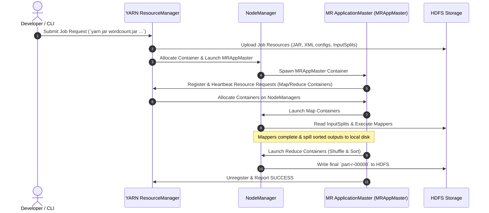
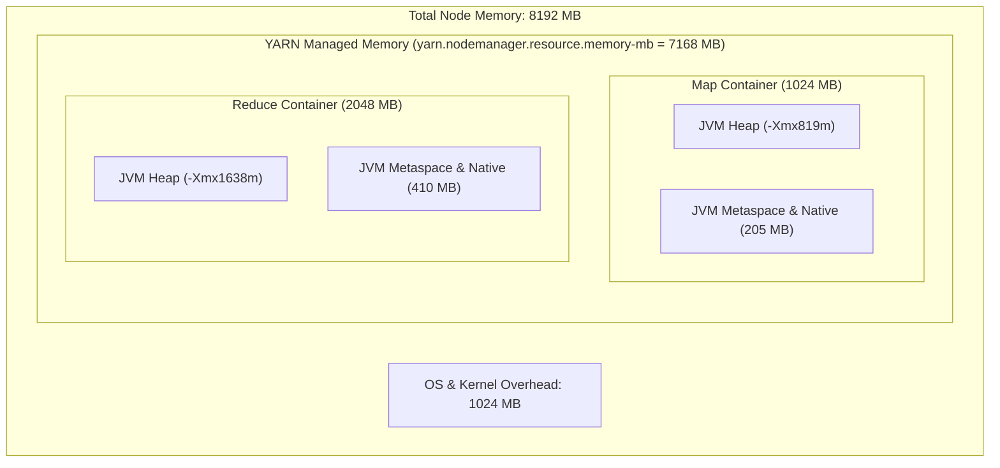

# ⚡ Apache Hadoop MapReduce Developer & Architecture Guide

This comprehensive guide covers developing, packaging, running, optimizing, and debugging **MapReduce 2 (MRv2 / YARN)** jobs on your containerized Hadoop cluster using both native Java and Python Hadoop Streaming.

---

## 📑 Table of Contents

- [Distributed MapReduce Execution Lifecycle](#-distributed-mapreduce-execution-lifecycle)
- [YARN MapReduce Job Submission Flow](#-yarn-mapreduce-job-submission-flow)
- [Native Java MapReduce WordCount](#-native-java-mapreduce-wordcount)
- [Python Hadoop Streaming WordCount](#-python-hadoop-streaming-wordcount)
- [Combiners, Partitioners & Secondary Sort](#-combiners-partitioners--secondary-sort)
- [YARN & MapReduce Memory Tuning Guide](#-yarn--mapreduce-memory-tuning-guide)
- [Monitoring & Diagnostic Metrics](#-monitoring--diagnostic-metrics)

---

## 🔄 Distributed MapReduce Execution Lifecycle

```mermaid
flowchart LR
    subgraph Input["1. Input Phase"]
        Split1["InputSplit 0<br/>(128 MB Block)"]
        Split2["InputSplit 1<br/>(128 MB Block)"]
    end

    subgraph MapPhase["2. Map Phase"]
        Map1["Mapper Task 0<br/><code>map(k1, v1)</code>"]
        Map2["Mapper Task 1<br/><code>map(k1, v1)</code>"]
        Buf1["In-Memory Buffer<br/>(100MB Ring Buffer)"]
        Buf2["In-Memory Buffer<br/>(100MB Ring Buffer)"]
        Comb1["In-Mapper Combiner"]
        Comb2["In-Mapper Combiner"]
    end

    subgraph ShuffleSort["3. Shuffle & Sort Phase"]
        Partitioner["HashPartitioner<br/><code>hash(K2) % numReducers</code>"]
        Network["HTTP Shuffle Transfer<br/>(Compressed with Snappy)"]
        MergeSort["Merge Sort & Grouping<br/><code>(K2, List[V2])</code>"]
    end

    subgraph ReducePhase["4. Reduce Phase"]
        Red1["Reducer Task 0<br/><code>reduce(k2, iter[v2])</code>"]
        Red2["Reducer Task 1<br/><code>reduce(k2, iter[v2])</code>"]
    end

    subgraph Output["5. Output Phase"]
        Out1["HDFS /output/<br/><code>part-r-00000</code>"]
        Out2["HDFS /output/<br/><code>part-r-00001</code>"]
    end

    Split1 --> Map1 --> Buf1 --> Comb1 --> Partitioner
    Split2 --> Map2 --> Buf2 --> Comb2 --> Partitioner
    Partitioner --> Network --> MergeSort
    MergeSort --> Red1 --> Out1
    MergeSort --> Red2 --> Out2

    classDef stage fill:#1e293b,stroke:#38bdf8,stroke-width:2px,color:#f8fafc;
    classDef highlight fill:#0284c7,stroke:#0369a1,stroke-width:2px,color:#ffffff;
    classDef alert fill:#ea580c,stroke:#c2410c,stroke-width:2px,color:#ffffff;
    class Map1,Map2,Red1,Red2 highlight;
    class Comb1,Comb2,MergeSort alert;
```



---

## 🏛️ YARN MapReduce Job Submission Flow



---

## ☕ Native Java MapReduce WordCount

### Source Implementation: `WordCount.java`

```java
import java.io.IOException;
import java.util.StringTokenizer;
import org.apache.hadoop.conf.Configuration;
import org.apache.hadoop.fs.Path;
import org.apache.hadoop.io.IntWritable;
import org.apache.hadoop.io.Text;
import org.apache.hadoop.mapreduce.Job;
import org.apache.hadoop.mapreduce.Mapper;
import org.apache.hadoop.mapreduce.Reducer;
import org.apache.hadoop.mapreduce.lib.input.FileInputFormat;
import org.apache.hadoop.mapreduce.lib.output.FileOutputFormat;

public class WordCount {

    // 1. Tokenizer Mapper Class
    public static class TokenizerMapper extends Mapper<Object, Text, Text, IntWritable> {
        private final static IntWritable one = new IntWritable(1);
        private Text word = new Text();

        @Override
        public void map(Object key, Text value, Context context) throws IOException, InterruptedException {
            String cleanLine = value.toString().replaceAll("[^a-zA-Z0-9 ]", " ").toLowerCase();
            StringTokenizer itr = new StringTokenizer(cleanLine);
            while (itr.hasMoreTokens()) {
                word.set(itr.nextToken());
                context.write(word, one);
            }
        }
    }

    // 2. Summing Reducer Class (also used as Combiner)
    public static class IntSumReducer extends Reducer<Text, IntWritable, Text, IntWritable> {
        private IntWritable result = new IntWritable();

        @Override
        public void reduce(Text key, Iterable<IntWritable> values, Context context) 
                throws IOException, InterruptedException {
            int sum = 0;
            for (IntWritable val : values) {
                sum += val.get();
            }
            result.set(sum);
            context.write(key, result);
        }
    }

    // 3. Driver Method
    public static void main(String[] args) throws Exception {
        if (args.length < 2) {
            System.err.println("Usage: WordCount <in-hdfs-path> <out-hdfs-path>");
            System.exit(2);
        }
        Configuration conf = new Configuration();
        Job job = Job.getInstance(conf, "production word count");
        job.setJarByClass(WordCount.class);
        job.setMapperClass(TokenizerMapper.class);
        job.setCombinerClass(IntSumReducer.class); // Local combiner optimization
        job.setReducerClass(IntSumReducer.class);
        job.setOutputKeyClass(Text.class);
        job.setOutputValueClass(IntWritable.class);
        FileInputFormat.addInputPath(job, new Path(args[0]));
        FileOutputFormat.setOutputPath(job, new Path(args[1]));
        System.exit(job.waitForCompletion(true) ? 0 : 1);
    }
}
```

### Execution Steps Inside the Container

```bash
# 1. Compile with Hadoop Classpath
javac -classpath $(docker compose exec hadoop hadoop classpath) -d . examples/mapreduce-java/WordCount.java
jar -cvf wordcount.jar *.class

# 2. Upload input text to HDFS
docker compose exec hadoop hdfs dfs -mkdir -p /input/wordcount
docker compose exec hadoop hdfs dfs -put /usr/local/hadoop/etc/hadoop/*.xml /input/wordcount/

# 3. Submit YARN Job
docker compose exec hadoop yarn jar wordcount.jar WordCount /input/wordcount /output/wordcount-java

# 4. View Top Words
docker compose exec hadoop hdfs dfs -cat /output/wordcount-java/part-r-00000 | sort -k2 -nr | head -n 20
```

---

## 🐍 Python Hadoop Streaming WordCount

Hadoop Streaming enables writing Mappers and Reducers in Python, Go, Rust, or any CLI executable using standard `stdin` and `stdout`.

### 1. `mapper.py`

```python
#!/usr/bin/env python3
import sys
import re

def main():
    for line in sys.stdin:
        line = line.strip()
        words = re.findall(r'\b[a-zA-Z0-9_]+\b', line.lower())
        for word in words:
            print(f"{word}\t1")

if __name__ == "__main__":
    main()
```

### 2. `reducer.py`

```python
#!/usr/bin/env python3
import sys

def main():
    current_word = None
    current_count = 0

    for line in sys.stdin:
        line = line.strip()
        if not line:
            continue
        try:
            word, count = line.split('\t', 1)
            count = int(count)
        except ValueError:
            continue

        if current_word == word:
            current_count += count
        else:
            if current_word is not None:
                print(f"{current_word}\t{current_count}")
            current_word = word
            current_count = count

    if current_word is not None:
        print(f"{current_word}\t{current_count}")

if __name__ == "__main__":
    main()
```

### 3. Submitting the Streaming Job via Make

```bash
make test-mr-python
```

---

## ⚡ YARN & MapReduce Memory Tuning Guide



### Configuration Parameters in `config/mapred-site.xml`

```xml
<configuration>
    <!-- Container Memory (YARN Scheduler Allocation) -->
    <property>
        <name>mapreduce.map.memory.mb</name>
        <value>1024</value>
    </property>
    <property>
        <name>mapreduce.reduce.memory.mb</name>
        <value>2048</value>
    </property>

    <!-- JVM Heap Limits for Task Processes (80% Rule) -->
    <property>
        <name>mapreduce.map.java.opts</name>
        <value>-Xmx819m -XX:+UseG1GC</value>
    </property>
    <property>
        <name>mapreduce.reduce.java.opts</name>
        <value>-Xmx1638m -XX:+UseG1GC</value>
    </property>

    <!-- Intermediate Output Compression -->
    <property>
        <name>mapreduce.map.output.compress</name>
        <value>true</value>
    </property>
    <property>
        <name>mapreduce.map.output.compress.codec</name>
        <value>org.apache.hadoop.io.compress.SnappyCodec</value>
    </property>
</configuration>
```

---

## 📊 Monitoring & Diagnostic Metrics

1. **YARN Web Dashboard**: [http://localhost:8088](http://localhost:8088) — Track active memory allocations and running tasks.
2. **JobHistory Web Dashboard**: [http://localhost:19888](http://localhost:19888) — Historical execution metrics and task-level execution breakdowns.
3. **Command Line Application Logs**:
   ```bash
   docker compose exec hadoop yarn logs -applicationId <application_id>
   ```
