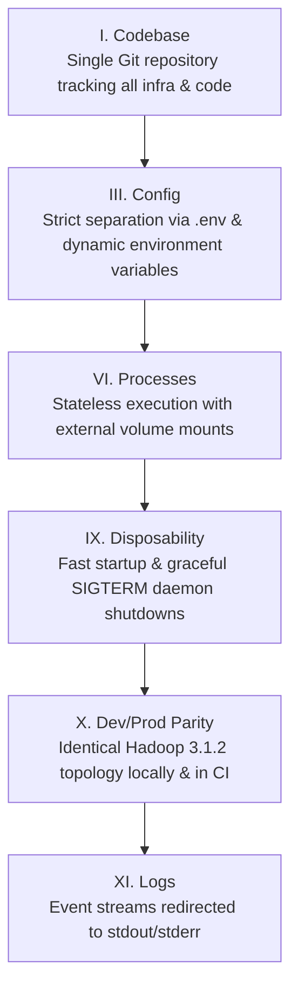
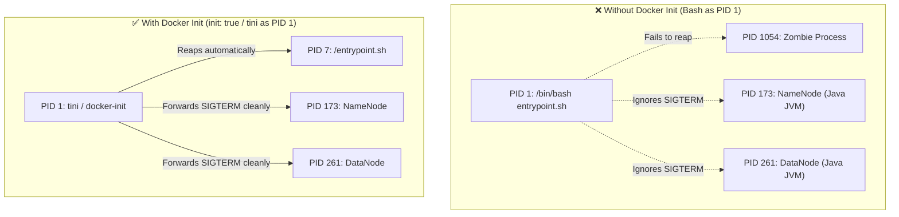
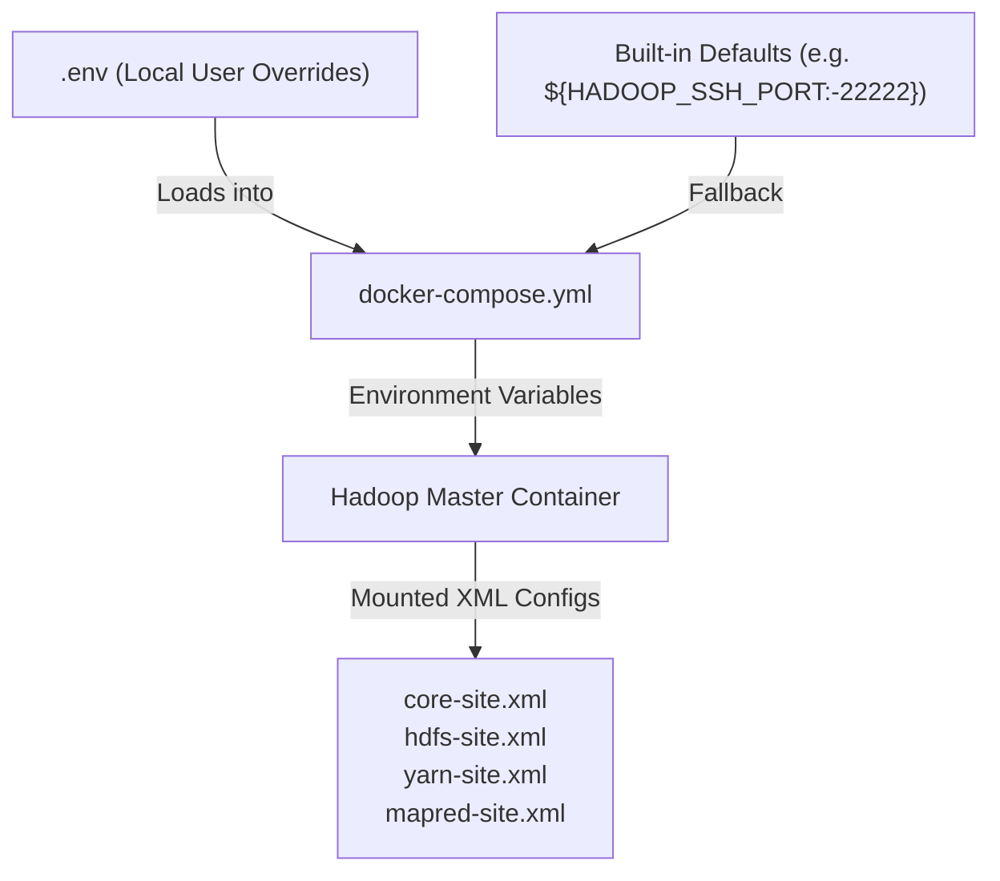
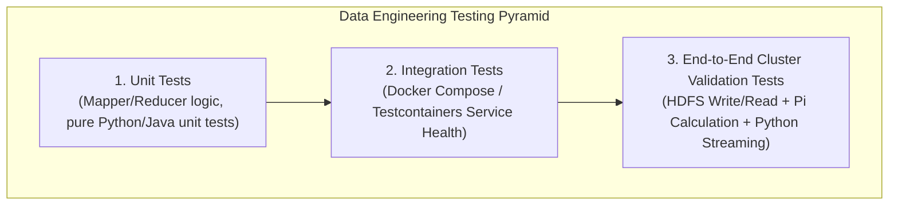

# 🛠️ Software Engineering Best Practices for Big Data Systems

This document details the Software Engineering (SWE) principles, architectural standards, automated testing frameworks, and containerization patterns implemented in this repository.

---

## 📑 Table of Contents

1. [Twelve-Factor Methodology for Big Data Clusters](#1-twelve-factor-methodology-for-big-data-clusters)
2. [Container Lifecycle & Process Management](#2-container-lifecycle--process-management)
   - [The Role of Init Systems (`tini`) & Zombie Process Reaping](#the-role-of-init-systems-tini--zombie-process-reaping)
   - [Signal Propagation (`SIGTERM` / `SIGKILL`)](#signal-propagation-sigterm--sigkill)
3. [Configuration Management & Environment Parity](#3-configuration-management--environment-parity)
4. [Automated Testing & Continuous Integration (CI)](#4-automated-testing--continuous-integration-ci)
   - [Unit Testing Data Pipelines](#unit-testing-data-pipelines)
   - [Integration Testing with Docker & Compose](#integration-testing-with-docker--compose)
   - [Automated Verification Scripts](#automated-verification-scripts)
5. [Observability, Logging & Health Probes](#5-observability-logging--health-probes)
   - [Liveness vs. Readiness Probes](#liveness-vs-readiness-probes)
   - [Centralized Log Aggregation & JVM JMX Metrics](#centralized-log-aggregation--jvm-jmx-metrics)
6. [Security & Least Privilege Execution Model](#6-security--least-privilege-execution-model)

---

## 1. Twelve-Factor Methodology for Big Data Clusters

We adhere to the [Twelve-Factor App](https://12factor.net/) principles adapted for distributed big data infrastructure:



| Factor | Implementation in this Repository |
| :--- | :--- |
| **I. Codebase** | Single repository containing Dockerfile, Docker Compose, configuration files, and MapReduce examples. |
| **III. Config** | All ports, cluster version, and volume names are parameterized via `.env` and environment variables. |
| **VI. Processes** | Hadoop daemons run as isolated processes; state is strictly isolated to named Docker volumes. |
| **IX. Disposability** | Graceful shutdown hooks and container init systems allow instantaneous teardown and restart. |
| **X. Dev/Prod Parity** | Local single-node Docker environment mirrors enterprise multi-node Hadoop clusters down to XML configs. |
| **XI. Logs** | Aggregated daemon logs are multiplexed to standard output (`tail -F`) for real-time observability. |

---

## 2. Container Lifecycle & Process Management

### The Role of Init Systems (`tini`) & Zombie Process Reaping

In Linux/Docker environments, **PID 1** is responsible for:
1. Reaping **zombie processes** (dead child processes whose parents did not call `wait()`).
2. Forwarding system signals (`SIGTERM`, `SIGINT`, `SIGHUP`) to child subprocesses.



By enabling `init: true` in [docker-compose.yml](file:///d:/courses/AraBigData/docker-hadoop/docker-compose.yml), Docker inserts the lightweight `docker-init` binary as PID 1, eliminating process leaks and hung container shutdowns.

### Signal Propagation (`SIGTERM` / `SIGKILL`)

When `docker compose stop` or `down` is executed:
1. Docker sends `SIGTERM` to PID 1.
2. `docker-init` forwards `SIGTERM` to all active JVM daemons (NameNode, DataNode, ResourceManager, NodeManager).
3. The JVM invokes its registered shutdown hooks, flushing pending HDFS edit logs to disk and updating filesystem metadata cleanly.
4. If processes do not exit within the timeout (default 10s), `SIGKILL` is sent.

---

## 3. Configuration Management & Environment Parity

Configurations follow a hierarchical, non-destructive parameterization pattern:



### Preventing Port Clashes on Developer Machines
- Ports default to safe, non-conflicting ranges (e.g. `22222` for SSH, `9870` for NameNode).
- Any port can be customized without editing code by adjusting `.env`:
  ```bash
  HADOOP_NAMENODE_PORT=19870
  HADOOP_RESOURCEMANAGER_PORT=18088
  HADOOP_SSH_PORT=22222
  ```

---

## 4. Automated Testing & Continuous Integration (CI)

A robust data pipeline requires multi-level testing:



### Unit Testing Data Pipelines

Unit test your Mappers and Reducers using standard testing tools (e.g. `pytest` or `JUnit`) without spinning up the Hadoop cluster:

```python
# tests/test_wordcount_mapper.py
import io
import sys
from examples.mapreduce_python.mapper import process_line

def test_mapper_tokenization():
    input_line = "Hadoop Spark Hadoop Docker"
    output = []
    
    for word, count in process_line(input_line):
        output.append((word, count))
        
    expected = [("hadoop", 1), ("spark", 1), ("hadoop", 1), ("docker", 1)]
    assert output == expected
```

### Integration Testing with Docker & Compose

Integration tests verify that all cluster subsystems (HDFS, YARN, RPC, Web UIs) collaborate properly:

```bash
# Execute built-in comprehensive health check
docker compose exec hadoop /healthcheck.sh

# Run end-to-end integration test suite
docker compose exec hadoop /test-cluster.sh
```

### Automated GitHub Actions CI Workflow

The `.github/workflows/ci.yml` pipeline automatically builds the image, starts the container, validates health status, and runs MapReduce test jobs on every push and pull request.

---

## 5. Observability, Logging & Health Probes

### Liveness vs. Readiness Probes

The container implements a robust health check mechanism:

```bash
# scripts/healthcheck.sh
#!/bin/bash
set -e

# 1. Probe NameNode Web UI (HTTP 9870)
curl -f -s http://localhost:9870 > /dev/null || exit 1

# 2. Probe YARN ResourceManager Web UI (HTTP 8088)
curl -f -s http://localhost:8088 > /dev/null || exit 1

# 3. Probe HDFS RPC and storage daemon responsiveness
su - hduser -c "hdfs dfsadmin -report" > /dev/null || exit 1

exit 0
```

- **Interval**: `30s`
- **Timeout**: `10s`
- **Retries**: `3`
- **Start Period**: `120s` (allows slow JVM startups on resource-constrained host machines without failing).

### Centralized Log Aggregation & JVM JMX Metrics

Hadoop exposes all internal operational metrics via **JMX JSON Endpoints**:
- **NameNode Metrics**: `http://localhost:9870/jmx`
- **DataNode Metrics**: `http://localhost:9864/jmx`
- **ResourceManager Metrics**: `http://localhost:8088/jmx`

These endpoints can be scraped directly by **Prometheus** or Datadog agents for production dashboards (Cluster Capacity, Under-Replicated Blocks, GC Pauses, Active Applications).

---

## 6. Security & Least Privilege Execution Model

1. **Non-Privileged Service Account (`hduser`)**:
   - All Hadoop storage and compute processes run under the dedicated non-root user `hduser` (UID `1000`, GID `1000`).
   - Root privileges are restricted to initial container setup.
2. **SSH Key Loopback Isolation**:
   - Dedicated RSA key pairs (`0600` permissions on private keys, `0700` on `.ssh` directory).
   - `StrictHostKeyChecking no` configured specifically for container loopback communication (`localhost`, `0.0.0.0`).
3. **Auditing & Volume Isolation**:
   - HDFS data volumes are isolated from the container root filesystem, preventing container rebuilds from destroying persistent cluster data.
