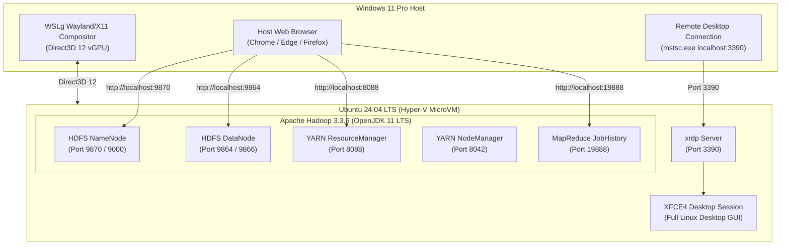

# 🐧 WSL 2 Ubuntu 24.04 LTS: High-Performance Hadoop & GUI Guide

This guide details the deployment of **Ubuntu 24.04 LTS** on **Windows 11 WSL 2** with a complete graphical desktop environment (GUI) and a fully configured **Apache Hadoop 3.3.6** single-node cluster powered by **OpenJDK 11 LTS**.

---

## 📑 Table of Contents
1. [Architecture Overview](#-architecture-overview)
2. [Why WSL 2 Outperforms VirtualBox](#-why-wsl-2-outperforms-virtualbox)
3. [Connecting to the Ubuntu GUI Desktop](#-connecting-to-the-ubuntu-gui-desktop)
4. [Hadoop Cluster Management](#-hadoop-cluster-management)
5. [Web Interfaces & Port Reference](#-web-interfaces--port-reference)
6. [Troubleshooting & FAQs](#-troubleshooting--faqs)

---

## 🏛️ Architecture Overview



---

## ⚡ Why WSL 2 Outperforms VirtualBox

| Capability | WSL 2 (Ubuntu 24.04 LTS) | Oracle VirtualBox |
| :--- | :--- | :--- |
| **Hypervisor** | Native Windows Type-1 Hyper-V MicroVM | Type-2 over user-space WHPX API |
| **Boot Time** | `< 1 Second` | `30–60 Seconds` |
| **RAM Utilization** | Dynamic (returns unused memory to Windows) | Static commitment (locks 4.1 GB from host) |
| **Display Acceleration** | Direct3D 12 vGPU hardware acceleration | CPU-based software LLVMpipe (100% CPU lockup) |
| **Networking** | Automatic localhost port forwarding to Windows | Requires manual NAT forwarding rules |
| **Stability** | Built & maintained directly by Microsoft | Prone to COM crashes, audio lockups, 0x80004005 |

---

## 🖥️ Connecting to the Ubuntu GUI Desktop

### Option A: 1-Click Remote Desktop Connection (Full Desktop Window)
We have configured **xRDP** on port **3390** (to avoid collision with Windows host Remote Desktop on port 3389).

1. Double-click the pre-generated shortcut:
   `d:\courses\AraBigData\docker-hadoop\Ubuntu-WSL-GUI.rdp`
   *Or* open **Remote Desktop Connection (`mstsc.exe`)** and enter:
   ```text
   localhost:3390
   ```
2. Log in with your credentials:
   * **Username**: `hadoopuser`
   * **Password**: `hadoopuser`
3. You will immediately see the full, interactive **XFCE4 graphical desktop window** with file browser, terminal, wallpaper, and application menu!

### Option B: Seamless GUI Apps via Native Windows 11 WSLg
Any GUI app launched from Ubuntu terminal automatically appears on your Windows desktop:
```bash
# Open Linux File Manager
nautilus . &

# Open Linux Graphical Terminal
xfce4-terminal &

# Open Text Editor
gedit &
```

---

## 🐘 Hadoop Cluster Management

### Start All Cluster Daemons:
Inside Ubuntu terminal (or via Windows PowerShell with `wsl -d Ubuntu-24.04 -u hadoopuser`):
```bash
/home/hadoopuser/start-hadoop-cluster.sh
```

### Check Active Daemons:
```bash
jps
```
Expected active processes:
* `NameNode`
* `DataNode`
* `SecondaryNameNode`
* `ResourceManager`
* `NodeManager`
* `JobHistoryServer`

### Stop Cluster Daemons:
```bash
stop-dfs.sh
stop-yarn.sh
mr-jobhistory-daemon.sh stop historyserver
```

---

## 🌐 Web Interfaces & Port Reference

All Hadoop services automatically map directly to your Windows host web browser on `localhost`:

| Service | Address | Description |
| :--- | :--- | :--- |
| **HDFS NameNode UI** | [http://localhost:9870](http://localhost:9870) | Cluster overview, capacity, browse HDFS files |
| **YARN ResourceManager UI** | [http://localhost:8088](http://localhost:8088) | Node health, active/completed MapReduce jobs |
| **HDFS DataNode UI** | [http://localhost:9864](http://localhost:9864) | Storage blocks, logs, volume status |
| **MapReduce JobHistory UI** | [http://localhost:19888](http://localhost:19888) | Historical job metrics and task logs |
| **Ubuntu Linux GUI (RDP)** | `localhost:3390` | Full graphical desktop (Remote Desktop Connection) |
